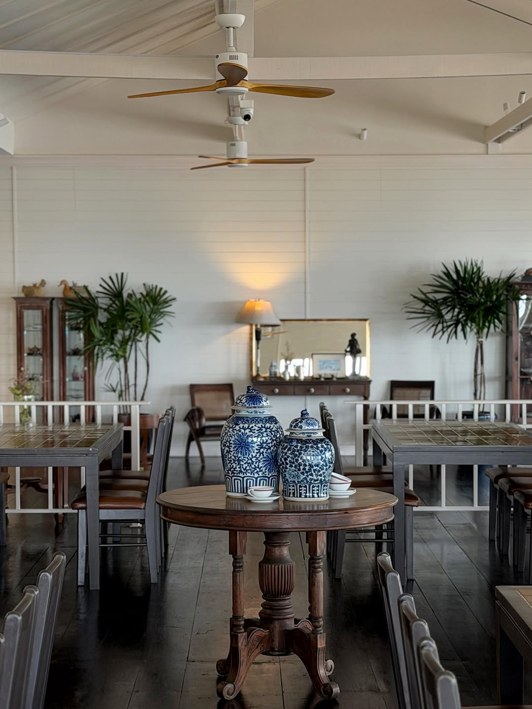
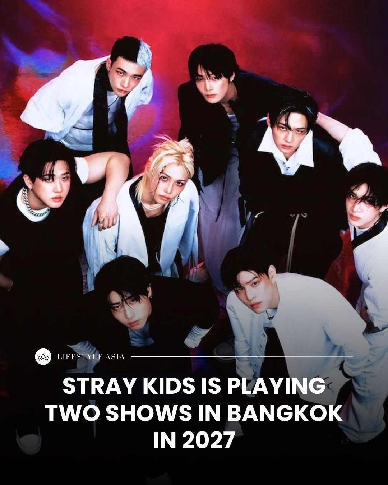
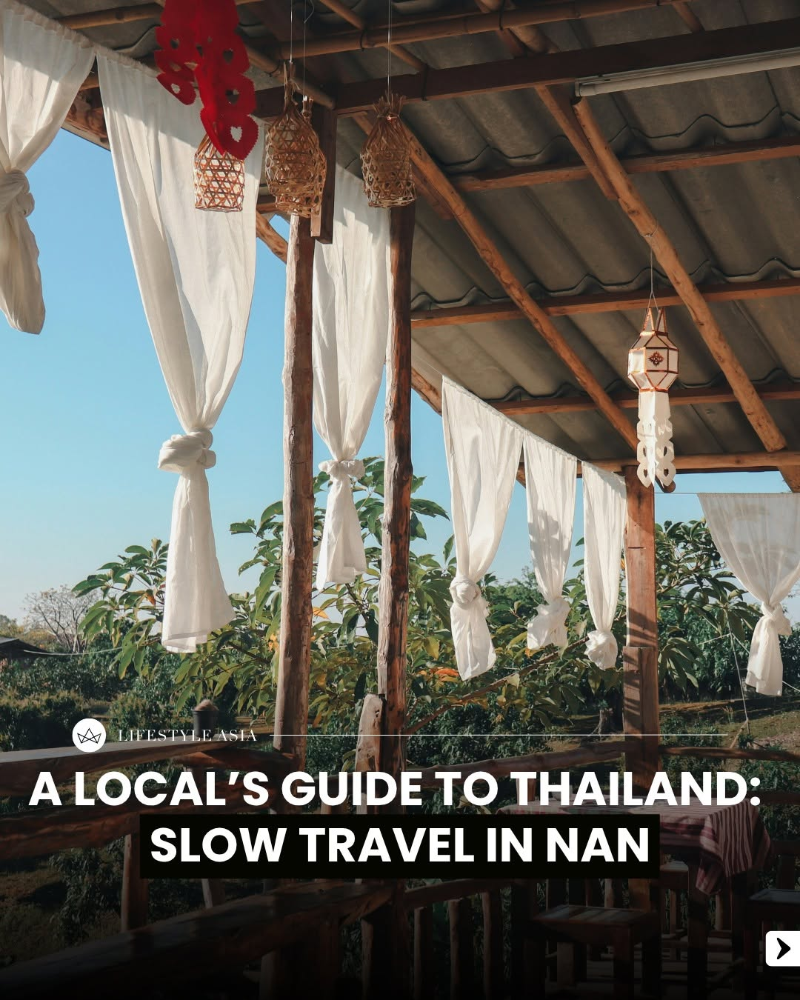
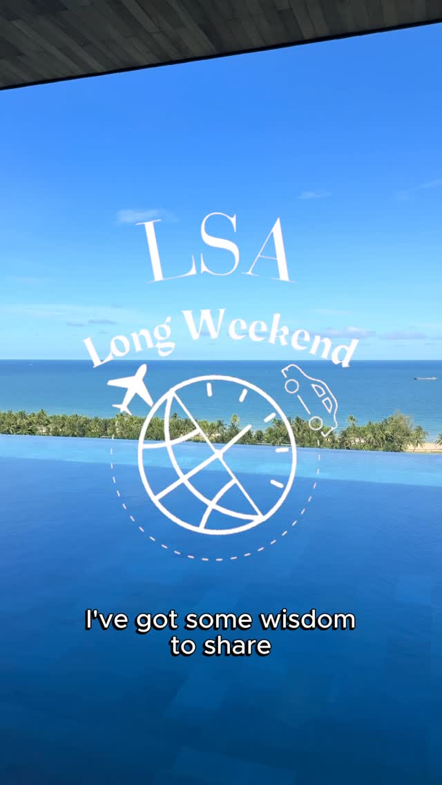
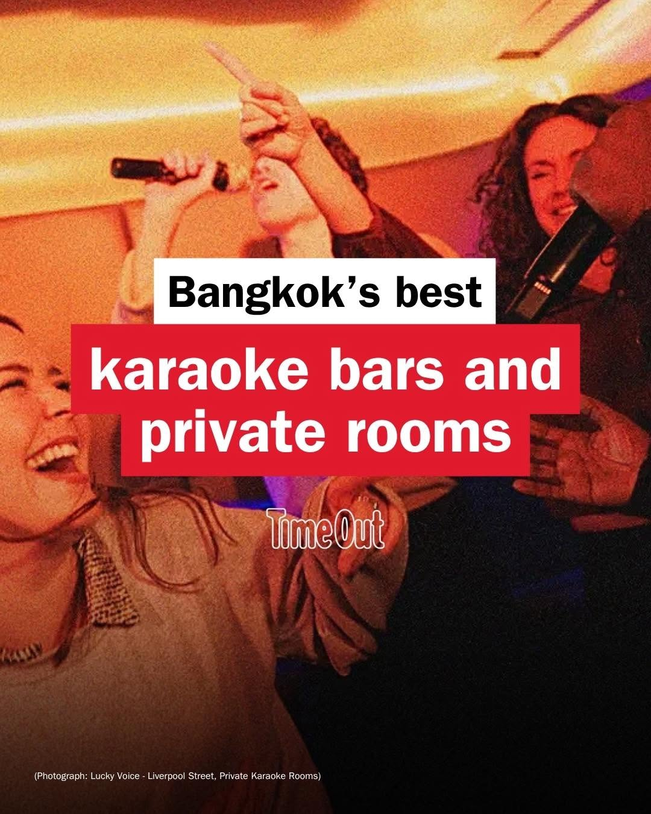

# 📸 2026-06-27 IG 新貼文彙整

## @jiranarong2 · 展覽

**地點：** บ้านสุริยน　**約會指數：** 8/10　**風格：** 文青、浪漫、靜謐

**摘要：** 這是一家位於泰國的餐廳，專注於海鮮料理，並且有著百年歷史的古老建築。餐廳的氛圍非常宜人，適合家庭聚餐或浪漫約會。

> ร้านบ้านสุริยนที่ศรีราชา เปิดมาตั้งแต่ พศ 2502 แต่เพิ่งเคยมาปีนี้ครั้งแรก 55 ที่นี่น่าจะเป็นบ้านตากอากาศตั้งแต่สมัย ร.5 ยื่นออกไปในทะเลมีบัง…

🔗 https://www.instagram.com/p/DaDJ2QdkxhQ/

---

## @lifestyleasiath · 旅遊

**地點：** Stray Kids 世界巡演　**約會指數：** 9/10　**風格：** 熱鬧、音樂、活動

**摘要：** 這是韓國男團 Stray Kids 的「Run It」世界巡演，將於2027年在曼谷舉行。這樣的音樂活動非常適合約會，特別是對於喜愛K-pop的情侶。

> K-pop boyband Stray Kids (@realstraykids) is bringing their “Run It” World Tour to Bangkok this 2027. Here’s what we know. Tap the link in b…

🔗 https://www.instagram.com/p/DaEmAqenKhA/

---

## @lifestyleasiath · 旅遊

**地點：** 南邦慢旅行　**約會指數：** 7/10　**風格：** 文青、靜謐、旅遊

**摘要：** 這篇文章介紹了泰國南邦的慢旅行概念，鼓勵人們以放鬆的心態探索當地。適合喜歡靜謐氛圍的約會對象，享受悠閒的時光。

> Welcome to “A Local’s Guide to Thailand,” a column where we explore one travel philosophy through a Thai lens. Each month, we share an itine…

🔗 https://www.instagram.com/p/DaDNRgmGLs8/

---

## @lifestyleasiath · 旅遊

**地點：** 哈利波特主題活動　**約會指數：** 6/10　**風格：** 文青、熱鬧

**摘要：** 這是一個結合哈利波特與世界盃的主題活動，適合喜愛魔法世界的朋友。雖然貼文沒有具體的時間和地點，但這樣的主題活動通常會吸引不少人，適合約會時一起體驗。

> If perhaps you don’t really get the World Cup but are well-versed in the Wizarding World, we’ve made a helpful explainer for you. (Images: W…

🔗 https://www.instagram.com/p/DaC4fCRmFyj/

---

## @lifestyleasiath · 旅遊

**地點：** 曼谷　**約會指數：** 5/10　

**摘要：** 這則貼文提到曼谷即將在6月28日舉行新州長選舉。雖然沒有具體的約會地點，但選舉期間的活動可能會吸引一些人前來參加，適合對政治有興趣的約會。

> Bangkok is set to elect a new governor this Sunday (28 June). Here’s what to be prepared for between now and election day.

🔗 https://www.instagram.com/p/DaCqf0Zk0Sk/

---

## @lifestyleasiath · 旅遊

**地點：** 富國島　**約會指數：** 7/10　**風格：** 靜謐、旅遊

**摘要：** 這篇貼文介紹了富國島，強調了這裡慢活的生活方式。適合想要放鬆心情的約會對象，是個不錯的旅遊選擇。

> For this edition of #LSALongWeekend, we head to Phu Quoc to embrace a slower way of life. #AnOdeToSpain #PhuQuoc #TravelVlog #LifestyleAsia …

🔗 https://www.instagram.com/p/DaCjh5gTj2g/

---

## @timeoutbangkok · 市集

**地點：** 曼谷市集　**約會指數：** 7/10　**風格：** 熱鬧、文青

**摘要：** 這是一個熱鬧的市集，適合在周末前往。建議攜帶雨傘和現金，以便購買書籍和商品，非常適合約會時一起探索。

> July looks busy, then. Carry an umbrella, keep some cash for books and merch and expect your weekends to fill up quickly. 🔗 Tap the link in…

🔗 https://www.instagram.com/p/DaExwifmw2d/

---

## @timeoutbangkok · 市集

**地點：** 曼谷夜間卡拉OK　**約會指數：** 7/10　**風格：** 熱鬧、娛樂、夜生活

**摘要：** 這是一個介紹曼谷夜間卡拉OK的貼文，適合喜歡唱歌和熱鬧氛圍的約會。雖然沒有具體的時間和價格，但這裡的娛樂設施非常適合夜間約會。

> Bangkok knows how to turn a night out into a singalong 🎤🕺🎶 From Japanese chains to all-night Thai karaoke rooms and restaurant-bars with …

🔗 https://www.instagram.com/p/DaC5j60m7DT/

---

## @timeoutbangkok · 市集

**地點：** 曼谷河濱市集　**約會指數：** 8/10　**風格：** 文青、熱鬧、戶外

**摘要：** 這是一個在曼谷河濱舉行的市集，聚集了超過50個攤位，販售二手衣物、復古收藏品和手作藝術品。市集於6月27-28日的週末舉行，入場免費，非常適合約會後一起逛逛。

> Clear a little space in your wardrobe and make a beeline for Whatever You Art 🛍️ This weekend market brings together influencers, artists, …

🔗 https://www.instagram.com/p/DaCjjbbG4nf/

---

