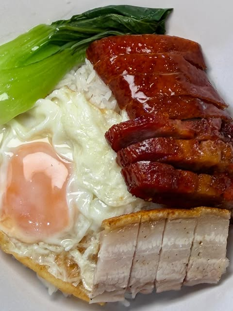
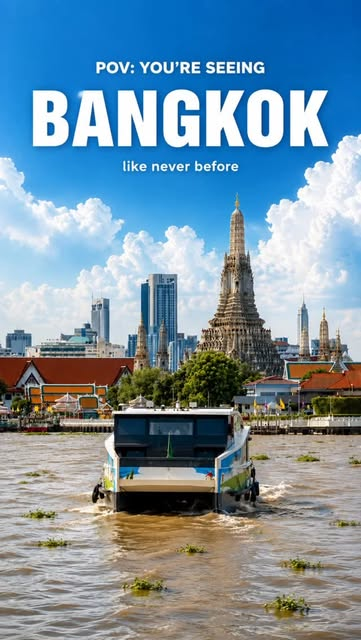
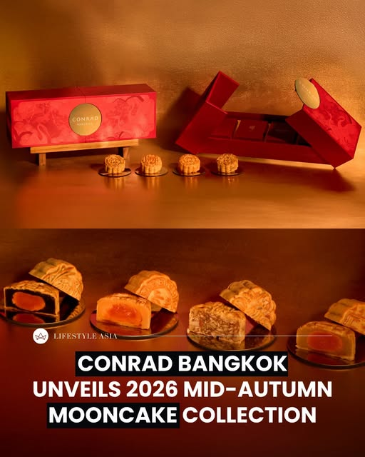
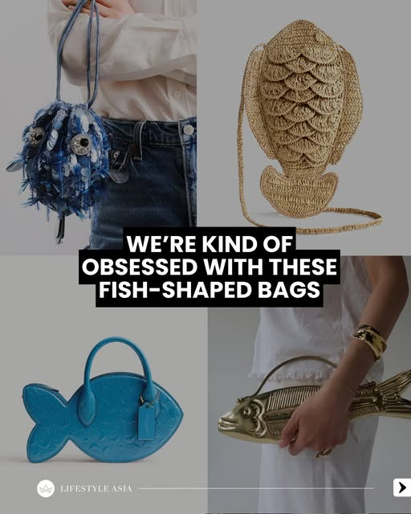
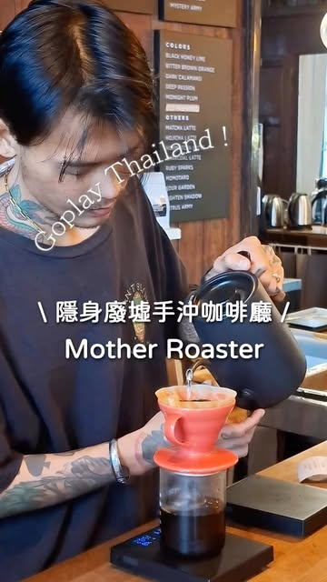
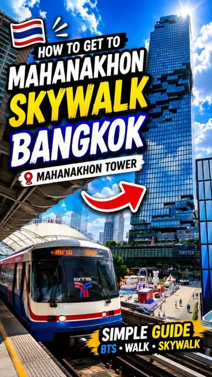
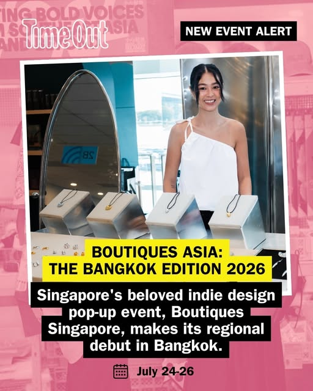
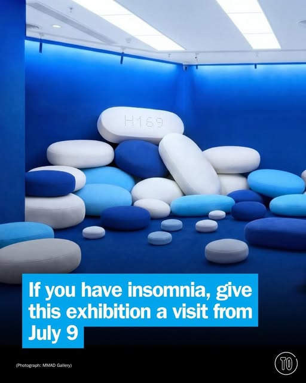

# 📸 2026-07-01 IG 新貼文彙整

## @jiranarong2 · 展覽

**地點：** 220c 餐廳　**約會指數：** 7/10　**風格：** 美食、熱鬧、休閒

**摘要：** 220c 餐廳是一家提供廣東菜的中餐廳，特色菜包括香港風味的燒鴨和脆皮豬肉。餐廳位於三合街，適合與朋友聚餐或約會，且不需預約即可享用部分菜品。

> ในที่สุดแถวละแวกบ้านมีร้านอาหารจีนดีๆ อีกร้านแล้ว เป็นร้านจีนกวางตุ้ง เชฟเป็นคนฮ่องกง จริงๆ เชฟอยู่ไทยมานานแล้ว ถ้าบอกว่าเคยเป็นเชฟร้านโจ๊กฮ…

🔗 https://www.instagram.com/p/DaNtlsfk1Rz/

---

## @richie.got.you · 旅遊

**地點：** 曼谷的昭披耶河　**約會指數：** 8/10　**風格：** 浪漫、戶外

**摘要：** 這裡是曼谷的昭披耶河，擁有美麗的河景，非常適合約會。可以享受悠閒的河邊散步，感受曼谷的魅力。

> Bangkok and the view of along Chao Phraya River #bangkok #bangkokthailand #bangkoktravel

🔗 https://www.instagram.com/p/DaNpoZxzlZq/

---

## @lifestyleasiath · 旅遊

**地點：** Conrad Bangkok　**約會指數：** 8/10　**風格：** 浪漫、文青、時尚

**摘要：** Conrad Bangkok 推出了 2026 年的月餅系列「Wings of Harmony」，結合了傳統與現代設計。這是一個適合送禮或自用的節慶產品，非常適合情侶在特殊時刻共享。

> @conradbangkokhotel just dropped their 2026 Mooncake Collection, 'Wings of Harmony,' and we are officially obsessed. It’s the perfect mix of…

🔗 https://www.instagram.com/p/DaPHCixHCjY/

---

## @lifestyleasiath · 旅遊

**地點：** 溫布頓網球錦標賽　**約會指數：** 6/10　**風格：** 熱鬧、運動

**摘要：** 這是2026年溫布頓網球錦標賽，兩位泰國選手在同一賽事中贏得了主賽的比賽，展現了泰國網球的新篇章。適合喜愛運動的情侶來觀賽，但需注意賽事的時間和票價。

> For the first time in the Open Era, two Thai players have won Grand Slam main-draw matches at the same tournament, and both are through to r…

🔗 https://www.instagram.com/p/DaPGaJJnLSr/

---

## @lifestyleasiath · 旅遊

**地點：** 魚形包包　**約會指數：** 5/10　**風格：** 時尚、夏日、輕鬆

**摘要：** 這篇貼文介紹了一些有趣的魚形包包，非常適合夏天或海邊使用。雖然不是約會地點，但可以作為約會時的時尚配件，增添輕鬆的氛圍。

> A perfect accessory for the summer or the sea-side, here’s our pick of the fun, playful fish-shaped bags right now. #Fish #LifestyleAsia #Li…

🔗 https://www.instagram.com/p/DaO5Y5ynENf/

---

## @lifestyleasiath · 旅遊

**地點：** Marche’ Thonglor　**約會指數：** 8/10　**風格：** 文青、熱鬧、浪漫

**摘要：** Marche’ Thonglor 是一個新開的白天咖啡館，提供多樣的飲品和糕點，非常適合約會。這裡的氛圍熱鬧，適合享受輕鬆的午餐時光。

> LSA Events Recap: Here’s our event recap from 1-30 June 2026. 1. SIWILAI RADICAL CLUB has launched its daytime cafe concept at Marche’ Thong…

🔗 https://www.instagram.com/p/DaNZHtlEwC7/

---

## @lifestyleasiath · 旅遊

**地點：** 曼谷　**約會指數：** 5/10　

**摘要：** 這則貼文提到曼谷市長Chadchart Sittipunt的政策，與旅遊約會無直接關聯。適合對曼谷政治感興趣的人，但不特別適合約會。

> After winning Sunday’s election by a landslide, we list out some of the major and ambitious policies Chadchart Sittipunt has proposed for hi…

🔗 https://www.instagram.com/p/DaNSg8WlV42/

---

## @goplaybangkok · 旅遊

**地點：** Mother Roaster　**約會指數：** 8/10　**風格：** 文青、復古、靜謐

**摘要：** Mother Roaster 是一家由70歲奶奶經營的廢墟咖啡廳，提供手沖咖啡和舒適的環境，非常適合拍照和約會。店內裝潢復古，營業時間為每日09:00至17:00，位於曼谷老城區，交通便利。

> \ #曼谷老城區超酷廢墟咖啡・老奶奶經營的 Mother Roaster 👵☕ / 「不要浪費剩餘的時間，鼓勵自己來外面學習新知，並且要做自己愛做的事」就是這樣的想法激發了一位70歲的奶奶 Mrs.Pim，讓她在遲暮之年做了個大膽決定，在石龍軍路上的老屋二樓開了咖啡廳，實現她自…

🔗 https://www.instagram.com/p/DaNgAb_SYmO/

---

## @aj.some.more · 旅遊

**地點：** Mahanakhon Skywalk　**約會指數：** 8/10　**風格：** 浪漫、戶外、熱鬧

**摘要：** Mahanakhon Skywalk 是曼谷最具代表性的觀景點之一，提供壯觀的城市景觀。這裡適合約會，尤其是喜歡戶外活動的情侶。記得查看票價和折扣資訊！

> Getting to Mahanakhon Skywalk is easier than you think! 🇹🇭✨ Skip the confusion and follow this simple BTS walking guide to one of Bangkok’…

🔗 https://www.instagram.com/p/DaPC6vMSNCJ/

---

## @aj.some.more · 旅遊

**地點：** CO LIMITED　**約會指數：** 8/10　**風格：** 文青、熱鬧、美食

**摘要：** 這是一個位於曼谷的泰國水果節，提供創意的鹹食、清爽的飲品和美味的甜點。活動僅到8月31日，適合喜愛美食的約會對象。

> 🇹🇭 I never thought Thai fruits could be transformed into dishes like these! 🤯🍽️ If you’re looking for a unique food experience in Bangko…

🔗 https://www.instagram.com/p/DaNgzd-yIM6/

---

## @timeoutbangkok · 市集

**地點：** ICONSIAM　**約會指數：** 8/10　**風格：** 文青、熱鬧、購物

**摘要：** 這是一個名為Boutiques Asia的獨立購物活動，將於2026年7月24日至26日在ICONSIAM舉行。活動匯聚了來自多個國家的120多個品牌，適合喜愛時尚和生活風格的人士，特別適合約會和朋友聚會。

> Singapore’s best-known independent shopping event is finally crossing the border 🛍️ After more than 20 years championing emerging labels th…

🔗 https://www.instagram.com/p/DaPNwooE-sC/

---

## @timeoutbangkok · 市集

**地點：** KFC Run 2026　**約會指數：** 7/10　**風格：** 運動、熱鬧、美食

**摘要：** 這是一個名為 'KFC Run 2026' 的跑步活動，參加者可在運動後享用美味的炸雞。活動將於9月6日在 Stadium One 舉行，適合喜愛運動和美食的約會對象。

> This run doesn't just warm up your legs – it gets your appetite race-ready too 🍗🏃💨 'KFC Run 2026' turns sweat straight back into somethin…

🔗 https://www.instagram.com/p/DaO_quAG6DI/

---

## @timeoutbangkok · 市集

**地點：** MMAD Gallery 1　**約會指數：** 7/10　**風格：** 藝術、靜謐、文化

**摘要：** 這是一個名為「Pillow」的藝術展，展出時間為7月9日至8月23日，免費入場。展覽探討失眠和內心深處的情感，適合喜愛藝術和靜謐氛圍的約會。

> Cool art might come from the worst nights 🌙 Pillow, the debut solo show from Sittha Jantharawong, better known as @hommes.hom, gathers up t…

🔗 https://www.instagram.com/p/DaNKs84GxTt/

---

## @timeoutbangkok · 市集

**地點：** 曼谷藝術雙年展 2026　**約會指數：** 8/10　**風格：** 文青、藝術、熱鬧

**摘要：** 曼谷藝術雙年展 2026 將於 2026 年 10 月 26 日至 2027 年 2 月 28 日舉行，展出來自泰國及全球的當代藝術作品。這是一個適合約會的藝術活動，可以一起探索創意與思考。

> Bangkok Art Biennale 2026 is rolling back into town, and this one is built around a theme with plenty of bite. A fresh wave of artists from …

🔗 https://www.instagram.com/p/DaM06CRm_hV/

---

