# 📸 2026-07-03 IG 新貼文彙整（已補摘要）

## @lifestyleasiath · 旅遊

**地點：** Blue by Alain Ducasse　**約會指數：** 8/10　**風格：** 浪漫、奢華、節慶

**摘要：** 這是 Blue by Alain Ducasse 在中秋節推出的2026年限量月餅系列，名為 'Once in a Blue Moon'，象徵著團圓與奢華。這個活動非常適合與摯愛分享特殊的時刻。

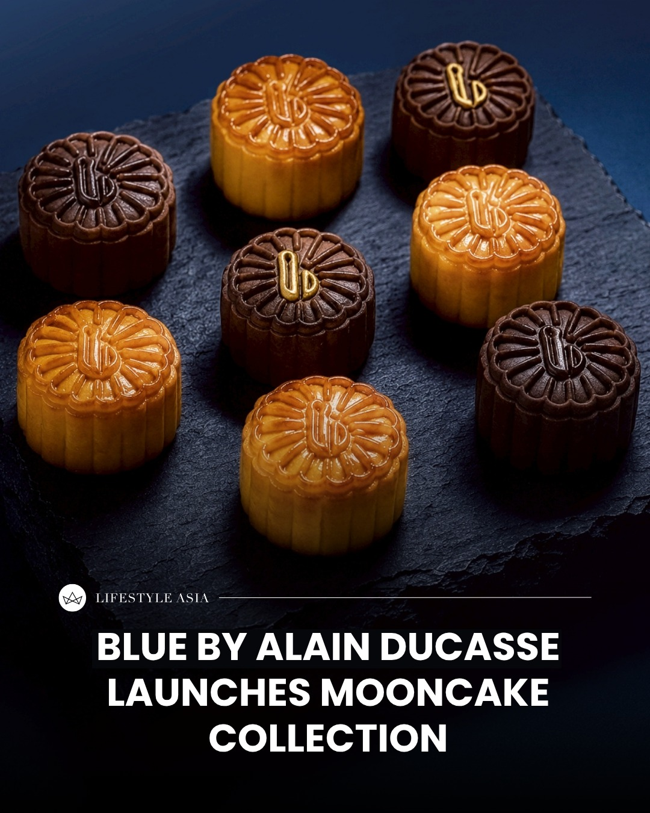

> This Mid-Autumn Festival, @bluebyalainducasse is elevating your celebrations with their ultra-exclusive 2026 mooncake collection. 'Once in a…

🔗 https://www.instagram.com/p/DaUQpSpHF9t/

---

## @timeoutbangkok · 市集

**摘要：** （分析失敗：Unexpected token 'T', "Too many r"... is not valid JSON）

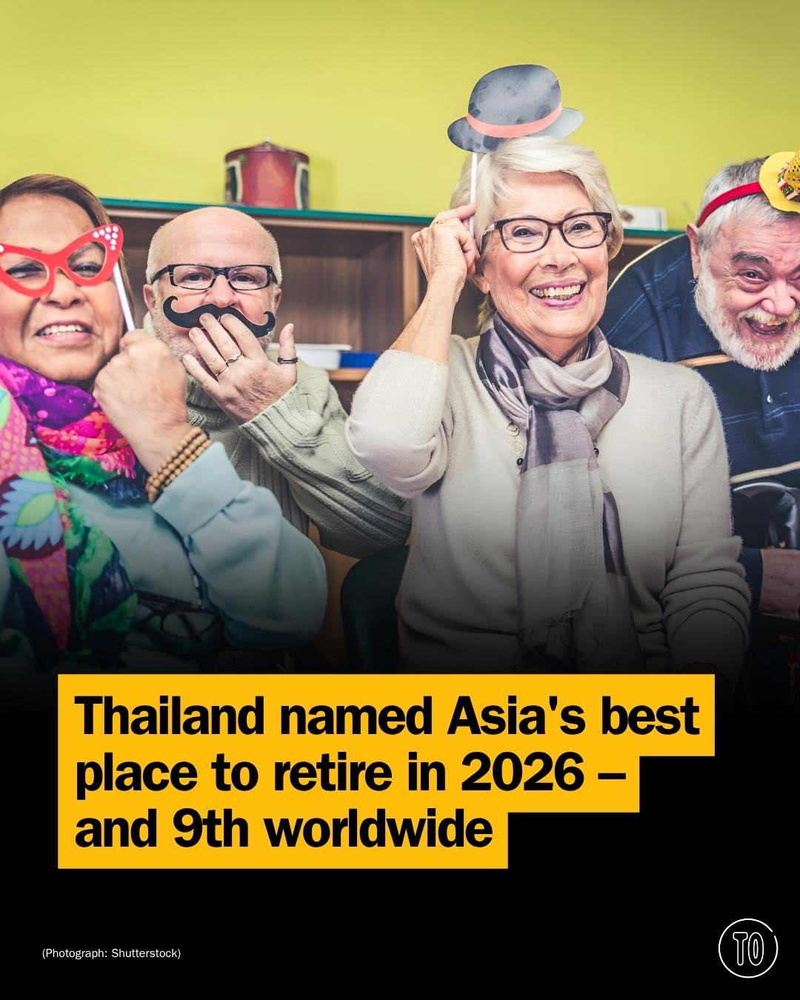

> Thinking of retiring in Thailand? The numbers are on your side. Thailand has been named Asia’s best place to retire in International Living’…

🔗 https://www.instagram.com/p/DaUMhd0m77S/

---

## @lifestyleasiath · 旅遊

**地點：** 曼谷網球場　**約會指數：** 6/10　**風格：** 運動、熱鬧

**摘要：** 這篇貼文介紹了曼谷的網球場，適合喜愛運動的約會對象。若你們想在網球場上揮拍，這裡有許多選擇可供參考。

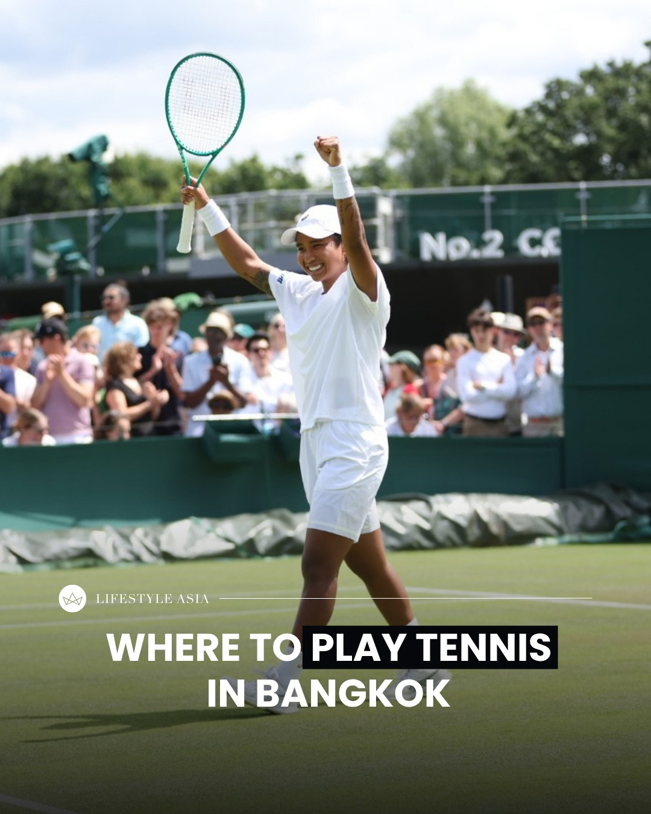

> The 2026 Wimbledon Championship kicked off in London yesterday (29 June), and is set to run until 12 July. If the grass-court action has you…

🔗 https://www.instagram.com/p/DaUC70SHNdC/

---

## @timeoutbangkok · 市集

**地點：** 曼谷美食市集　**約會指數：** 8/10　**風格：** 熱鬧、美食、文化

**摘要：** 這是一個充滿創意的美食市集，聚集了多位名廚和特色餐廳的合作活動，提供不同風味的美食體驗。適合喜愛美食和社交的約會，建議提前預訂以免錯過。時間和具體地點可透過連結查詢。

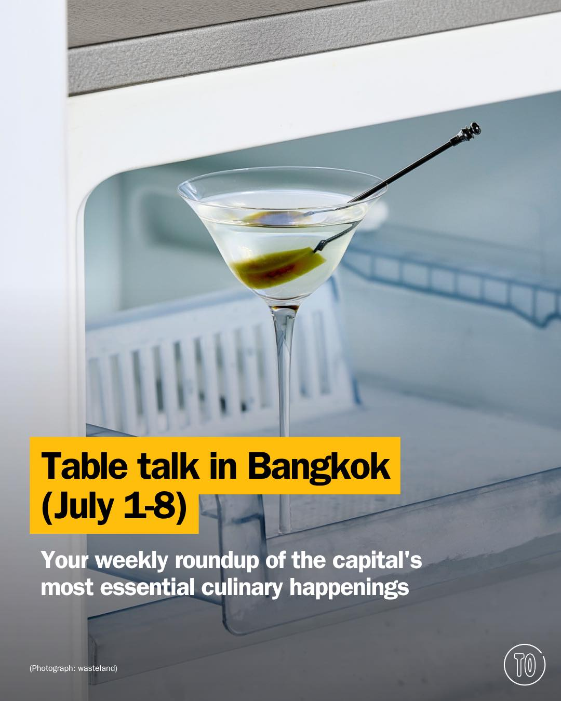

> This week’s food news is packed with collaborations that cross borders, styles and even cocktail menus. Benjarong (@benjarong.bkk) continues…

🔗 https://www.instagram.com/p/DaSuGVwm4qT/

---

## @aj_some_more · 旅遊

**地點：** 泰國　**約會指數：** 5/10　**風格：** 旅遊、懷舊

**摘要：** 這篇貼文表達了對泰國的懷念，適合喜愛旅遊的人士。雖然沒有具體的地點或活動，但它傳達了對泰國的情感。適合與伴侶分享旅行的回憶。

> What’s the hardest part about visiting Thailand? 🇹🇭🥹 For me… it’s leaving. Comment “See you soon Thailand” if you already miss Thailand b…

🔗 https://www.instagram.com/p/DaSrMUjyqWg/

---

## @timeoutbangkok · 市集

**地點：** 曼谷獨立日慶祝活動　**約會指數：** 8/10　**風格：** 熱鬧、戶外、慶祝

**摘要：** 這是一系列為美國獨立日慶祝的活動，包括燒烤派對和煙火表演，適合各種人參加。活動將在曼谷的多個地點舉行，非常適合約會和朋友聚會。

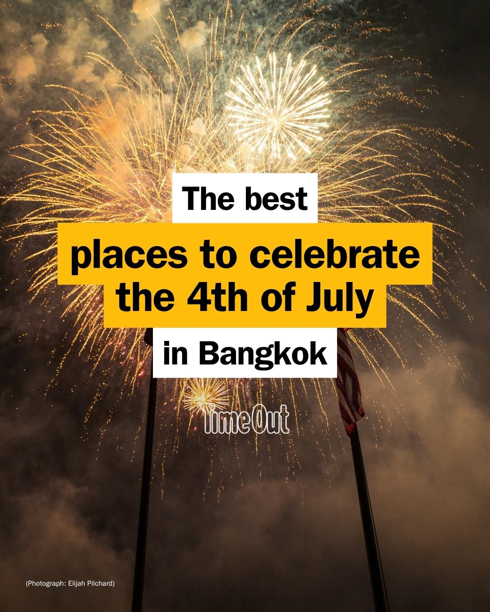

> Teleport to America for the weekend with all the food, freedom and festivities going on for Fourth of July. From a boat cookout with Bangkok…

🔗 https://www.instagram.com/p/DaSIuklG1D3/

---

## @lifestyleasiath · 旅遊

**地點：** 曼谷紐約風格披薩店　**約會指數：** 7/10　**風格：** 熱鬧、美食

**摘要：** 這篇貼文介紹了曼谷幾家提供大型紐約風格披薩的店家，非常適合與朋友或約會對象共享美食。想要品嚐美味披薩的話，這裡是個不錯的選擇。

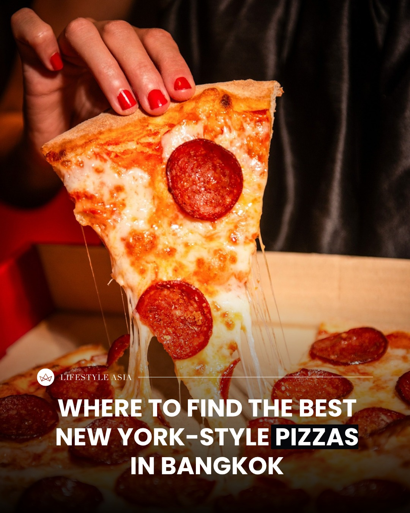

> Because sometimes, a 12” pie isn’t enough. Here are our picks of places to go for big, New York-style pizza in Bangkok. Tap the link in bio …

🔗 https://www.instagram.com/p/DaSAvqHFR3Q/

---

## @timeoutbangkok · 市集

**地點：** 國家圖書館拉瑪六基金會Sri Ayudhaya禮堂　**約會指數：** 8/10　**風格：** 文化、浪漫、文藝

**摘要：** 這是一場由Siam Repertory Theatre主辦的世界首演，演出HM King Rama VI的劇作《國王的命令》。活動於7月18日免費入場，適合喜愛文化和文藝的約會對象。捐款將支持拉瑪六基金會及劇團的發展。

> HM King Rama VI wrote more than 20 plays in English after falling for theatre during his years at Oxford. Almost none have ever been staged …

🔗 https://www.instagram.com/p/DaR612kGx1C/

---

## @lifestyleasiath · 旅遊

**地點：** 曼谷 Court Rave　**約會指數：** 8/10　**風格：** 熱鬧、運動、派對

**摘要：** 這是一個結合運動與派對的活動，名為「Court Rave」，將於七月舉行，活動在晚上九點結束。適合喜歡運動和夜生活的情侶，讓你們在同一天享受運動與派對的樂趣。

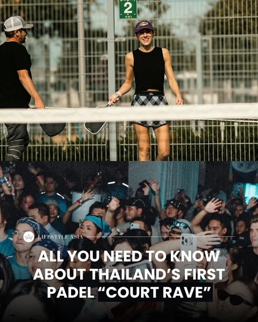

> A workout and a night out all in the same day? Count us in. An unconventional party that wraps up by 9pm? Even better. Padel has quickly bec…

🔗 https://www.instagram.com/p/DaRrxn-nKYi/

---

## @timeoutbangkok · 市集

**地點：** Khao 餐廳　**約會指數：** 9/10　**風格：** 浪漫、文青、熱鬧

**摘要：** Khao 餐廳是一家獲得米其林星的泰國餐廳，以精緻的傳統菜餚和優質食材聞名。餐廳在曼谷的 Ekkamai 和 Wireless Road 兩個地點均有營業，適合約會享受美食。

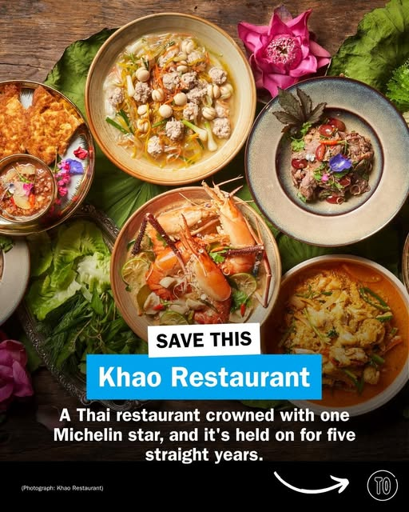

> The trouble with @khaogroup is you make peace with the fact you can't order everything. And what a menu it is. Thick, glossy and stacked wit…

🔗 https://www.instagram.com/p/DaRrqa0jjyG/

---

## @timeoutbangkok · 市集

**地點：** 泰國醫療旅遊　**約會指數：** 5/10　

**摘要：** 泰國被評選為全球第二佳醫療旅遊目的地，提供高品質的醫療服務和專業的醫療團隊。這裡的醫療旅遊適合對醫療需求有興趣的情侶，但不一定是傳統約會的選擇。

> Thailand has been named the world's second-best destination for medical tourism in Travel And Tour World's 2026 rankings 🌍 The list looks a…

🔗 https://www.instagram.com/p/DaRljQfm9TX/

---

## @lifestyleasiath · 旅遊

**地點：** BSC Cosmetology 與 Mama OK 合作的限量化妝品系列　**約會指數：** 6/10　**風格：** 時尚、創意

**摘要：** 這是一個結合泰國化妝品品牌與即食麵品牌的限量化妝品系列，展現了廚房與美容的創意融合。雖然沒有具體的活動時間，但這個獨特的合作值得關注，適合對美妝有興趣的約會對象。

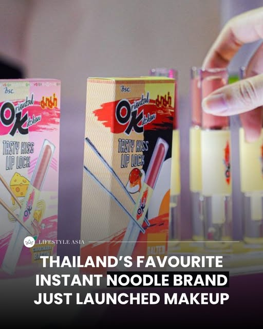

> In what might be the most unexpectedly delicious beauty collab of the year, Thai cosmetics powerhouse BSC Cosmetology has joined forces with…

🔗 https://www.instagram.com/p/DaReCrcHKpV/

---

## @richie_got_you · 旅遊

**地點：** Hua Chang Heritage Hotel　**約會指數：** 8/10　**風格：** 浪漫、靜謐

**摘要：** 這是一家位於曼谷的美麗精品酒店，適合約會或享受浪漫時光。可以透過 AGODA 預訂，並使用優惠碼獲得折扣。

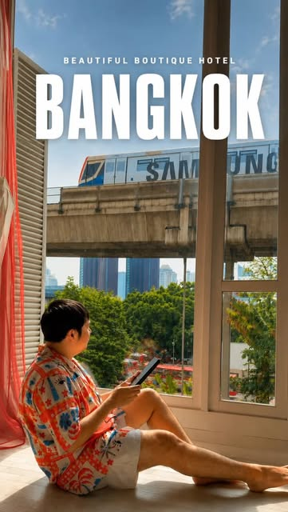

> Found a beautiful boutique hotel in Bangkok #agodaambassador #agodacreatorcommunity #agoda #bangkok #bangkokhotel 📍Hua Chang Heritage Hotel…

🔗 https://www.instagram.com/p/DaQSEJDTsuO/

---

## @aj_some_more · 旅遊

**地點：** Stella Palace　**約會指數：** 9/10　**風格：** 浪漫、美食、高空、放鬆

**摘要：** 這是一家位於曼谷 Baiyoke Sky Hotel 79 樓的中式自助餐廳，提供正宗的中華料理和壯觀的城市天際線景觀。沒有時間限制，非常適合約會時悠閒享用美食。

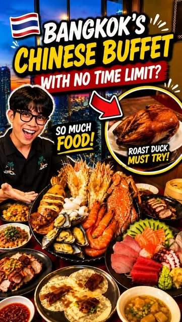

> 🇹🇭 I think I found one of Bangkok’s best Chinese buffets! 🥢✨ Enjoy authentic Chinese cuisine on the 79th floor while taking in breathtaki…

🔗 https://www.instagram.com/p/DaQJ7tQhH7N/

---

## @lifestyleasiath · 旅遊

**地點：** 電影院　**約會指數：** 6/10　**風格：** 熱鬧、娛樂

**摘要：** 這篇貼文提到七月的電影上映，適合喜歡看電影的約會對象。可以一起享受最新的電影作品，增進彼此的交流與互動。

> Spidey swings back to theaters this month. Here’s what to watch in cinemas this July. #LifestyleAsia #LifestyleAsiaTH

🔗 https://www.instagram.com/p/DaP2_zGE7x_/

---

## @lifestyleasiath · 旅遊

**地點：** 泰國　**約會指數：** 6/10　**風格：** 熱鬧、刺激

**摘要：** 這是一個以泰國為背景的節目，結合了辣味食物挑戰與真人秀元素，適合喜歡刺激的約會對象。雖然沒有具體的活動時間，但可以作為約會的話題或靈感。

> Good evening, islanders. On tonight's episode, we’re putting a Thai spin on one of reality television’s greatest guilty pleasures. Spicy foo…

🔗 https://www.instagram.com/p/DaPwhj0FXUO/

---

## @timeoutbangkok · 市集

**地點：** 曼谷河濱文青市集　**約會指數：** 7/10　**風格：** 文青、熱鬧、戶外

**摘要：** 這個市集提供多樣的活動，包括驕傲展覽和文具交換，非常適合週末放鬆。適合情侶一起參加，享受河邊的氛圍。

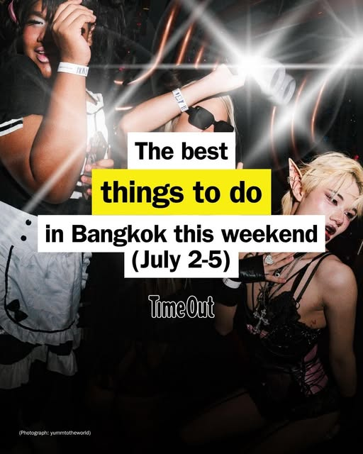

> From Pride exhibitions and stationery swaps to riverside psytrance and a park bench with your name on it, here's how to fill the weekend. 🔗…

🔗 https://www.instagram.com/p/DaPswLuG9AM/

---

## @timeoutbangkok · 市集

**地點：** 曼谷天際線電影活動　**約會指數：** 9/10　**風格：** 浪漫、戶外、文青

**摘要：** 這是一個在曼谷河濱舉辦的天際線電影活動，時間為7月9日至12日。活動將會播放各類型的電影，非常適合情侶在星空下享受浪漫時光。

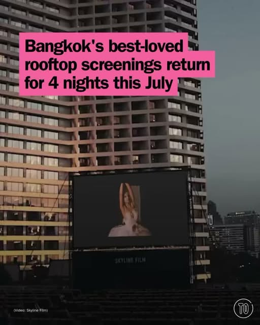

> July 9-12, Bangkok's skyline gets a movie date as @skylinefilmbkk returns to the rooftop of @rivercitycontemporary. The line-up is a proper …

🔗 https://www.instagram.com/p/DaPfWp2jN4i/

---

## @lifestyleasiath · 旅遊

**地點：** 居家觀影　**約會指數：** 5/10　**風格：** 放鬆、靜謐

**摘要：** 這是一個適合在家裡享受的觀影活動，適合和伴侶一起度過悠閒的時光。七月有很多精彩的串流內容可以觀看，非常適合約會。

> Stay in, snuggle up, and binge. Here’s what to watch on streaming this July. #LifestyleAsia #LifestyleAsiaTH

🔗 https://www.instagram.com/p/DaPczwPE9Qh/

---

## @timeoutbangkok · 市集

**地點：** ICONSIAM　**約會指數：** 9/10　**風格：** 熱鬧、時尚、購物

**摘要：** 這是一個名為 Boutiques Asia: The Bangkok Edition 2026 的市集，將於 7 月 24 至 26 日在 ICONSIAM 的 7 樓舉行。超過 120 個品牌參展，適合喜愛時尚和購物的約會對象。

> Singapore’s best-known independent shopping event is finally crossing the border 🛍️ After more than 20 years championing emerging labels th…

🔗 https://www.instagram.com/p/DaPNwooE-sC/

---

## @lifestyleasiath · 旅遊

**地點：** Conrad Bangkok　**約會指數：** 7/10　**風格：** 浪漫、時尚、節慶

**摘要：** Conrad Bangkok 剛推出了 2026 年的月餅系列「Wings of Harmony」，融合了傳統與現代設計，非常適合作為節慶贈禮或自用。這款系列是喜愛月餅的情侶或朋友之間的完美選擇。

> @conradbangkokhotel just dropped their 2026 Mooncake Collection, 'Wings of Harmony,' and we are officially obsessed. It’s the perfect mix of…

🔗 https://www.instagram.com/p/DaPHCixHCjY/

---

## @lifestyleasiath · 旅遊

**地點：** 溫布頓網球錦標賽　**約會指數：** 7/10　**風格：** 運動、熱鬧

**摘要：** 這是2026年的溫布頓網球錦標賽，兩位泰國選手在同一賽事中贏得了主賽的比賽，展現了泰國網球的崛起。這個活動適合熱愛運動的約會對象。

> For the first time in the Open Era, two Thai players have won Grand Slam main-draw matches at the same tournament, and both are through to r…

🔗 https://www.instagram.com/p/DaPGaJJnLSr/

---

## @aj_some_more · 旅遊

**地點：** Mahanakhon Skywalk　**約會指數：** 8/10　**風格：** 浪漫、戶外、旅遊

**摘要：** Mahanakhon Skywalk 是曼谷最具代表性的觀景點之一，提供壯觀的城市全景。這裡適合約會，尤其是喜歡戶外活動的情侶。票價和折扣碼可透過留言獲得。

> Getting to Mahanakhon Skywalk is easier than you think! 🇹🇭✨ Skip the confusion and follow this simple BTS walking guide to one of Bangkok’…

🔗 https://www.instagram.com/p/DaPC6vMSNCJ/

---

## @timeoutbangkok · 市集

**地點：** KFC Run 2026　**約會指數：** 8/10　**風格：** 熱鬧、戶外、運動

**摘要：** 這是一場以KFC為主題的跑步活動，參加者可以選擇5公里或10公里的賽程，跑完後可享受美味的炸雞獎勵。活動將於9月6日在Stadium One舉行，適合喜愛運動和美食的約會對象。

> This run doesn't just warm up your legs – it gets your appetite race-ready too 🍗🏃💨 'KFC Run 2026' turns sweat straight back into somethin…

🔗 https://www.instagram.com/p/DaO_quAG6DI/

---

## @lifestyleasiath · 旅遊

**地點：** 海邊　**約會指數：** 6/10　**風格：** 文青、夏日、輕鬆

**摘要：** 這是一則介紹適合夏天或海邊的有趣魚形包包的貼文。這些包包充滿玩趣，適合輕鬆的約會氛圍。

> A perfect accessory for the summer or the sea-side, here’s our pick of the fun, playful fish-shaped bags right now. #Fish #LifestyleAsia #Li…

🔗 https://www.instagram.com/p/DaO5Y5ynENf/

---

## @jiranarong2 · 展覽

**地點：** 220c 中餐廳　**約會指數：** 7/10　**風格：** 美食、熱鬧、家庭

**摘要：** 220c 是一家位於三ัคคี的廣東菜餐廳，主打正宗的港式燒鴨、脆皮豬和紅燒肉。這裡的菜品新鮮美味，適合與家人或朋友聚餐，但需要提前預訂的菜品也有。

> ในที่สุดแถวละแวกบ้านมีร้านอาหารจีนดีๆ อีกร้านแล้ว เป็นร้านจีนกวางตุ้ง เชฟเป็นคนฮ่องกง จริงๆ เชฟอยู่ไทยมานานแล้ว ถ้าบอกว่าเคยเป็นเชฟร้านโจ๊กฮ…

🔗 https://www.instagram.com/p/DaNtlsfk1Rz/

---

## @richie_got_you · 旅遊

**地點：** 湄南河沿岸　**約會指數：** 8/10　**風格：** 浪漫、靜謐、戶外

**摘要：** 這裡是湄南河沿岸，適合欣賞河景和享受浪漫時光。非常適合約會，特別是傍晚時分。無明確的結束日期。

> Bangkok and the view of along Chao Phraya River #bangkok #bangkokthailand #bangkoktravel

🔗 https://www.instagram.com/p/DaNpoZxzlZq/

---

## @aj_some_more · 旅遊

**地點：** 泰國水果節　**約會指數：** 8/10　**風格：** 熱鬧、美食、戶外

**摘要：** 這是一個在曼谷舉辦的泰國水果節，提供創意的鹹食、清爽的飲品和美味的甜點。活動僅限於8月31日前，適合喜愛美食的約會對象。

> 🇹🇭 I never thought Thai fruits could be transformed into dishes like these! 🤯🍽️ If you’re looking for a unique food experience in Bangko…

🔗 https://www.instagram.com/p/DaNgzd-yIM6/

---

## @goplaybangkok · 旅遊

**地點：** Mother Roaster　**約會指數：** 8/10　**風格：** 文青、浪漫、靜謐

**摘要：** Mother Roaster 是一家由70歲奶奶經營的廢墟咖啡廳，提供手沖咖啡，營業時間為每日 09:00 – 17:00。這裡不僅適合拍照打卡，還能享受濃郁的咖啡香氣，適合咖啡愛好者和約會。

> \ #曼谷老城區超酷廢墟咖啡・老奶奶經營的 Mother Roaster 👵☕ / 「不要浪費剩餘的時間，鼓勵自己來外面學習新知，並且要做自己愛做的事」就是這樣的想法激發了一位70歲的奶奶 Mrs.Pim，讓她在遲暮之年做了個大膽決定，在石龍軍路上的老屋二樓開了咖啡廳，實現她自…

🔗 https://www.instagram.com/p/DaNgAb_SYmO/

---

## @lifestyleasiath · 旅遊

**地點：** Marche’ Thonglor　**約會指數：** 8/10　**風格：** 文青、熱鬧、浪漫

**摘要：** Marche’ Thonglor 新推出的白天咖啡概念，提供多樣飲品和糕點，非常適合約會。這裡的氛圍輕鬆愉快，適合享受悠閒的午後時光。

> LSA Events Recap: Here’s our event recap from 1-30 June 2026. 1. SIWILAI RADICAL CLUB has launched its daytime cafe concept at Marche’ Thong…

🔗 https://www.instagram.com/p/DaNZHtlEwC7/

---

## @lifestyleasiath · 旅遊

**地點：** 曼谷　**約會指數：** 5/10　

**摘要：** 這則貼文提到曼谷市長查德查特·西提蓬在選舉中獲勝，並提出了他的政策計畫。雖然沒有具體的約會地點，但曼谷本身是一個充滿活力的城市，適合探索和約會。

> After winning Sunday’s election by a landslide, we list out some of the major and ambitious policies Chadchart Sittipunt has proposed for hi…

🔗 https://www.instagram.com/p/DaNSg8WlV42/

---

## @timeoutbangkok · 市集

**地點：** MMAD Gallery 1　**約會指數：** 8/10　**風格：** 文青、藝術、靜謐

**摘要：** 這是一個名為「Pillow」的藝術展，展出藝術家 Sittha Jantharawong 的作品，探討失眠與內心的掙扎。展覽時間為7月9日至8月23日，入場免費，非常適合喜愛藝術的約會對象。

> Cool art might come from the worst nights 🌙 Pillow, the debut solo show from Sittha Jantharawong, better known as @hommes.hom, gathers up t…

🔗 https://www.instagram.com/p/DaNKs84GxTt/

---

## @timeoutbangkok · 市集

**地點：** 曼谷藝術雙年展 2026　**約會指數：** 9/10　**風格：** 文青、熱鬧、藝術

**摘要：** 曼谷藝術雙年展 2026 將於 2026 年 10 月 26 日至 2027 年 2 月 28 日舉行，展出來自泰國及全球的當代藝術作品。這是一個充滿創意與討論的藝術盛會，非常適合約會時一起探索藝術的情侶。

> Bangkok Art Biennale 2026 is rolling back into town, and this one is built around a theme with plenty of bite. A fresh wave of artists from …

🔗 https://www.instagram.com/p/DaM06CRm_hV/

---

## @timeoutbangkok · 市集

**地點：** Seren Le Moment　**約會指數：** 8/10　**風格：** 浪漫、靜謐、奢華

**摘要：** Seren Le Moment 是一家位於曼谷的奢華美容中心，提供專業的皮膚護理服務，讓你在私密的環境中享受放鬆的時光。這裡適合約會，特別是對於喜歡美容護理的伴侶。

> The first thing they do is look at your face. Really look at it. 20 years of Parisian expertise, serious actives and a private room entirely…

🔗 https://www.instagram.com/p/DaMpGrZm7vM/

---

## @lifestyleasiath · 旅遊

**地點：** UOB LIVE　**約會指數：** 8/10　**風格：** 熱鬧、音樂、浪漫

**摘要：** 這是一場 Zara Larsson 的音樂會，將於 2026 年 11 月 1 日在 UOB LIVE 舉行。票價從 2,800 泰銖起，非常適合喜愛音樂的情侶約會。

> Looks like we’re living the lush life. Zara Larsson is bringing her infectious pop anthems to Bangkok later this year. The concert takes pla…

🔗 https://www.instagram.com/p/DaMkpbQz37j/

---

## @lifestyleasiath · 旅遊

**地點：** DFA 亞洲設計獎 2026　**約會指數：** 5/10　**風格：** 創意、專業、國際

**摘要：** 這是DFA亞洲設計獎的徵件活動，邀請設計師和品牌參加，截止日期為7月15日。此活動適合對設計有興趣的情侶參加，能夠感受創意氛圍。

> Exceptional design deserves recognition ✨ The DFA Design for Asia Awards 2026 submissions is now extending until 15 July, inviting designers…

🔗 https://www.instagram.com/p/DaMUbennJNE/

---

## @richie_got_you · 旅遊

**地點：** Cocoon BKK　**約會指數：** 7/10　**風格：** 熱帶、浪漫

**摘要：** 這是一家位於曼谷的酒店，擁有熱帶風情的氛圍，非常適合情侶約會。酒店的環境舒適，讓人放鬆。

> Found a hotel in Bangkok with tropical vibes #bangkok #bangkokthailand #bangkoktravel 📍Cocoon BKK

🔗 https://www.instagram.com/p/DaLJZQXT3mP/

---

## @lifestyleasiath · 旅遊

**地點：** 曼谷藝術島節　**約會指數：** 7/10　**風格：** 熱鬧、戶外

**摘要：** 這是曼谷的一個藝術島節，將於2026年6月29日至7月5日舉行。活動適合喜愛藝術和熱鬧氛圍的約會對象。

> From a night of line dancing to the Art Island festival, here are the best things to do in Bangkok from 29 June to 5 July 2026. Tap the link…

🔗 https://www.instagram.com/p/DaKvJqPk_mT/

---

## @aj_some_more · 旅遊

**地點：** 曼谷　**約會指數：** 7/10　**風格：** 文青、熱鬧

**摘要：** 這則貼文提到泰國曼谷，鼓勵人們分享對這個城市的印象，並提供旅遊建議。適合喜歡探索城市的約會對象。

> 🇹🇭 Tell me you’re in Bangkok without telling me you’re in Bangkok. 👀 What’s the first thing that comes to your mind? 🇹🇭😂 Comment “Bang…

🔗 https://www.instagram.com/p/DaKpaiXy7yB/

---

## @timeoutbangkok · 市集

**地點：** 曼谷午夜陽光音樂會　**約會指數：** 8/10　**風格：** 熱鬧、音樂、浪漫

**摘要：** 這是一場由 @zaralarsson 帶來的音樂會，將於11月1日在曼谷舉行。票價範圍從B2,800到B3,900，VIP套票為B9,000，非常適合音樂愛好者的約會選擇。

> Bangkok pop season is not slowing down 🌺🐬 @zaralarsson is bringing the Midnight Sun Tour to @uoblive_bangkok on November 1. Named after th…

🔗 https://www.instagram.com/p/DaKpTs7G_x6/

---

## @timeoutbangkok · 市集

**地點：** Issara餐廳　**約會指數：** 8/10　**風格：** 文青、浪漫、熱鬧

**摘要：** Issara餐廳是普吉島最新的熱點，由一位大廚和一位調酒師兄弟共同經營，提供結合歐洲技術與亞洲風味的美食體驗。這裡的每一道菜和每一杯雞尾酒都經過精心設計，非常適合約會。

> Issara (@issara.phuket) is Phuket’s newest obsession. A restaurant that brings together two brothers – a MasterChef-winning chef and an acco…

🔗 https://www.instagram.com/p/DaKSCGRnHhE/

---

## @timeoutbangkok · 市集

**地點：** 曼谷　**約會指數：** 5/10　

**摘要：** 這則貼文慶祝查特查特連任曼谷市長，展現了曼谷市民的信心。雖然沒有具體的約會地點，但曼谷本身是一個充滿活力的城市，適合約會。

> Congratulations Governor! Chadchart wins a landslide vote for a second term. More than a million votes from the people of Bangkok seal Chadc…

🔗 https://www.instagram.com/p/DaKKcVNGxEy/

---

## @timeoutbangkok · 市集

**地點：** EKM6　**約會指數：** 8/10　**風格：** 文青、靜謐、戶外

**摘要：** EKM6 是一個位於 Ekkamai Soi 6 的社區商場，提供植物性產品、咖啡和活動空間，適合想要放鬆和親近自然的城市居民。這裡每天營業，開放時間為早上 8 點到晚上 8 點，非常適合約會。

> Right now, the trend of plant-based eating and sustainable living is becoming increasingly popular among urban people. Today, we would like …

🔗 https://www.instagram.com/p/DaJ2iUADCdN/

---

## @aj_some_more · 旅遊

**地點：** 昭披耶河公船　**約會指數：** 8/10　**風格：** 文青、戶外、浪漫

**摘要：** 搭乘昭披耶河公船是探索曼谷的便宜且風景優美的方式。只需 40 泰銖即可享受河上美景，非常適合約會。還可以選擇購買 1 天無限次搭乘的通行證。

> 🚤 Explore Bangkok for just 40 THB! 🇹🇭 One of the cheapest and most scenic ways to see the city. Hop on the public boat from Sathorn Pier …

🔗 https://www.instagram.com/p/DaJzB0qyfo1/

---

## @lifestyleasiath · 旅遊

**地點：** 2027 PUMA HYROX 世界錦標賽　**約會指數：** 7/10　**風格：** 熱鬧、運動

**摘要：** 這是一個即將在香港舉辦的運動盛事，2027 PUMA HYROX 世界錦標賽將於明年舉行。適合喜愛運動和熱鬧氣氛的約會。

> Hong Kong is set to host the 2027 PUMA HYROX World Championships a year from now. From dates and what to expect, here’s all you need to know…

🔗 https://www.instagram.com/p/DaJvr-vHMQZ/

---

## @aj_some_more · 旅遊

**地點：** 曼谷　**約會指數：** 7/10　**風格：** 熱鬧、探索

**摘要：** 這篇貼文提到曼谷充滿驚喜，是個適合探索的旅遊地點。若你喜歡熱鬧的氛圍，這裡非常適合約會。

> Bangkok is full of surprises 🇹🇭🌈 Follow ➡️ @aj.some.more for more Bangkok content

🔗 https://www.instagram.com/p/DaIE8qzSa_4/

---

## @lifestyleasiath · 旅遊

**地點：** 健身房　**約會指數：** 5/10　**風格：** 運動、時尚

**摘要：** 這則貼文探討了健身房的時尚穿搭，並提到奢侈品牌也開始進軍健身與健康領域。雖然主題偏向運動，但健身房的氛圍也可以成為約會的選擇之一。

> As even luxury fashion houses are tapping into the fitness and wellness space, what you may wear to the gym is becoming increasingly varied.…

🔗 https://www.instagram.com/p/DaIB-0Nlvon/

---

## @lifestyleasiath · 旅遊

**地點：** 倫敦音樂會　**約會指數：** 7/10　**風格：** 熱鬧、音樂、時尚

**摘要：** 這是一場倫敦的音樂會，充滿了熱鬧的氛圍和時尚的元素。適合喜歡音樂和社交的約會對象。

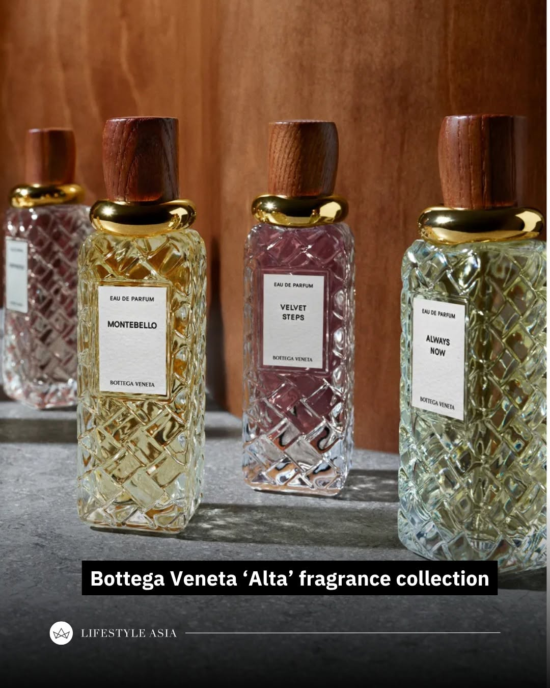

> From a viral mini camera to a London concert look, here are our #WeeklyObsessions this week. #LifestyleAsia #LifestyleAsiaTH

🔗 https://www.instagram.com/p/DaHRyflHHRs/

---

## @jiranarong2 · 展覽

**約會指數：** 1/10　

**摘要：** 這則貼文沒有提供具體的地點或活動資訊，因此無法判斷其約會適合度。

> ฉันมีความสุข

🔗 https://www.instagram.com/p/DaGHpNmz4d3/

---

## @timeoutbangkok · 市集

**地點：** 曼谷經典紀念品　**約會指數：** 5/10　**風格：** 文青、懷舊

**摘要：** 這篇貼文提到曼谷的經典紀念品，喚起了許多人對於旅行的回憶。雖然沒有具體的活動或地點，但這樣的話題適合與伴侶分享旅行經歷，增進感情。

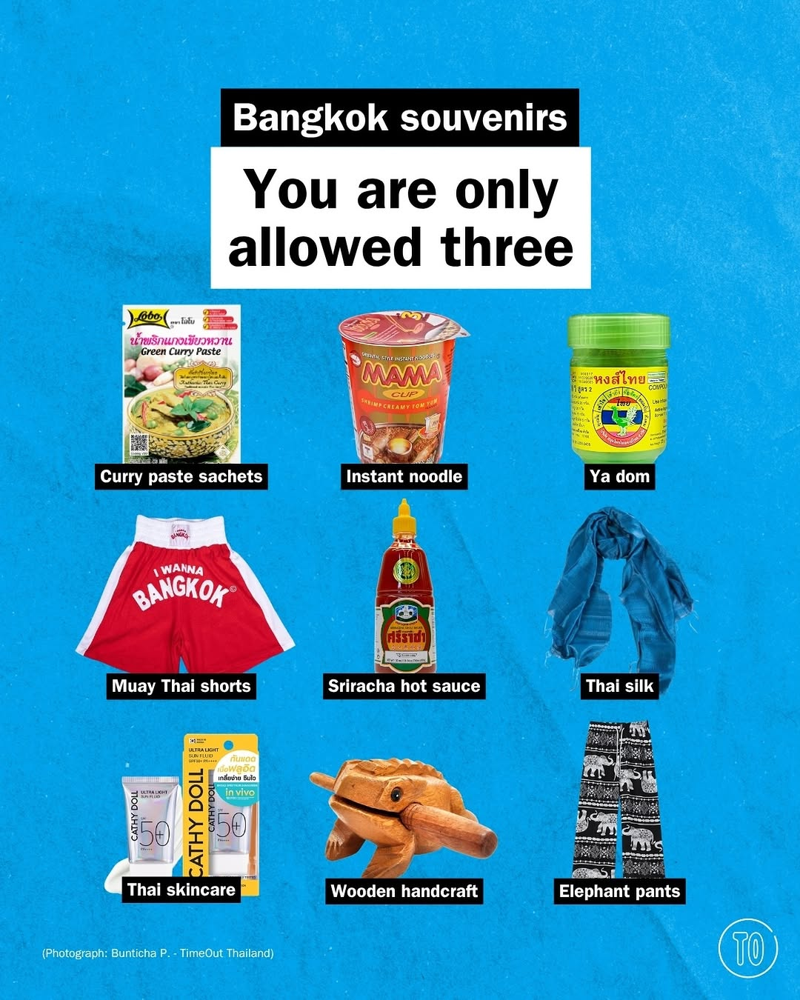

> Who remembers snatching these classic Bangkok souvenirs? 🙋‍♀️ Every trip to Bangkok used to come with at least one of these iconic picks – …

🔗 https://www.instagram.com/p/DaFn_qLzZKk/

---

## @timeoutbangkok · 市集

**地點：** 曼谷劇場節　**約會指數：** 9/10　**風格：** 文青、熱鬧、藝術

**摘要：** 曼谷劇場節將於11月14日至29日舉行，這是一個集合各種藝術表演的盛會，適合喜愛藝術和表演的人士前來參加。活動地點包括曼谷藝術文化中心等，十分熱鬧，適合約會。

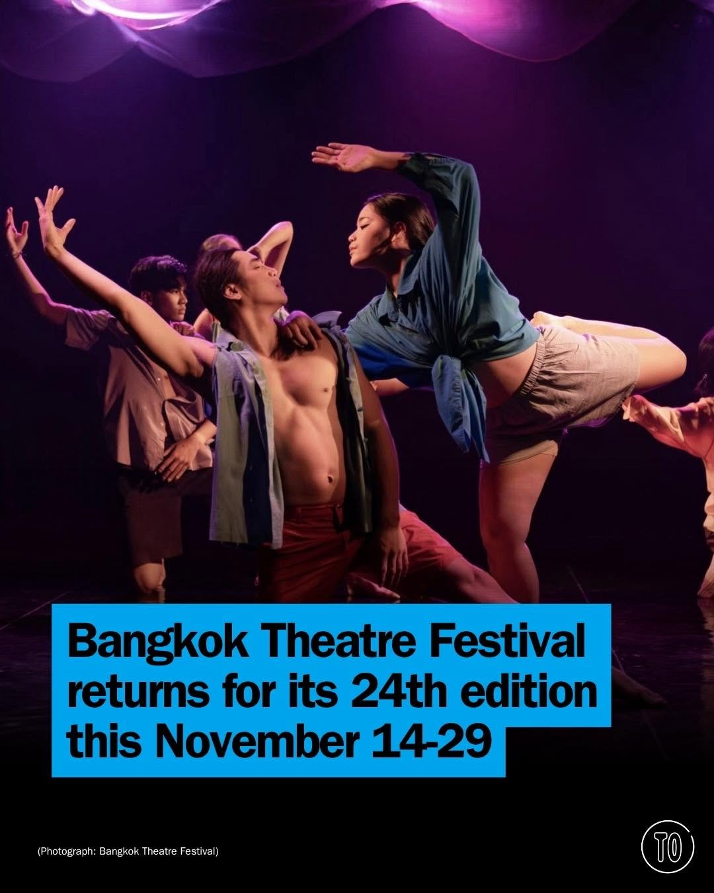

> At the end of this year Bangkok turns itself over to imagination once more, with a festival that gathers everyone to celebrate the thrill of…

🔗 https://www.instagram.com/p/DaFJspbm1Ax/

---

## @timeoutbangkok · 市集

**地點：** 曼谷市集　**約會指數：** 7/10　**風格：** 熱鬧、文青

**摘要：** 這是一個充滿活力的市集，適合喜歡書籍和周邊商品的人。建議攜帶雨傘和現金，適合約會時一起探索。

> July looks busy, then. Carry an umbrella, keep some cash for books and merch and expect your weekends to fill up quickly. 🔗 Tap the link in…

🔗 https://www.instagram.com/p/DaExwifmw2d/

---

## @lifestyleasiath · 旅遊

**地點：** 曼谷　**約會指數：** 9/10　**風格：** 熱鬧、音樂、娛樂

**摘要：** K-pop 男團 Stray Kids 將於 2027 年在曼谷舉行「Run It」世界巡演。這是一個適合喜愛音樂和演出的約會活動，詳細資訊可透過連結查詢。

> K-pop boyband Stray Kids (@realstraykids) is bringing their “Run It” World Tour to Bangkok this 2027. Here’s what we know. Tap the link in b…

🔗 https://www.instagram.com/p/DaEmAqenKhA/

---

## @lifestyleasiath · 旅遊

**地點：** 南邦慢旅行　**約會指數：** 7/10　**風格：** 文青、靜謐、文化

**摘要：** 這篇文章介紹了在泰國南邦的慢旅行，鼓勵人們以放鬆的心態探索當地文化。適合喜愛深度旅遊的情侶，享受靜謐的氛圍。

> Welcome to “A Local’s Guide to Thailand,” a column where we explore one travel philosophy through a Thai lens. Each month, we share an itine…

🔗 https://www.instagram.com/p/DaDNRgmGLs8/

---

## @jiranarong2 · 展覽

**地點：** บ้านสุริยน　**約會指數：** 8/10　**風格：** 文青、浪漫、靜謐

**摘要：** 這是一家位於泰國的餐廳，專注於海鮮料理，並有著百年歷史的古老建築。餐廳環境優雅，適合家庭聚餐或約會，享受美味的泰國料理。

> ร้านบ้านสุริยนที่ศรีราชา เปิดมาตั้งแต่ พศ 2502 แต่เพิ่งเคยมาปีนี้ครั้งแรก 55 ที่นี่น่าจะเป็นบ้านตากอากาศตั้งแต่สมัย ร.5 ยื่นออกไปในทะเลมีบัง…

🔗 https://www.instagram.com/p/DaDJ2QdkxhQ/

---

## @timeoutbangkok · 市集

**地點：** 曼谷夜間卡拉OK　**約會指數：** 8/10　**風格：** 熱鬧、戶外、文青

**摘要：** 這篇貼文介紹了曼谷的夜間卡拉OK和餐廳酒吧，適合喜歡唱歌和熱鬧氛圍的約會對象。無論是日式連鎖店還是泰國本地的卡拉OK房，都能讓你享受一個充滿樂趣的夜晚。

> Bangkok knows how to turn a night out into a singalong 🎤🕺🎶 From Japanese chains to all-night Thai karaoke rooms and restaurant-bars with …

🔗 https://www.instagram.com/p/DaC5j60m7DT/

---

## @lifestyleasiath · 旅遊

**地點：** 哈利波特主題活動　**約會指數：** 6/10　**風格：** 文青、熱鬧

**摘要：** 這是一個與哈利波特相關的主題活動，適合對魔法世界感興趣的人。雖然與世界盃無關，但仍然可以吸引許多粉絲。適合喜歡電影和文化的約會對象。

> If perhaps you don’t really get the World Cup but are well-versed in the Wizarding World, we’ve made a helpful explainer for you. (Images: W…

🔗 https://www.instagram.com/p/DaC4fCRmFyj/

---

## @lifestyleasiath · 旅遊

**地點：** 曼谷　**約會指數：** 6/10　**風格：** 熱鬧、城市

**摘要：** 這篇貼文提到曼谷即將舉行州長選舉，選舉日為6月28日。這是一個熱鬧的城市活動，適合對當地政治或社會議題感興趣的約會對象。

> Bangkok is set to elect a new governor this Sunday (28 June). Here’s what to be prepared for between now and election day.

🔗 https://www.instagram.com/p/DaCqf0Zk0Sk/

---

## @lifestyleasiath · 旅遊

**地點：** 富國島　**約會指數：** 7/10　**風格：** 靜謐、浪漫、旅遊

**摘要：** 這篇貼文介紹了富國島，強調了一種悠閒的生活方式。適合喜愛放鬆和享受自然的約會對象。這裡是個理想的旅遊地點。

> For this edition of #LSALongWeekend, we head to Phu Quoc to embrace a slower way of life. #AnOdeToSpain #PhuQuoc #TravelVlog #LifestyleAsia …

🔗 https://www.instagram.com/p/DaCjh5gTj2g/

---

## @timeoutbangkok · 市集

**地點：** 曼谷河濱市集　**約會指數：** 8/10　**風格：** 文青、熱鬧、戶外

**摘要：** 這是一個在曼谷河濱舉辦的市集，聚集了超過50個攤位，販售二手服裝、復古物品和手作作品。市集於6月27日至28日舉行，入場免費，非常適合約會後一起逛逛藝術展覽。

> Clear a little space in your wardrobe and make a beeline for Whatever You Art 🛍️ This weekend market brings together influencers, artists, …

🔗 https://www.instagram.com/p/DaCjjbbG4nf/

---

## @timeoutbangkok · 市集

**地點：** 曼谷　**約會指數：** 6/10　**風格：** 熱鬧、市集

**摘要：** 這篇貼文提到曼谷在選舉日的禁酒令，從6月27日下午6點到6月28日下午6點，市內所有酒吧、餐廳等都不能販售酒精。適合在選舉後的聚會中享受熱鬧的氛圍，但在禁酒期間不適合約會。

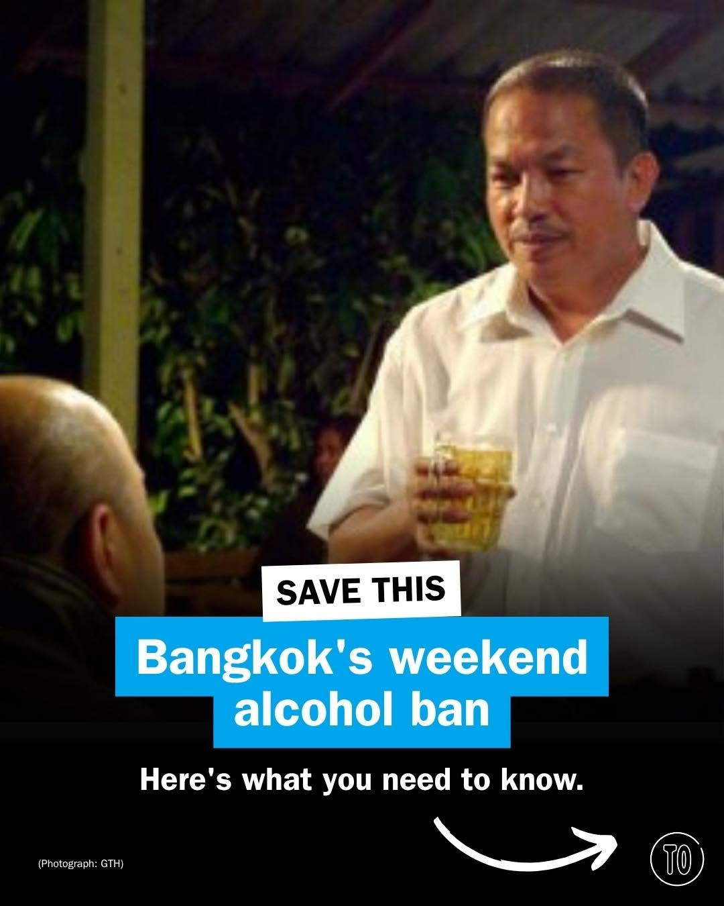

> Pick your leader with a clear head, Bangkok 🗳️ Just as Thailand scraps the afternoon drinking ban, Bangkok gets one more dry spell for elec…

🔗 https://www.instagram.com/p/DaCUDK-m1_B/

---

## @aj_some_more · 旅遊

**地點：** Wat Paknam Phasi Charoen　**約會指數：** 8/10　**風格：** 文青、浪漫、戶外

**摘要：** 這是一個位於曼谷的免費寺廟拍照景點，擁有壯觀的大佛景觀，非常適合拍照留念。這個地點適合約會，特別是喜歡戶外活動的情侶。

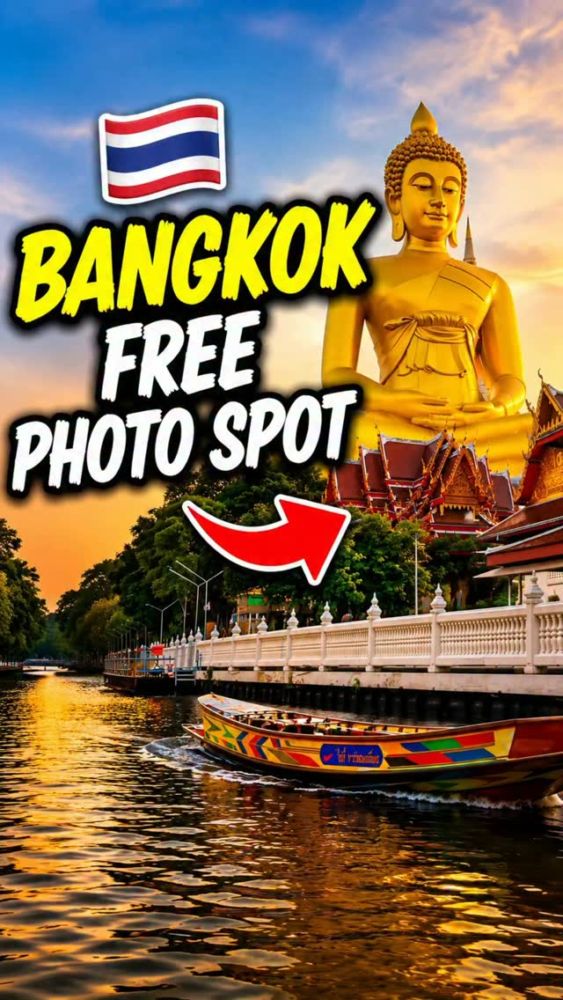

> 📍A FREE temple photo spot in Bangkok that looks straight out of a postcard! 🇹🇭✨ If you’re visiting Bangkok, don’t miss this iconic view o…

🔗 https://www.instagram.com/p/DaCLBnZBzIT/

---

## @timeoutbangkok · 市集

**地點：** 曼谷河濱市集　**約會指數：** 9/10　**風格：** 文青、熱鬧、戶外

**摘要：** 這個週末，曼谷河濱市集將舉辦曼谷藝術漫遊，展出超過50位泰國及國際藝術家的作品。活動時間為6月26日至28日，每天下午2點到晚上11點，非常適合約會。

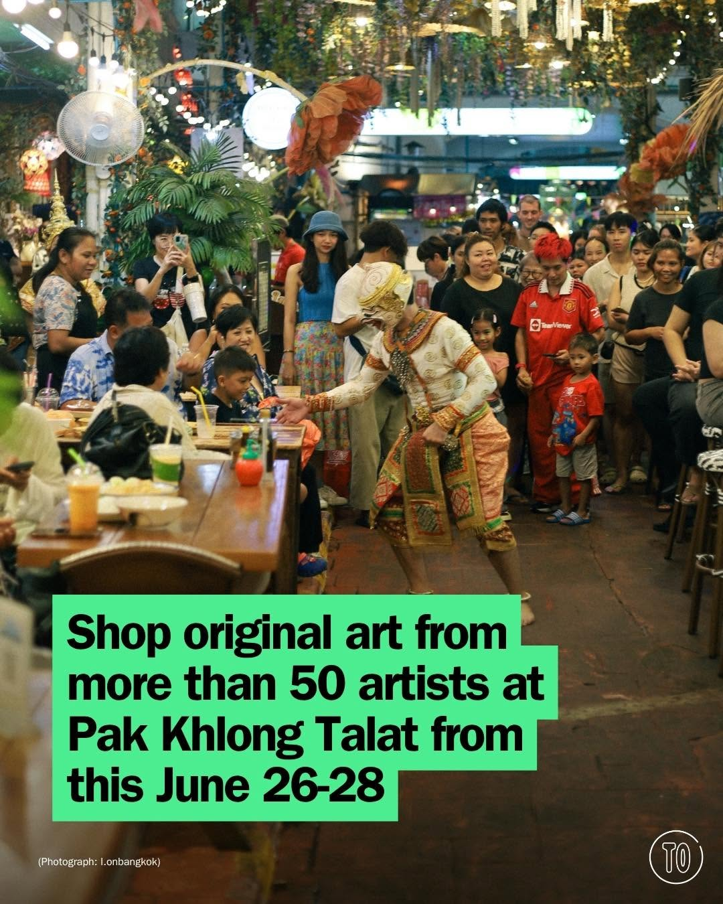

> Pak Khlong Talat does flowers better than anywhere else in Bangkok, but this weekend its famous blooms get unexpected company 🌸Bangkok Art …

🔗 https://www.instagram.com/p/DaCH2MrG_Wo/

---

## @lifestyleasiath · 旅遊

**地點：** Disney+　**約會指數：** 5/10　**風格：** 娛樂、輕鬆

**摘要：** 這則貼文提到《The Bear》在 Disney+ 上推出第五季，適合喜歡追劇的情侶一起享受。雖然是線上平台，但可以在家中輕鬆約會，享受劇集帶來的娛樂。無明確結束日期。

> The Bear returns with Season 5 today (26 June 2026), with all eight episodes dropping at 9am (Thailand time) on Disney+. To celebrate the ac…

🔗 https://www.instagram.com/p/DaCBV1NnHL7/

---

## @richie_got_you · 旅遊

**地點：** 曼谷萬豪行政公寓　**約會指數：** 6/10　**風格：** 浪漫、靜謐

**摘要：** 這是一家位於曼谷的萬豪行政公寓，適合尋找舒適住宿的旅客。該公寓提供高品質的服務，非常適合情侶約會或短期度假。

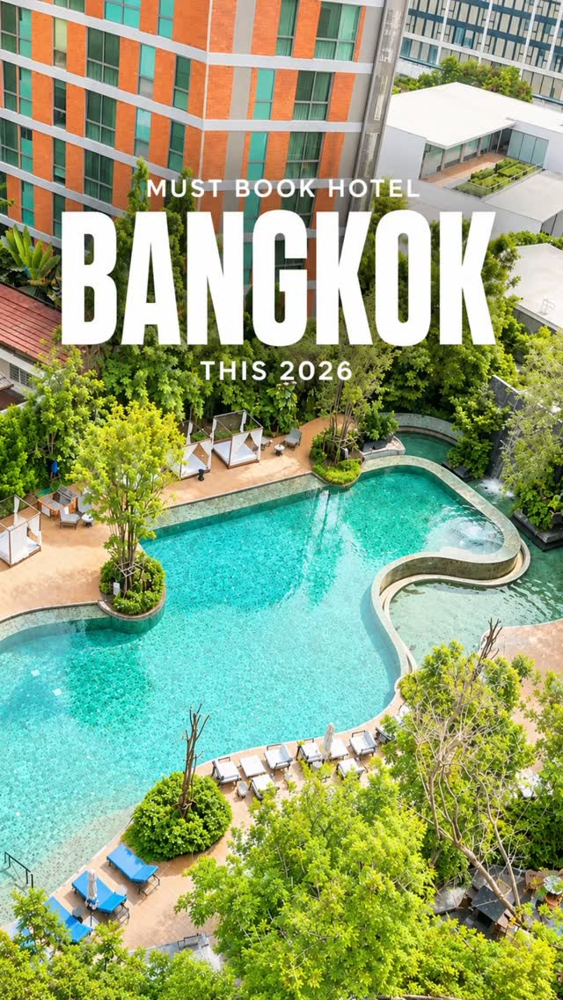

> Looking for a Bangkok hotel that’s worth booking? Check out Marriott Executive Apartments, Bangkok Townhall Sukhumvit #agodacreatorcommunity…

🔗 https://www.instagram.com/p/DaAwfEbTjcP/

---

## @goplaybangkok · 旅遊

**地點：** Luxnara Jewelry CentralWorld　**約會指數：** 8/10　**風格：** 文青、浪漫、熱鬧

**摘要：** Luxnara 是位於曼谷 Central World 的人氣手作品牌，專賣經過四面佛祈福的許願手鍊。店內目前有買四送一的優惠，非常適合與朋友一起前來挑選，增添旅程的儀式感與好運。

> \ #CentralWorld必逛手作品牌・曼谷四面佛加持的超人氣許願手鍊🪄🔮 / 很多朋友會問，四面佛到底該怎麼拜❓ ​其實泰國當地人在參拜時，並沒有硬性規定哪一面要拜什麼，只要誠心祈求，那份心意就是與神佛最好的連結🙏 ​ 而近年很流行的一種參拜方式，就是 #帶著許願手鍊…

🔗 https://www.instagram.com/p/DaAoCOIEtqR/

---

## @timeoutbangkok · 市集

**地點：** 曼谷美食市集　**約會指數：** 8/10　**風格：** 熱鬧、美食、戶外

**摘要：** 這個週末的曼谷美食市集提供多樣的美食選擇，包括北泰式特色的貝果和多種創意料理。適合約會的地方，享受美食與熱鬧的氛圍。

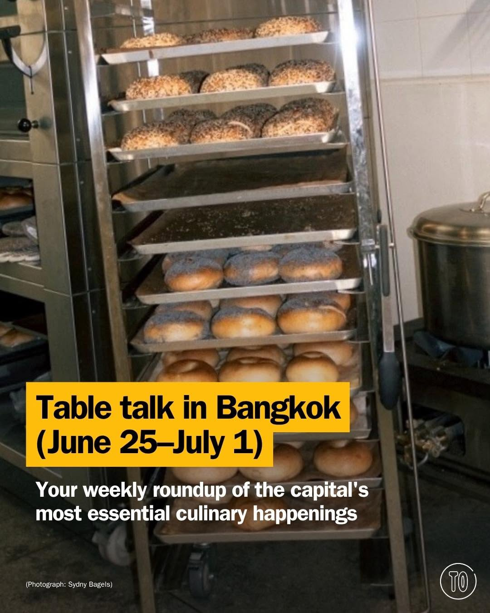

> This week's food news takes us from bagels and doughnuts to tomatoes, durian and duck. Sydny Bagels (@sydnybagels) is serving a orthern Thai…

🔗 https://www.instagram.com/p/DaAgVCwG9lZ/

---

## @lifestyleasiath · 旅遊

**地點：** 泰國　**約會指數：** 5/10　

**摘要：** 這篇貼文提到德國-尼日利亞足球員 Maduka Okoye 在泰國的活動建議。雖然沒有具體的約會地點，但可以作為旅遊參考，適合喜歡足球的情侶。

> In case you haven’t heard: Maduka Okaye is in Thailand. Naturally, we came up with five things for the German-Nigerian footballer to do duri…

🔗 https://www.instagram.com/p/DaAdm0OlVCu/

---

## @lifestyleasiath · 旅遊

**地點：** 泰國同志選美大賽　**約會指數：** 7/10　**風格：** 熱鬧、多元、慶祝

**摘要：** 這是泰國首屆專為 toms 和跨性別男性舉辦的選美大賽，旨在慶祝驕傲月。活動詳情可透過帳號中的連結查詢，適合喜愛多元文化的約會對象參加。

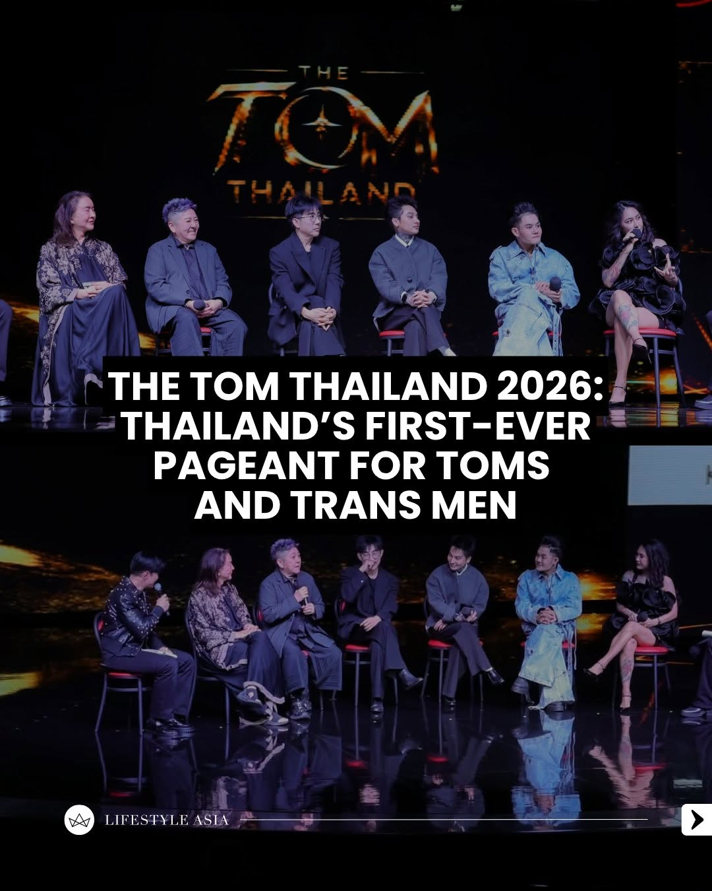

> Happy Pride Month, readers. It’s here and it’s queer: The Tom Thailand 2026, the country’s first-ever national pageant dedicated to toms and…

🔗 https://www.instagram.com/p/DaATuaiFnBY/

---

## @timeoutbangkok · 市集

**地點：** House Samyan　**約會指數：** 8/10　**風格：** 文青、熱鬧、浪漫

**摘要：** House Samyan 影城慶祝 22 週年，整個 7 月都有特別活動和電影放映，包含韋斯·安德森的經典電影《皇家特能班》。這是一個適合電影愛好者的好去處，享受電影的同時也能感受到浪漫的氛圍。

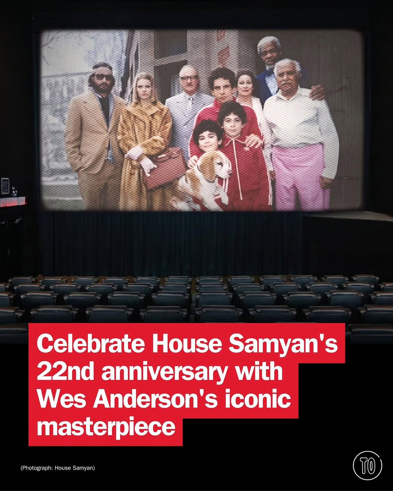

> House Samyan turns 22, and the party runs all July long 🎥 The Bangkok cinema marks its anniversary with a month of special activities, hand…

🔗 https://www.instagram.com/p/DZ__z44m5MY/

---

## @lifestyleasiath · 旅遊

**地點：** 倫披尼公園　**約會指數：** 7/10　**風格：** 戶外、文青

**摘要：** 這則貼文提到在曼谷最古老的倫披尼公園慶祝《龍之家族》第三季的首映。這裡適合喜歡戶外活動和文青氛圍的約會對象。

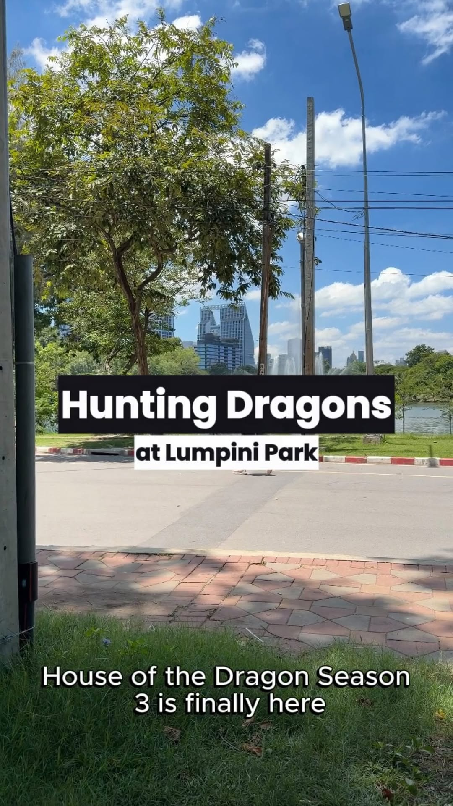

> Westeros? Nah, Lumpini Park. We go hunting for dragons in Bangkok’s oldest park to celebrate the premiere of ‘House of the Dragon’ Season 3.…

🔗 https://www.instagram.com/p/DZ__aQbTzeH/

---

## @timeoutbangkok · 市集

**地點：** 曼谷自行車騎行路線　**約會指數：** 7/10　**風格：** 戶外、文青

**摘要：** 這篇貼文介紹了曼谷的自行車騎行路線，適合喜愛戶外活動的情侶。騎行可以探索城市的綠地和專用車道，是一個健康又有趣的約會選擇。

> Bangkok has never been more rideable 🚴‍♂️🚴‍♀️ With dedicated park lanes, purpose-built circuits and pockets of traffic-free green space sp…

🔗 https://www.instagram.com/p/DZ_wYn1k-TN/

---

## @aj_some_more · 旅遊

**地點：** 哈德克隆欣海灘　**約會指數：** 8/10　**風格：** 靜謐、浪漫、戶外

**摘要：** 這是泰國的一個美麗海灘，擁有清澈的水和柔軟的白沙，非常適合放鬆和約會。這裡的環境非常寧靜，適合享受浪漫時光。

> 🏝️ My favorite beach in Thailand? It has to be this one. 🤍🌊 Crystal-clear water, soft white sand, and one of the most peaceful beaches I’…

🔗 https://www.instagram.com/p/DZ_pE1bSW9p/

---

## @timeoutbangkok · 市集

**地點：** Siam Square Walking Street　**約會指數：** 9/10　**風格：** 熱鬧、戶外、青春

**摘要：** 這是一個在Siam Square Walking Street舉辦的每月街舞之夜，首次活動將於6月27日舉行，並且完全免費。活動包括戶外舞蹈課程和表演，非常適合約會和享受熱鬧的氛圍。

> See you on the dancefloor at @siamsquareofficial this Friday 💃? Bangkok's iconic youth district is launching a new monthly street dance nig…

🔗 https://www.instagram.com/p/DZ_jHpfm7TY/

---

## @lifestyleasiath · 旅遊

**地點：** 狗狗與手袋活動　**約會指數：** 6/10　**風格：** 文青、熱鬧

**摘要：** 這是一個專為狗狗愛好者和手袋迷設計的活動，適合喜歡寵物和時尚的人士參加。活動內容充滿趣味，適合約會。

> If dogs are your best friends and handbags are a close second, this is for you. #DogLovers #HandBags #LifestyleAsia #LifestyleAsiaTH

🔗 https://www.instagram.com/p/DZ_cjBCFQ0R/

---

## @aj_some_more · 旅遊

**地點：** 白喬克天空酒店　**約會指數：** 9/10　**風格：** 浪漫、靜謐、高空

**摘要：** 這是一家位於曼谷的高級酒店，提供壯觀的城市景觀和美味的中式自助餐。特別適合情侶約會，享受浪漫的日落時光。

> I stayed in Bangkok’s tallest hotel and the views were absolutely worth it 🤩 From the Panorama Suite and breakfast on the 81st floor to a p…

🔗 https://www.instagram.com/p/DZ-LRUthQih/

---

## @timeoutbangkok · 市集

**地點：** 曼谷　**約會指數：** 7/10　**風格：** 熱鬧、戶外

**摘要：** 這篇貼文提到曼谷的周末活動，適合喜歡熱鬧氛圍的約會對象。雖然沒有具體的活動名稱，但可以期待多樣的市集和活動。

> Still dithering? Bangkok rarely makes choosing easy. Lucky that's what weekends are for. 🔗 Tap the link in @timeoutbangkok’s bio to read it…

🔗 https://www.instagram.com/p/DZ91fu0GxDP/

---

## @lifestyleasiath · 旅遊

**地點：** Diptyque　**約會指數：** 5/10　**風格：** 時尚、奢華

**摘要：** Diptyque 是一家奢華香氛品牌，最近推出了一款新的「螺旋香」。雖然被網友戲稱為高檔的蚊香，但仍然吸引了不少人的注意。適合對香氛有興趣的約會者。

> Luxury fragrance brand Diptyque unveiled a new “spiral incense” but the internet has dubbed it a bougie overpriced mosquito coil. Tap the li…

🔗 https://www.instagram.com/p/DZ9u6JFljSv/

---

## @timeoutbangkok · 市集

**地點：** Volume Live House　**約會指數：** 8/10　**風格：** 熱鬧、音樂、浪漫

**摘要：** 這是一場名為 'Fungjai SOLO Series 02: YONLAPA Homebound' 的音樂演出，將於8月28日在曼谷的Volume Live House舉行。票價自6月26日起開賣，非常適合喜愛音樂的約會情侶。

> @yonlapa rank among Thailand's most beloved bands, and the Chiang Mai dream-pop crew keep racking up tour dates at home and across Asia, win…

🔗 https://www.instagram.com/p/DZ9g9vjG8M3/

---

## @lifestyleasiath · 旅遊

**地點：** 曼谷甜甜圈店　**約會指數：** 6/10　**風格：** 文青、熱鬧

**摘要：** 這是一家位於曼谷的甜甜圈店，適合喜愛甜食的人士。店內氣氛熱鬧，非常適合約會或與朋友聚會。

> Bangkok has a real sweet tooth, and if you’re yet to try some of the best, smaller doughnut chains in Bangkok, here’s a good place to start.…

🔗 https://www.instagram.com/p/DZ7J0Flk6hL/

---

## @timeoutbangkok · 市集

**地點：** ANIMA Saigon Boutique Hotel　**約會指數：** 8/10　**風格：** 文青、浪漫、靜謐

**摘要：** ANIMA Saigon Boutique Hotel 是一個以當代越南藝術為靈感的酒店，提供舒適的住宿和多樣的休閒設施。這裡的 ÚNU Eatery & Bar 結合了美食、雞尾酒和藝術，非常適合約會。

> Artful Intimacy at ANIMA Saigon Just a short flight from Thailand – direct flights from Bangkok are plentiful and inexpensive – Vietnam’s vi…

🔗 https://www.instagram.com/p/DZ9Mw9sG-RQ/

---

## @timeoutbangkok · 市集

**地點：** 曼谷島碼頭　**約會指數：** 9/10　**風格：** 文青、熱鬧、戶外

**摘要：** 這是一個在曼谷島碼頭舉行的浮動藝術派對，時間是7月5日下午4點到晚上11點59分。活動包含畫廊式展覽、手作寶物和互動工作坊，非常適合約會。

> Trade your usual weekend plans for a floating arts party on the Chao Phraya River 🚢🎨 Wander gallery-style exhibitions, snap up handmade tr…

🔗 https://www.instagram.com/p/DZ89_-Fmyrt/

---

## @lifestyleasiath · 旅遊

**地點：** THE BARAI HUA HIN　**約會指數：** 9/10　**風格：** 浪漫、靜謐、度假

**摘要：** THE BARAI HUA HIN 是泰國首家 Hyatt 的高端度假酒店，提供世界級的放鬆體驗。位於華欣的 Khao Takiab 海灘，這裡是個完美的約會地點，結合了建築、自然和泰國文化的獨特設計。

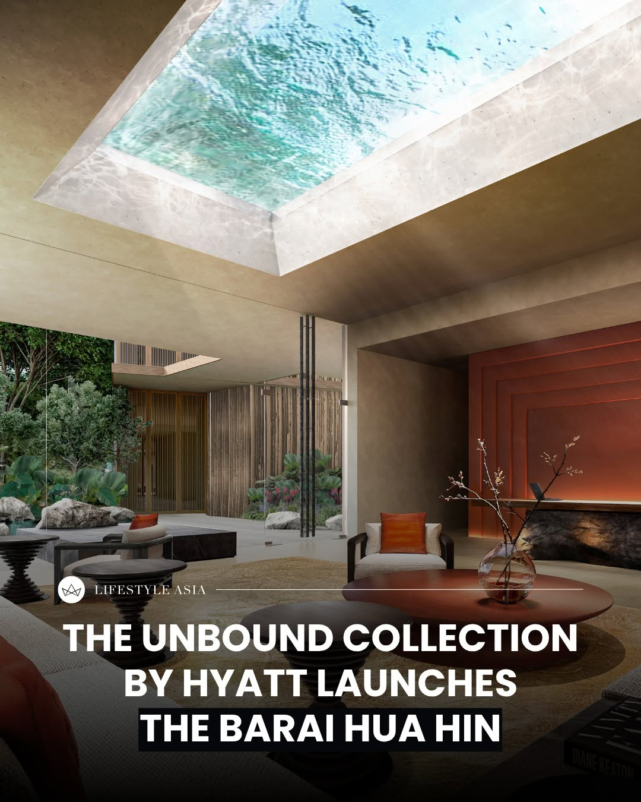

> The ultimate in world-class relaxation, ‘The Unbound Collection by Hyatt’ debuts its first hotel in Thailand: ‘THE BARAI HUA HIN’ (@thebarai…

🔗 https://www.instagram.com/p/DZ83vYMmr74/

---

## @bangkok_insiders · 展覽

**地點：** Door No. 6　**約會指數：** 8/10　**風格：** 浪漫、靜謐、熱鬧

**摘要：** 這是一個位於曼谷的酒吧，提供特色雞尾酒，適合約會的浪漫氛圍。非常適合與伴侶共度美好夜晚。

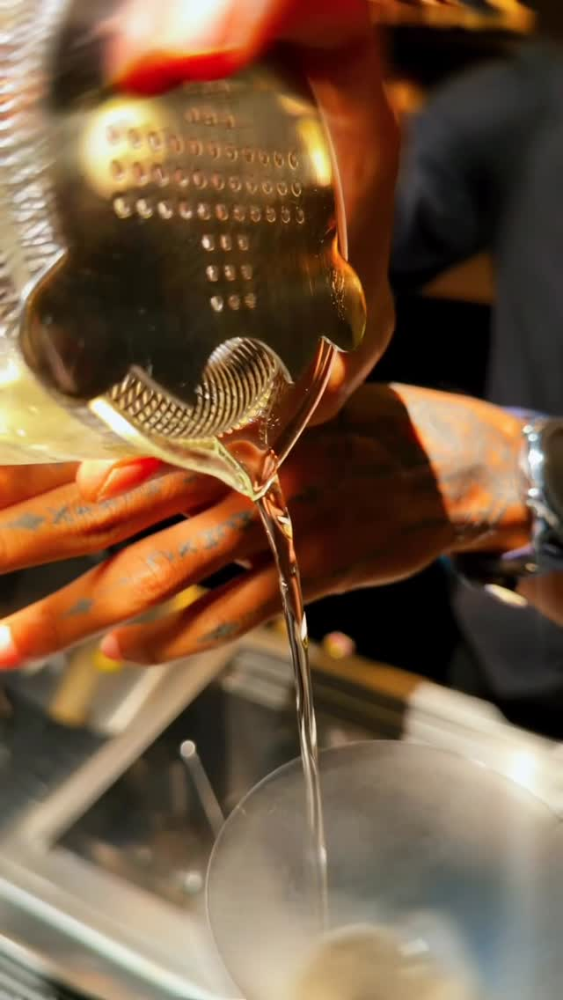

> What a lovely evening with the signature cocktails @doorno6.bkk #speakeasy #bar #bkk #bangkok #amazing

🔗 https://www.instagram.com/p/DZ7t-63vmAw/

---

## @aj_some_more · 旅遊

**地點：** Bangkok’78 餐廳　**約會指數：** 8/10　**風格：** 文青、浪漫、熱鬧

**摘要：** Bangkok’78 餐廳位於 Sindhorn Midtown Hotel Bangkok，提供高性價比的自助早餐。每天早上 6:30 到 11:00 開放，適合約會享受悠閒的早晨時光。

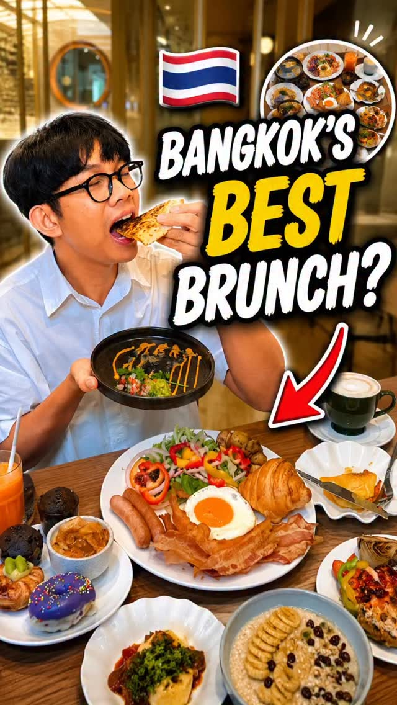

> One of the best-value hotel brunch spots in Bangkok 🍽️✨🇹🇭 📍Bangkok’78 at Sindhorn Midtown Hotel Bangkok serves a breakfast buffet you ca…

🔗 https://www.instagram.com/p/DZ7p3wZz522/

---

## @richie_got_you · 旅遊

**地點：** 曼谷夜市　**約會指數：** 7/10　**風格：** 熱鬧、文青

**摘要：** 這是曼谷的一個夜市，適合在晚上逛逛，享受當地美食和文化。非常適合約會，特別是喜歡熱鬧氛圍的情侶。

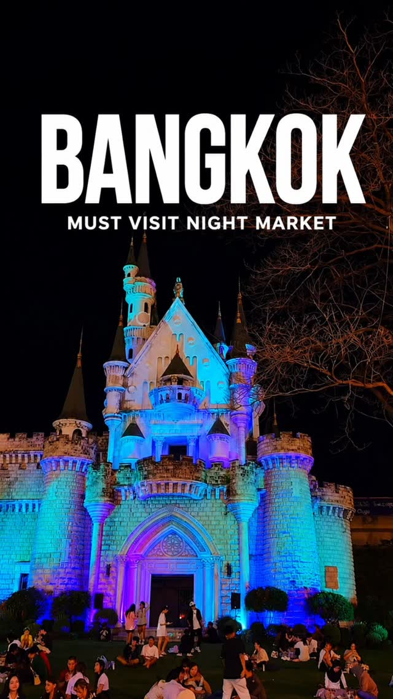

> Save this Bangkok night market for your next visit this 2026 #bangkok #bangkokthailand #bangkoktravel 📍 Liabduan Danneramit Night Market ตล…

🔗 https://www.instagram.com/p/DZ7ozUvzhBK/

---

## @goplaybangkok · 旅遊

**地點：** 石龍軍路　**約會指數：** 8/10　**風格：** 熱鬧、美食、在地

**摘要：** 石龍軍路是曼谷著名的美食街，擁有多家老字號小吃和米其林名店，適合喜愛美食的約會對象。這裡的美食選擇多樣，從魚丸到泰式甜點應有盡有，讓人流連忘返。

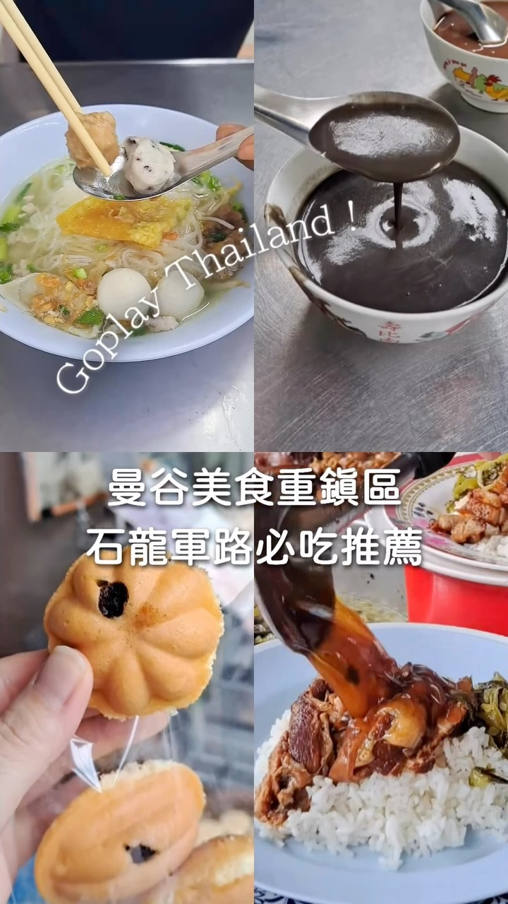

> \ #曼谷老字號美食一級戰區・石龍軍路必吃七選🍜🍪 / 身為老饕，來曼谷沒造訪石龍軍路說不過去！在這條隨地大小米其林的街道，擁有許多在地人私藏的老字號小吃以及觀光客耳熟能詳的米其林名店，小編選出七間必吃美食，推薦給你🍖 🍙 灶龍手工魚丸 魚丸鮮味十足、有咬勁，連周潤發都來…

🔗 https://www.instagram.com/p/DZ7eZ89SrUm/

---

## @bangkok_insiders · 展覽

**地點：** WellEra 曼谷健康綜合體　**約會指數：** 8/10　**風格：** 文青、靜謐、現代

**摘要：** WellEra 曼谷健康綜合體是一個結合健康、居住、款待和生活方式的創新生態系統，旨在支持日常健康。這個地點適合喜愛健康生活的約會對象，並且提供現代化的環境。

> WellEra Bangkok Unveils a THB-29 Billion Investment in Wellness Complex Driving Thailand Towards Becoming a Wellness Hub of the World Develo…

🔗 https://www.instagram.com/p/DZ7YHzCmCgG/

---

## @lifestyleasiath · 旅遊

**地點：** MGM MACAU 和 MGM COTAI　**約會指數：** 9/10　**風格：** 奢華、文化、美食、娛樂

**摘要：** MGM MACAU 和 MGM COTAI 是一個集奢華、美食、文化和娛樂於一身的度假目的地。這裡有米其林星級餐廳、沉浸式體驗和世界級展覽，非常適合約會。

> Luxury, culture, dining, wellness, and entertainment all in one destination. Discover the art of living at MGM MACAU and MGM COTAI (@mgm.mo)…

🔗 https://www.instagram.com/p/DZ7RBB0Gp3V/

---

## @lifestyleasiath · 旅遊

**地點：** 奢華健身活動　**約會指數：** 6/10　**風格：** 時尚、運動、奢華

**摘要：** 這是一個結合奢華品牌與健身生活的活動，展現了時尚與運動的結合。適合對奢華品牌和健身有興趣的情侶一起參加。

> Pilates rings with Dior motifs. Padel with Louis Vuitton. Running shoes from a luxury maison. Here's who's breaking a sweat as luxury brands…

🔗 https://www.instagram.com/p/DZ7KHR4GkS_/

---

## @bangkok_insiders · 展覽

**地點：** 曼谷　**約會指數：** 5/10　**風格：** 熱鬧、旅遊

**摘要：** 這是一則關於曼谷的貼文，展現了曼谷在明亮日子的氛圍。適合喜歡熱鬧和旅遊的約會對象。

> Bangkok vibes on the bright day #bangkok #bkk #amazing #travel #cnntravel

🔗 https://www.instagram.com/p/DZ6_eKgJtOu/

---

## @timeoutbangkok · 市集

**地點：** TCDC 書寫愛好者展　**約會指數：** 8/10　**風格：** 文青、創意、靜謐

**摘要：** 這是一個專為紙類愛好者設計的展覽，展出各種筆記本、文具和泰國設計。活動免費入場，時間為 7 月 1 日至 10 月 18 日，每天開放，適合喜歡文創的約會對象。

> Grab your tote and clear an afternoon: TCDC's 'Stationerycore: A Love Affair with Stationery' is a paper-lover's playground ✏️📓 Wander thro…

🔗 https://www.instagram.com/p/DZ69XYOm2Y7/

---

## @lifestyleasiath · 旅遊

**地點：** House of the Dragon 相關活動　**約會指數：** 6/10　**風格：** 熱鬧、影視

**摘要：** 這是一個慶祝《龍之家族》第三季推出的活動，主要以迷因為主題。雖然沒有具體的時間和地點，但適合影迷聚會和交流。

> With the release of @houseofthedragonhbo on @hbomaxth this week, we’re celebrating the third season in our favourite way: memes. #HOTD #Hous…

🔗 https://www.instagram.com/p/DZ6s_INE0X7/

---

## @lifestyleasiath · 旅遊

**地點：** Conrad Bangkok 酒店的 Liu 餐廳　**約會指數：** 9/10　**風格：** 浪漫、美食、高級

**摘要：** 這是一家位於 Conrad Bangkok 酒店的高級廣東餐廳 Liu，主廚 Andy Fung 的招牌菜色如燒鴨配黑松露醬等，展現了廣東料理的精緻工藝。非常適合約會的浪漫用餐地點。

> Some places you don't just visit once. 🥢✨ LSA Best Bites Let’s Try visits Liu at @conradbangkokhotel to experience the artistry of Executiv…

🔗 https://www.instagram.com/p/DZ6nb0cS2bN/

---

## @timeoutbangkok · 市集

**地點：** 燈籠藝術節　**約會指數：** 9/10　**風格：** 浪漫、熱鬧、戶外

**摘要：** 燈籠藝術節以「璀璨花開」為主題，展現一片光影交織的美麗花園。活動在 @samyanmitrtown 前的廣場舉行，時間為7月17日至31日，免費入場，非常適合約會。

> When the light of imagination blossoms as art ✨🌸 The Lantern Art Festival glows back to life, and this year it goes by the theme 'The Lumin…

🔗 https://www.instagram.com/p/DZ6iAN2GE1K/

---

## @aj_some_more · 咖啡廳

**地點：** 曼谷　**約會指數：** 5/10　

**摘要：** 這則貼文提到作者剛抵達曼谷，並鼓勵追蹤更多內容。雖然沒有具體的咖啡廳名稱，但曼谷有許多適合約會的地方。

> The second I land in Bangkok 🇹🇭😆 FOLLOW @aj.some.more for more Bangkok content

🔗 https://www.instagram.com/p/DZ6b_8tyrcc/

---

## @timeoutbangkok · 市集

**地點：** Kind Market　**約會指數：** 8/10　**風格：** 文青、熱鬧、靜謐

**摘要：** Kind Market 是一個慶祝個性、創意和有意識生活的市集，將於 6 月 28 日在 Ekkamai Soi 6 舉行。這裡有當地製作者和獨立品牌的手作商品及植物性小吃，非常適合約會時放鬆心情，享受輕鬆的午後時光。

> Skip the gloomy rainy-season slump and head to Kind Market this June, a feel-good gathering that celebrates individuality, creativity and co…

🔗 https://www.instagram.com/p/DZ6ZvvXD2Vo/

---

## @lifestyleasiath · 旅遊

**地點：** 曼谷書籍與啤酒節　**約會指數：** 8/10　**風格：** 文青、熱鬧

**摘要：** 這是曼谷的一個書籍與啤酒節，將於2026年6月26日至7月5日舉行，地點在SINGHA COMPLEX。這個活動適合喜愛書籍和啤酒的人，非常適合約會。

> If your idea of grand time involves a book in one hand and a bevvy in the other, Books and Beers returns to Bangkok from 26 June to 5 July 2…

🔗 https://www.instagram.com/p/DZ6S7VSj1hd/

---

## @timeoutbangkok · 市集

**地點：** 曼谷藝術展覽　**約會指數：** 8/10　**風格：** 文青、熱鬧

**摘要：** 曼谷擁有許多獨立藝術空間和前衛畫廊，非常適合藝術愛好者參觀。這裡的展覽挑戰與啟發，讓人驚嘆不已，是個適合約會的好地方。

> Bangkok has art coming out of its ears. Poky independent spaces, avant-garde galleries, those big crowd-pleasing museums – the city brims wi…

🔗 https://www.instagram.com/p/DZ4YLLIExgo/

---

## @timeoutbangkok · 市集

**地點：** Burapa 東泰料理酒吧　**約會指數：** 8/10　**風格：** 文青、熱鬧、美食

**摘要：** Burapa 提供東泰風味的午餐套餐，價格在 B530 至 B550 之間，包含多種美味選擇，適合喜愛泰國海岸風味的食客。餐廳每日營業，午餐時間為中午11點至下午2點，非常適合約會或與朋友聚餐。

> Skint and starving by midday? Burapa’s new lunch set has you covered. The eastern-Thai spot on Sukhumvit 11 lays on a daily set menu from 11…

🔗 https://www.instagram.com/p/DZ4Fy1Kk5j5/

---

## @aj_some_more · 咖啡廳

**地點：** 曼谷　**約會指數：** 5/10　**風格：** 文青、熱鬧

**摘要：** 這則貼文介紹了泰國曼谷的別名「Krung Thep」，並提到其完整名稱的意義。雖然沒有具體的約會地點，但曼谷作為一個熱鬧的城市，適合探索和約會。

> 🇹🇭 In Thailand, we don’t say “Bangkok”… 🤯 Most locals actually call it “Krung Thep” — and that’s only the short version! 😅 Wait until yo…

🔗 https://www.instagram.com/p/DZ2gT6vy4W8/

---

## @jiranarong2 · 展覽

**地點：** 泰國四家牛肉麵店　**約會指數：** 6/10　**風格：** 熱鬧、美食

**摘要：** 這篇貼文介紹了泰國四家牛肉麵店，分別是店名和特色。這些店都位於泰國的沛差武里，適合喜愛美食的約會對象，但可能需要排隊等候。建議有興趣的朋友可以前往嘗試。

> ใครเห็นโพสต์นี้ผ่านๆ หรือไม่ได้อ่านอาจจะคิดว่าเป็นโพสต์ก๋วยเตี๋ยวของร้านเพ็ญพริกเผ็ด ที่เพชรบุรี แค่ร้านเดียว แต่ที่จริงนี่คือก๋วยเตี๋ยว 4 ร…

🔗 https://www.instagram.com/p/DZ2FynsE-6S/

---

## @jiranarong2 · 展覽

**地點：** 餐廳　**約會指數：** 7/10　**風格：** 文青、美食、輕鬆

**摘要：** 這是一家位於泰國的餐廳，提供美味的牛內臟湯和其他料理。餐廳環境乾淨，適合與朋友輕鬆聚餐，但可能不太適合正式的約會。無明確的結束日期。

> ต้มพุงเนื้อ (ต้มเครื่องในวัว) ที่ชอบอีกร้านครับ ผมสั่งเป็นเนื้อล้วนเพราะวัยและสุขภาพตอนนี้กินเครื่องในไม่ไหวแล้ว ถึงจะเป็นของชอบก็เถอะ 55 ร้…

🔗 https://www.instagram.com/p/DZz1drFE3X1/

---

## @aj_some_more · 咖啡廳

**地點：** Sindhorn Midtown Hotel Bangkok　**約會指數：** 8/10　**風格：** 浪漫、靜謐、文青

**摘要：** 這是一家位於曼谷的酒店，提供寬敞的套房、天際泳池和屋頂日落美景，非常適合約會或浪漫之旅。酒店內的早餐也相當豐富，是一個理想的住宿選擇。

> I stayed in one of the most strategic hotels in Bangkok 🇹🇭 From a spacious One Bedroom Suite with a kitchenette and washer/dryer to a skyl…

🔗 https://www.instagram.com/p/DZztrybSj5e/

---

## @bangkok_insiders · 展覽

**地點：** Tai Hong Gong Yok Khao　**約會指數：** 6/10　**風格：** 熱鬧、文青

**摘要：** Tai Hong Gong Yok Khao 是一個位於曼谷的展覽，適合喜歡探索當地文化和藝術的人。這裡的氛圍熱鬧，適合約會時一起欣賞藝術作品。

> Tai Hong Gong Yok Khao #sathorn #bangkok #bkk #amazing #travel

🔗 https://www.instagram.com/p/DZzQechvwWX/

---

## @bangkok_insiders · 展覽

**地點：** Madura Bangkok　**約會指數：** 8/10　**風格：** 浪漫、熱鬧、戶外

**摘要：** 這是一個位於曼谷的屋頂酒吧，剛開幕的夜晚非常熱鬧，適合約會。享受美麗的天空景觀，讓約會更加浪漫。

> Amazing grand opening night @madurabangkok #bkk #bangkok #rooftop #amazing #skyview

🔗 https://www.instagram.com/p/DZxHdl_hXIa/

---

## @aj_some_more · 咖啡廳

**地點：** 查圖查克市場的泰式奶茶店　**約會指數：** 7/10　**風格：** 文青、熱鬧

**摘要：** 這是一家位於查圖查克市場的高級泰式奶茶店，提供豐富順滑的奶茶，並以巨型冰球和金粉裝飾。適合約會時享受獨特的飲品。

> One of the most premium Thai tea spots I’ve found in Chatuchak 🇹🇭🧋 Rich, smooth, and beautifully presented with a giant ice sphere and go…

🔗 https://www.instagram.com/p/DZw1olfydma/

---

## @richie_got_you · 咖啡廳

**地點：** 曼谷　**約會指數：** 6/10　**風格：** 文青、靜謐

**摘要：** 這是一則提到曼谷的貼文，適合喜歡旅行和咖啡的約會對象。雖然沒有具體的店名，但可以想像是一個適合放鬆和交流的地方。

> When the only thing you’re thinking about is your next trip to Bangkok #bangkok #bangkokthailand #bangkoktravel

🔗 https://www.instagram.com/p/DZwNvjvT3wM/

---

## @jiranarong2 · 展覽

**地點：** 阿公豬腳飯　**約會指數：** 7/10　**風格：** 熱鬧、美食

**摘要：** 這是位於哈賴的阿公豬腳飯新開的店，提供美味的中藥豬腳飯，適合與朋友或伴侶一同享用。店家剛搬遷，環境熱鬧，非常適合約會。

> ร้านข้าวขาหมูอากง ที่หาดใหญ่ เพิ่งย้ายมาเปิดใหม่หลังน้ำท่วมครับ อยู่ติดกับร้านส่างหยุ่น 1 (ร้านก๋วยเตี๋ยวแคะ) แล้วคนแนะนำก็คือเฮียเจ้าของร้า…

🔗 https://www.instagram.com/p/DZv7vSzzADT/

---

## @goplaybangkok · 旅遊

**地點：** After You 超商甜點　**約會指數：** 7/10　**風格：** 文青、甜點、輕鬆

**摘要：** After You 是泰國知名的甜點品牌，提供多種口味的冰麵包，適合當作下午茶或飯後甜點。每顆大約 55 泰銖，值得一試，是甜點控的好選擇。

> \ #泰國超商甜點推薦・After You 冰麵包竟然有這麼多口味🍞❄️/ 相信不少人都吃過泰國國民甜點 After You，提到它大家第一個想到的通常都是蜜糖吐司和刨冰系列。 ​ 但其實除了門市之外，在超商也能買到 After You 的小包裝甜點和飲品喔～其中這款「冰麵包」…

🔗 https://www.instagram.com/p/DZumcMCkvip/

---

## @jiranarong2 · 展覽

**地點：** 新地標—舊城區的 TCDC 和 CEA　**約會指數：** 7/10　**風格：** 文青、藝術

**摘要：** 這是一個位於舊城區的新地標，明天將正式開幕。適合喜愛藝術和文化的約會對象。若你們對展覽感興趣，這裡將會是一個不錯的選擇。

> เปิดพรุ่งนี้วันแรก TCDC และ CEA แลนด์มาร์คแห่งใหม่ ของเมืองเก่าสงขลา

🔗 https://www.instagram.com/p/DZuh55hT6cB/

---

## @richie_got_you · 咖啡廳

**地點：** Ying Yong Flower Garden　**約會指數：** 7/10　**風格：** 文青、靜謐、戶外

**摘要：** 這是一個位於清邁的美麗花園，適合拍照和享受靜謐的氛圍。非常適合約會，尤其是喜歡大自然的情侶。

> Found a beautiful photo spot in Chiang Mai #thailand #thailand🇹🇭 #thailandtravel #chiangmai 📍Ying Yong Flower Garden ยิ่งยงสวนดอกไม้

🔗 https://www.instagram.com/p/DZubwgAzqyF/

---

## @aj_some_more · 咖啡廳

**地點：** 曼谷　**約會指數：** 5/10　

**摘要：** 這是一則關於曼谷的貼文，提到將會回到這個城市。雖然沒有具體的地點或活動資訊，但曼谷的咖啡廳通常適合約會。

> One day we’ll be back in Bangkok 🇹🇭

🔗 https://www.instagram.com/p/DZtloGiSEsU/

---

## @bangkok_insiders · 展覽

**地點：** 曼谷 SONGWAT　**約會指數：** 7/10　**風格：** 文青、熱鬧

**摘要：** 這是一個在曼谷 SONGWAT 舉行的展覽，由 adidas 和 arabica 合作。適合喜歡文創和時尚的約會對象，地點熱鬧且富有藝術氛圍。

> @adidasthailand x @arabica.thailand at SONGWAT , Bangkok #adidas #arabica #bkk #bangkok #songwat

🔗 https://www.instagram.com/p/DZrNxCBtkzF/

---

## @goplaybangkok · 旅遊

**地點：** Baan Manee BKK　**約會指數：** 9/10　**風格：** 浪漫、靜謐、文青

**摘要：** Baan Manee BKK 是一間擁有河景的咖啡廳，氣氛放鬆且不商業化，非常適合約會。建議在黃昏時分前往，享受美麗的夕陽與獨特的飲品。營業時間為每日 10:00 - 20:00，週六公休。

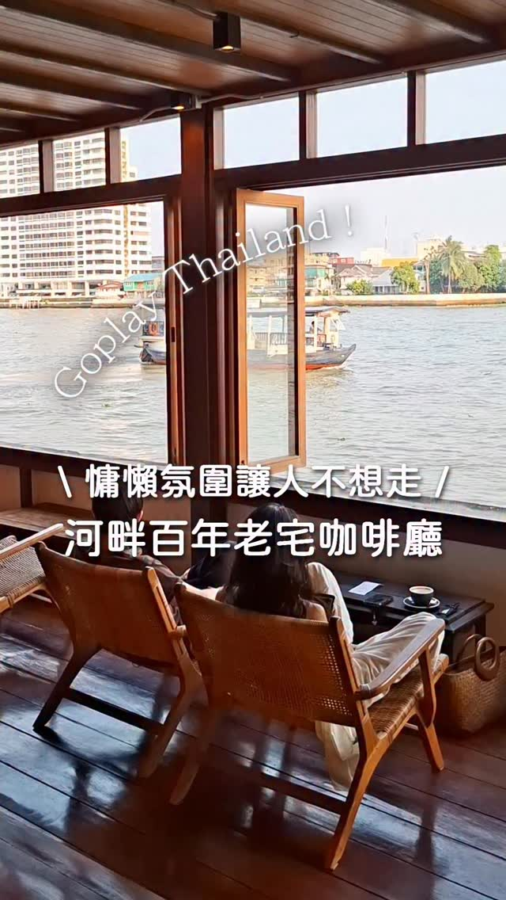

> \ #曼谷歷史老宅河岸咖啡廳・喝咖搭配落日河景有夠浪漫🥰🛶 / 如果你心目中最完美咖啡廳是「有河景、風景漂亮、氣氛放鬆」，再加上一點「觀光客不多」，那 Baan Manee BKK 絕對值得列入清單！這是一間由百年歷史的泰式老宅改建而成的精品旅館與河岸咖啡廳，坐落於昭披耶河西…

🔗 https://www.instagram.com/p/DZpczTTyg8u/

---

## @richie_got_you · 咖啡廳

**地點：** Cave Fantasy　**約會指數：** 8/10　**風格：** 浪漫、戶外、文青

**摘要：** 這是一個位於曼谷的燈光展覽，名為Cave Fantasy，非常適合約會。展覽中有美麗的燈光裝置，營造出浪漫的氛圍。

> Must visit Bangkok light exhibit #bangkok #bangkokthailand #bangkoktravel #thailand 📍Cave Fantasy

🔗 https://www.instagram.com/p/DZnBJl-TA4u/

---

## @jiranarong2 · 展覽

**地點：** 設定廟　**約會指數：** 6/10　**風格：** 美食、熱鬧

**摘要：** 這是一家位於春武里（Chonburi）的餐廳，提供獨特的湯麵，搭配豐富的配料。適合約會時享受美食，特別是喜歡嘗試新口味的情侶。

> เป็นก๋วยเตี๋ยวที่ผมไม่เคยเจอทรงนี้นะ คือเป็นเหมือนตือฮวนใส่เส้น มีผักกาดดองในซุป ตีหมูสับด้วยน้ำร้อน และกากหมูล้นๆ กินแล้วก็ชอบ ร้านนี้ชื่อต…

🔗 https://www.instagram.com/p/DZjVJOdzRoT/

---

## @richie_got_you · 咖啡廳

**地點：** 咖啡廳　**約會指數：** 6/10　**風格：** 靜謐、文青

**摘要：** 這是一則慶祝生日的貼文，提到對生活的感激。咖啡廳是一個適合與朋友聚會或慶祝的地方，適合約會。無具體的時間或價格資訊。

> No big speech. Just grateful. For the people, the memories, the lessons, and another year to keep growing 🌼 HAPPY BIRTHDAY TO ME 🎂

🔗 https://www.instagram.com/p/DZhMbffGWy1/

---

## @richie_got_you · 咖啡廳

**地點：** 曼谷　**約會指數：** 5/10　**風格：** 靜謐、文化

**摘要：** 這篇貼文提到曼谷的日常活動大多正常進行，但因為泰國正在哀悼公主的逝世，某些活動和景點可能會有時間上的變動。適合想要體驗當地文化的約會。

> BANGKOK UPDATE If you’re visiting Bangkok, most daily activities continue as normal, but some events and attractions may have schedule chang…

🔗 https://www.instagram.com/p/DZerIDFGfj3/

---

## @goplaybangkok · 旅遊

**地點：** 泰國超市　**約會指數：** 7/10　**風格：** 熱鬧、在地、購物

**摘要：** 這篇貼文介紹了9大泰國必逛的超市，適合想體驗在地文化或購買伴手禮的遊客。無論是平價大賣場還是進口商品超市，各具特色，讓人流連忘返。

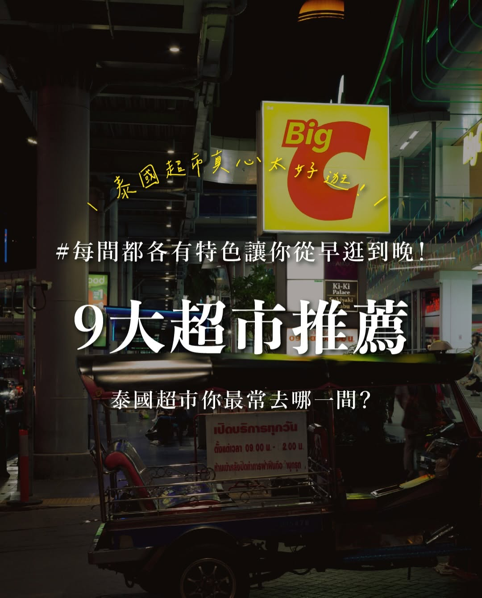

> \ #9大好逛的泰國超市・在地人補貨觀光客買伴手禮都去哪間🛒❓/ 泰國的超市超好逛的！每次進去都像進入精神時光屋，沒有一小時出不來ㄟ😇 從在地人逛的平價大賣場，到進口商品齊全的高端超市，可以說每一間都有讓人想走進去的理由，各家也都有不同特色～ ​ 今天就幫大家整理出「9 大泰…

🔗 https://www.instagram.com/p/DZck2ECkqR4/

---

