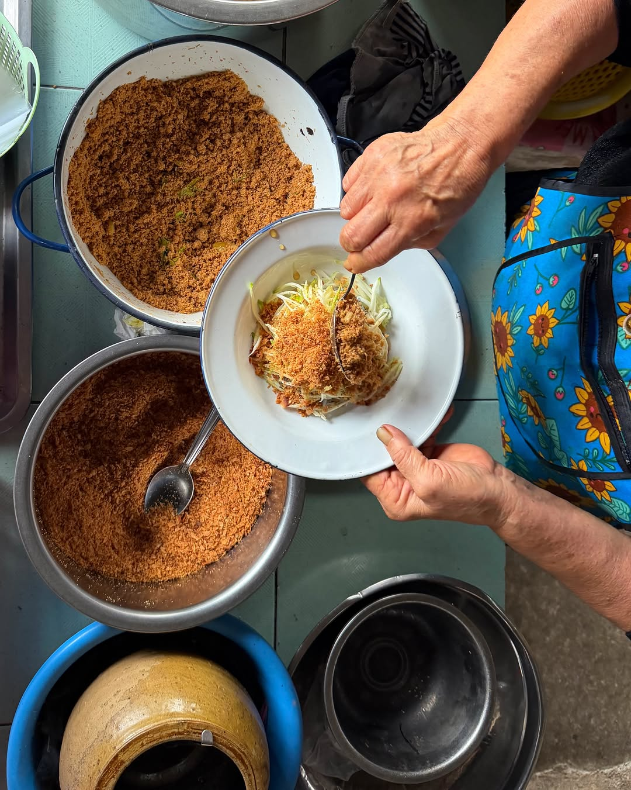
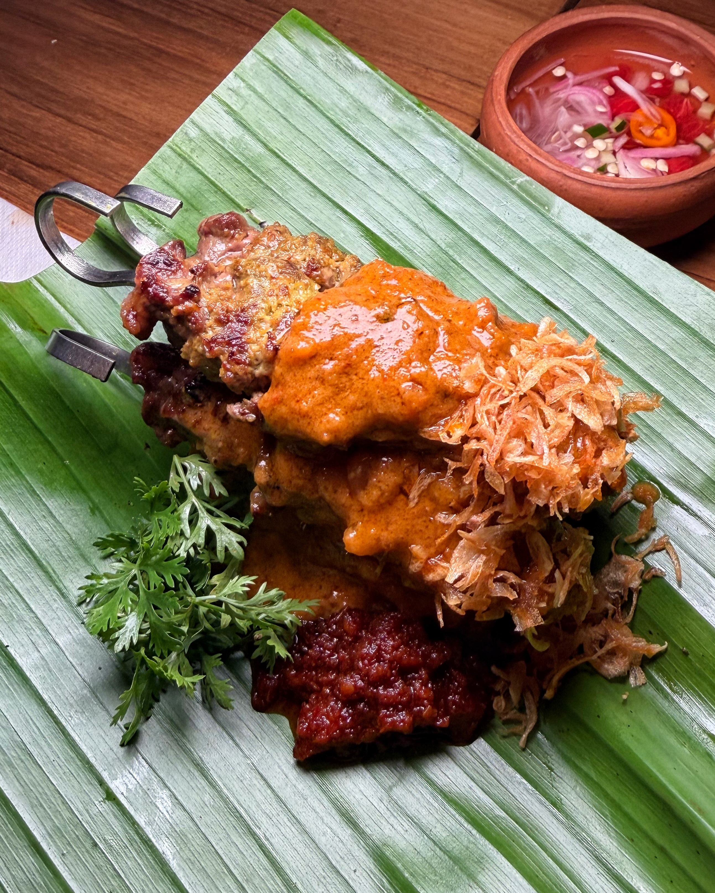
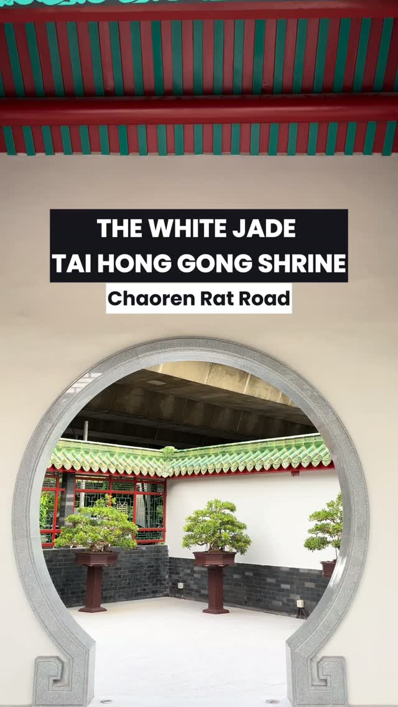
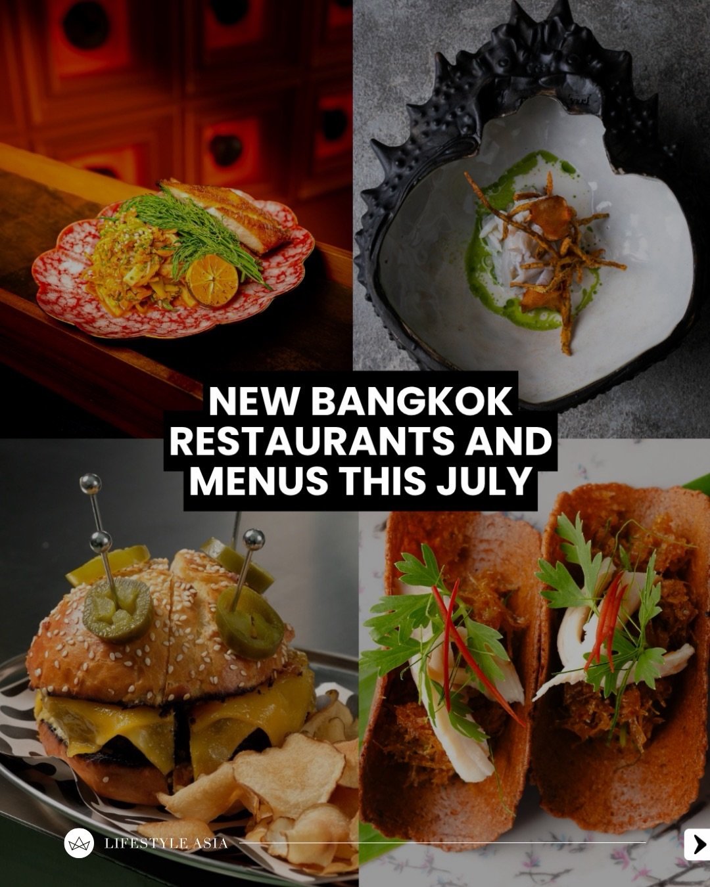
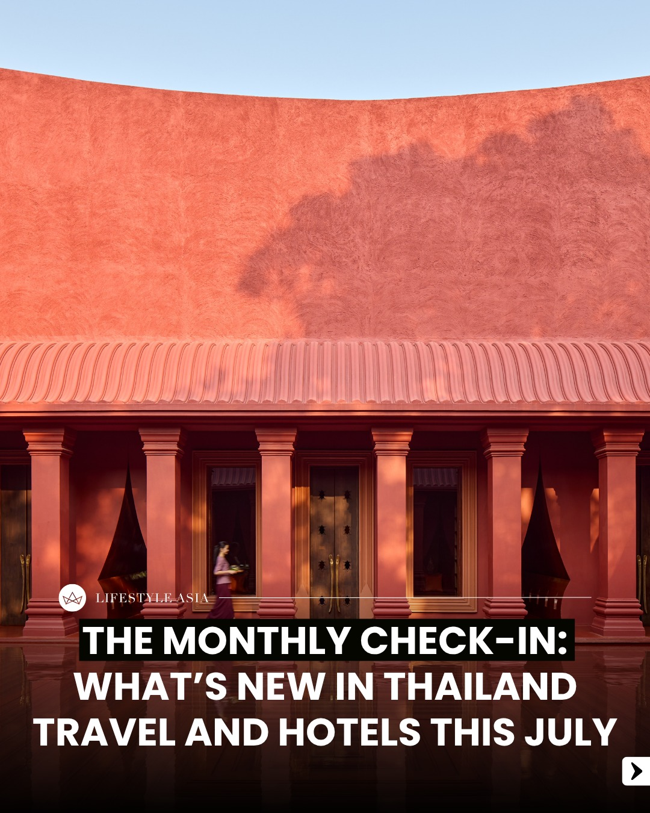
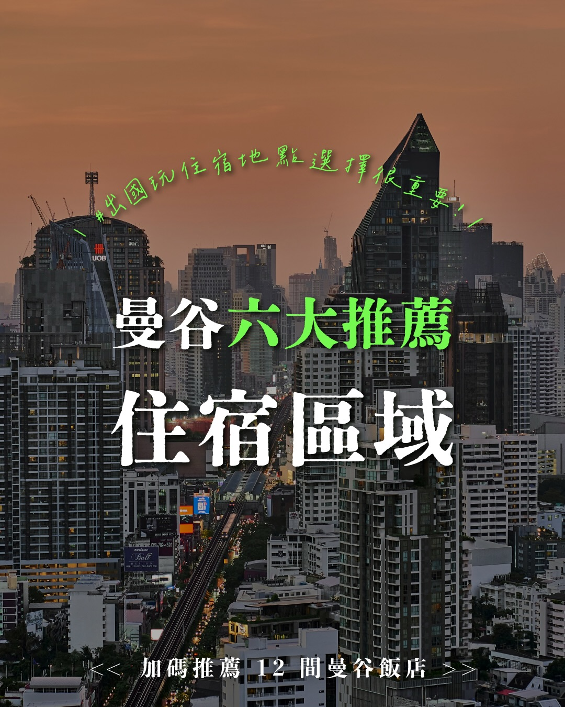
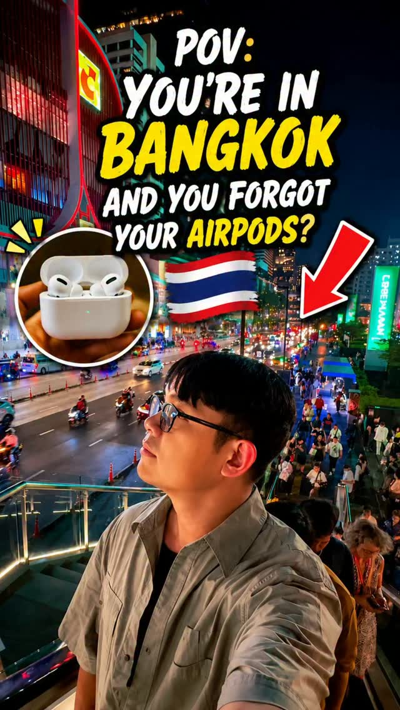
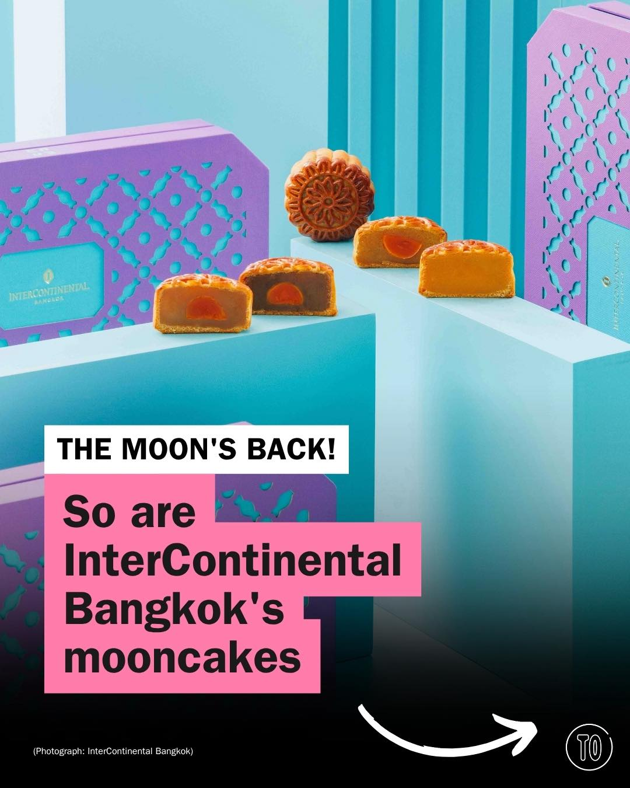
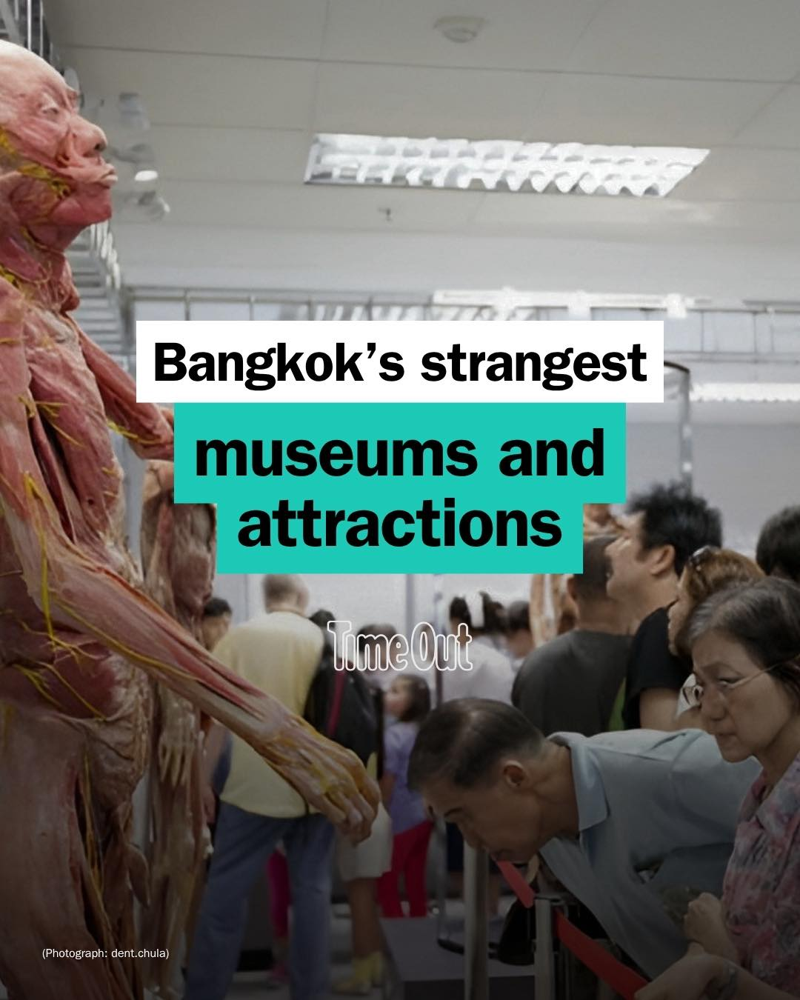

# 📸 2026-07-04 IG 新貼文彙整

## @jiranarong2 · 展覽

**地點：** 食物文化展覽　**約會指數：** 7/10　**風格：** 文青、知識、文化

**摘要：** 這是一個關於即將消失的食物文化的展覽，探討食物的演變與文化之間的關聯。展覽適合對食物歷史和文化感興趣的約會對象，能夠引發深刻的對話與思考。

> ช่วงปีหลังๆ ผมชอบทำโปรเจกต์เกี่ยวกับอาหารที่กำลังจะหายไปบ่อยขึ้นเรื่อยๆ ทั้งคุยพอดคาสต์ ทำสารคดี หนังสือรวมสูตรแจกฟรี ทริป จัดมื้ออาหาร และอ…

🔗 https://www.instagram.com/p/DaWn1dUzQFc/

---

## @jiranarong2 · 展覽

**地點：** 斯拉博酒吧　**約會指數：** 8/10　**風格：** 熱鬧、文青、美食

**摘要：** 這是一家專注於提供各種泰國傳統酒精飲品的酒吧，特別是多樣化的米酒和配合的美食。店內氣氛熱鬧，非常適合在工作日的晚上約會或聚餐，並且位於BTS安努沙瓦里站附近，交通便利。

> ได้ลองสาโท สโมสรของเชฟชาลีแล้ว 1. ที่นี่มีสาโทไทยแบบถูกต้องตามกฏหมายเยอะที่สุดในไทย (ถ้าเอาแบบชาวบ้านๆ มาด้วยคงได้กว่านี้อีกเยอะ) 2.สาโทรวมม…

🔗 https://www.instagram.com/p/DaVI2CKE_cc/

---

## @lifestyleasiath · 旅遊

**地點：** 白玉太皇宮　**約會指數：** 7/10　**風格：** 文化、靜謐

**摘要：** 白玉太皇宮是一個新的文化和靈性地標，位於曼谷的薩吞區，開放時間為週一至週四的早上7點到下午6點，週五則延長至下午7點，非常適合喜愛文化和靜謐氛圍的約會。這裡提供一個獨特的靈性體驗。

> A new cultural and spiritual landmark has opened its doors in Bangkok: The White Jade Tai Hong Gong Shrine. Located in Sathon, the shrine is…

🔗 https://www.instagram.com/p/DaWnlirFToZ/

---

## @lifestyleasiath · 旅遊

**地點：** 曼谷喜劇演出　**約會指數：** 7/10　**風格：** 熱鬧、幽默

**摘要：** 英國愛爾蘭喜劇演員吉米·卡爾將於2027年回到曼谷舉行喜劇演出。這是一個充滿幽默的夜晚，非常適合喜愛喜劇的約會對象。

> Buckle up for an irreverent night of hilarity when British-Irish comedian Jimmy Carr returns to Bangkok in 2027. Tap link in bio for details…

🔗 https://www.instagram.com/p/DaU53jFlYT2/

---

## @lifestyleasiath · 旅遊

**地點：** 新泰國餐廳　**約會指數：** 7/10　**風格：** 美食、熱鬧

**摘要：** 這則貼文介紹了本月新開的泰國餐廳和法式小酒館，還有各種新菜單。這些地方適合喜愛美食的約會對象，享受熱鬧的用餐氛圍。

> This month, we’ve got new Thai restaurant concepts, a French bistro, and plenty of impressive new menus. Tap link in bio for the full dining…

🔗 https://www.instagram.com/p/DaUy2v_kz8v/

---

## @lifestyleasiath · 旅遊

**地點：** 曼谷　**約會指數：** 6/10　**風格：** 旅遊、熱鬧

**摘要：** 這篇貼文介紹了曼谷的多個旅遊亮點，包括新開的飯店和交通便利的計程車服務，非常適合喜歡探索新地點的約會對象。若你計劃前往曼谷，這裡有許多新鮮事物可以體驗。

> For our July edition, we’re spotlighting Club Wyndham’s Thailand debut, card payments coming to Bangkok tuk-tuks, THE BARAI HUA HIN’s rebran…

🔗 https://www.instagram.com/p/DaUliw9nFns/

---

## @goplaybangkok · 旅遊

**地點：** 曼谷住宿區域推薦　**約會指數：** 8/10　**風格：** 旅遊、舒適、便利

**摘要：** 這篇貼文介紹了曼谷六大住宿區域及推薦飯店，適合計劃前往曼谷旅遊的情侶或朋友。這些飯店都位於交通便利的地點，能提升住宿體驗。

> \ #曼谷熱鬧便利的 6 大住宿區域推薦・優缺點一次分析🫣💥 / 正在規劃去曼谷旅遊的你，除了煩惱行程之外，對於「住哪裡？飯店該選哪間？」是不是也感覺有些頭痛呢～？ 畢竟曼谷腹地大、塞車程度更是世界知名！加上許多熱門景點、百貨商圈與美食聚集地，都能透過搭乘 BTS 空鐵與 M…

🔗 https://www.instagram.com/p/DaVOVAtEv25/

---

## @aj.some.more · 旅遊

**地點：** 曼谷　**約會指數：** 5/10　**風格：** 旅遊、放鬆

**摘要：** 這則貼文提到在曼谷旅遊的經歷，似乎是對於遺失耳機的感慨。曼谷是一個充滿活力的城市，適合放鬆和探索。

> POV: You just realized you left your AirPods at the hotel… 😭🎧 FOLOW @aj.some.more for more Bangkok content

🔗 https://www.instagram.com/p/DaUxvxJhaz8/

---

## @timeoutbangkok · 市集

**地點：** Sip Thai by Song Craft　**約會指數：** 8/10　**風格：** 熱鬧、文青、戶外

**摘要：** 這是一個在Dusit Central Park舉行的泰國精釀啤酒市集，時間為7月6日至12日，免費入場，開放時間為上午11點至晚上10點。這裡匯聚了泰國各地的優質生產者，適合喜愛音樂和創意的人士，適合約會。

> Fresh off its craft beer festival that swallowed the shophouse streets of Song Wat Road whole, Sip Thai by Song Craft swaggers back from Jul…

🔗 https://www.instagram.com/p/DaWwMZfm9TK/

---

## @timeoutbangkok · 市集

**地點：** 曼谷洲際酒店月餅　**約會指數：** 8/10　**風格：** 浪漫、文青、節慶

**摘要：** 曼谷洲際酒店推出2026年中秋月餅系列，包裝精美，內含多種口味，適合中秋佳節的送禮選擇。訂購時間為2026年7月1日至8月12日，價格為每盒B1,088至B1,448，適合約會時分享美食。

> The moon comes round again, and @intercontinentalbangkok knows exactly what you want to be clutching when it does. This Mid-Autumn, the hote…

🔗 https://www.instagram.com/p/DaU5w0yASq7/

---

## @timeoutbangkok · 市集

**地點：** 魔鬼之口洞穴　**約會指數：** 7/10　**風格：** 冒險、刺激、浪漫

**摘要：** 這是 Prime Video 新片《魔鬼之口》的拍攝地點，位於泰國的洞穴和海岸線，適合喜歡冒險的情侶。電影將於 2026 年 7 月 29 日全球上線，若想體驗類似的刺激，可以考慮前往這裡探險。

> Prime Video's new shark thriller The Devil's Mouth turns Thailand's caves and coastlines into the setting for a survival nightmare with very…

🔗 https://www.instagram.com/p/DaUs94FG9kU/

---

## @timeoutbangkok · 市集

**地點：** 曼谷奇特博物館　**約會指數：** 6/10　**風格：** 文青、熱鬧

**摘要：** 這是一個介紹曼谷各種奇特博物館的貼文，包括醫療奇觀、蛇農場和避孕套博物館等。適合喜歡探索新奇事物的約會對象，建議提前查詢開放時間。

> Bangkok has already given you temples, rooftop bars and street food. This is everything else: from medical oddities, a snake farm, a governm…

🔗 https://www.instagram.com/p/DaUk-eKm1fm/

---

## @timeoutbangkok · 市集

**地點：** 曼谷怪物音樂節　**約會指數：** 9/10　**風格：** 熱鬧、戶外、音樂

**摘要：** 這是曼谷最大的音樂節，將於7月25日至26日在皇后詩麗吉國際會議中心舉行。票價為2500泰銖（早鳥票1700泰銖），適合喜愛音樂的約會對象。

> Check the line-up, then grab your ticket and get ready to rock at @monstermusicfest 🎤🎸🎶 As the biggest music festival in the heart of Ban…

🔗 https://www.instagram.com/p/DaUX6izm25v/

---

