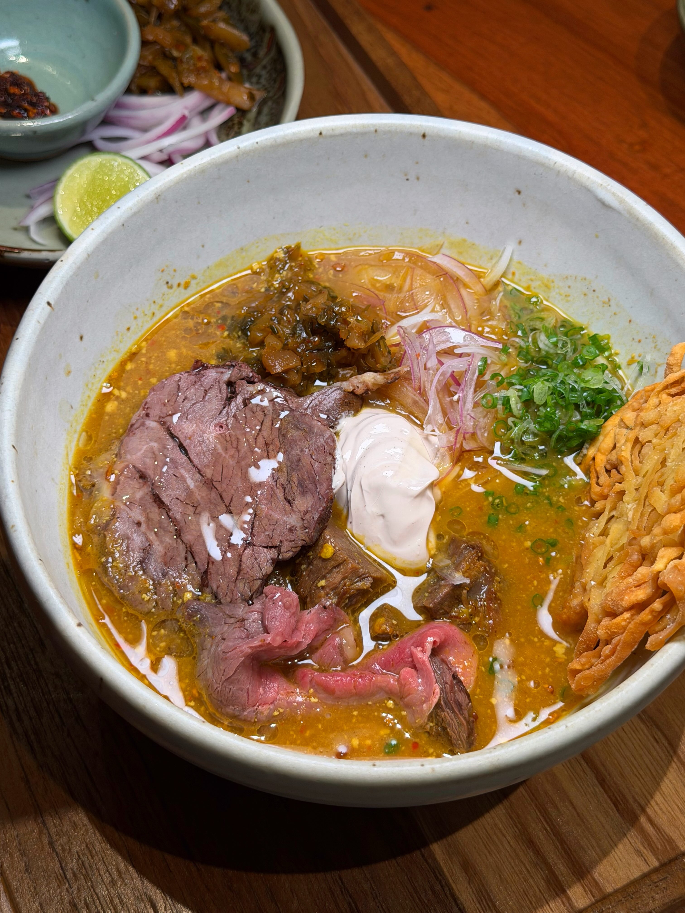
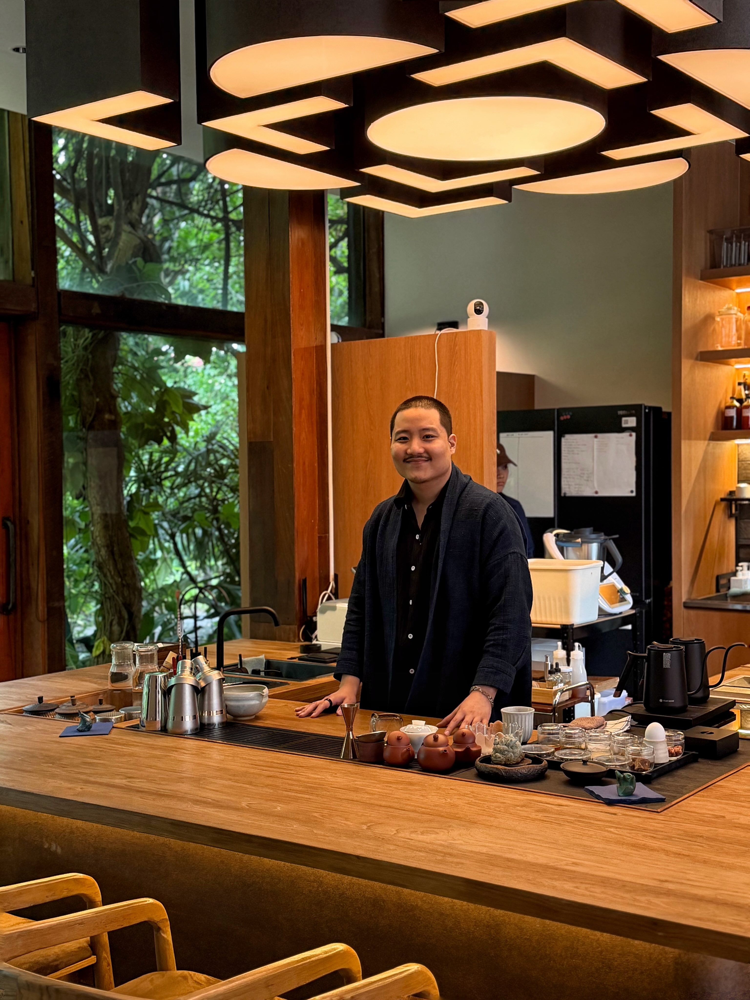
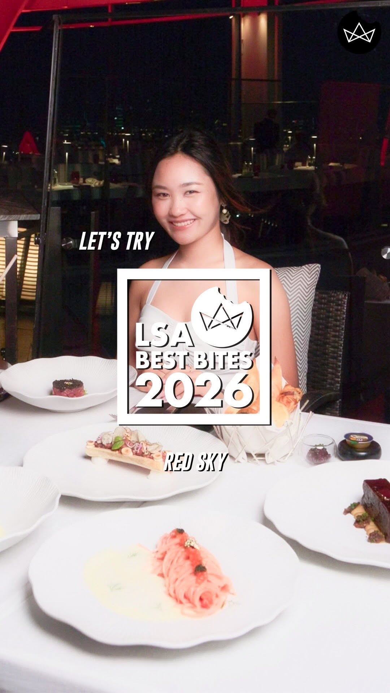
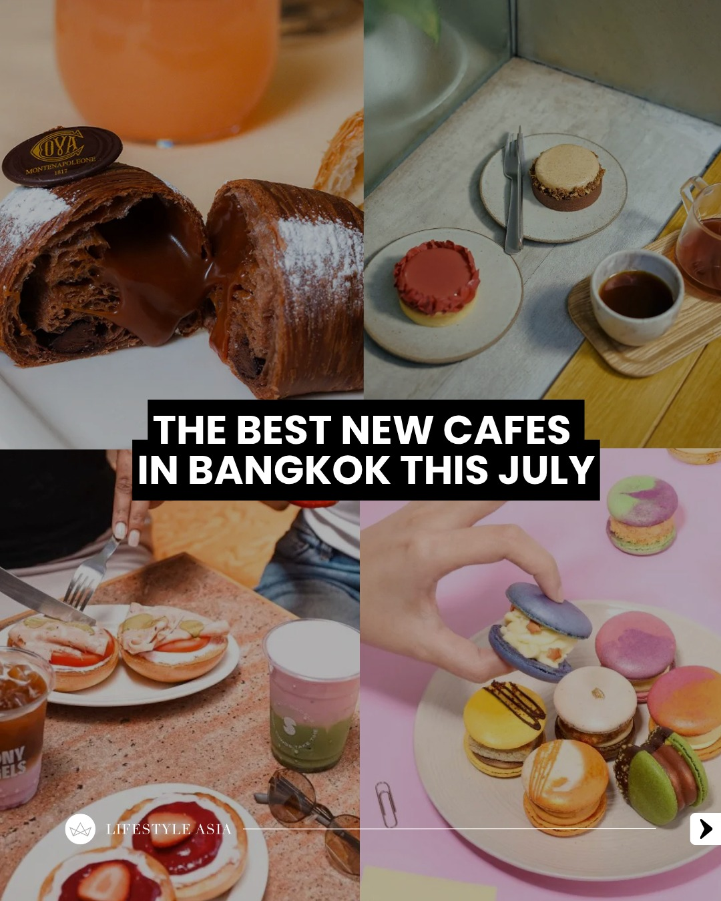
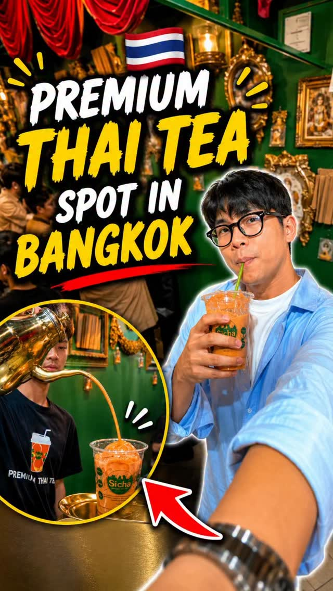
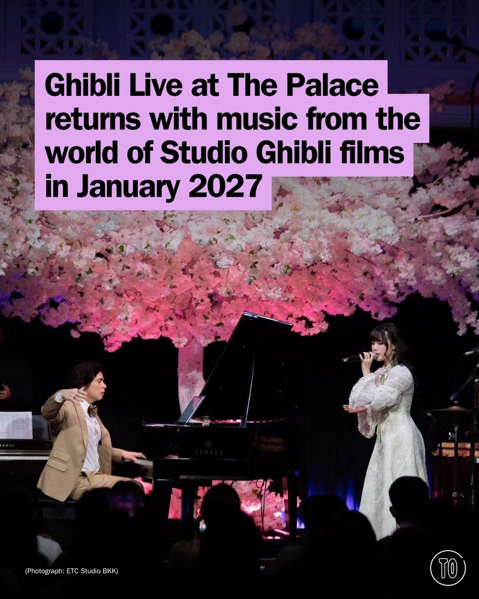
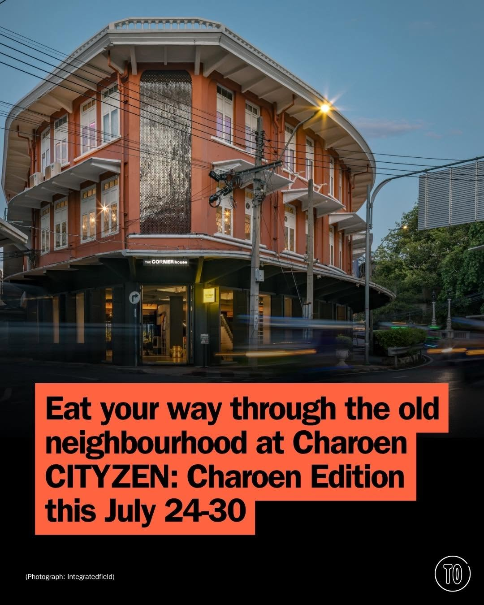

# 📸 2026-07-05 IG 新貼文彙整

## @jiranarong2 · 展覽

**地點：** wiang (เวียง) 餐廳　**約會指數：** 8/10　**風格：** 文青、熱鬧、美食

**摘要：** wiang (เวียง) 是一家位於曼谷的特色餐廳，專注於提供創新的泰國傳統美食「ข้าวซอย」。餐廳每週四至週六營業，菜單上有多種不同風格的ข้าวซอย可供選擇，適合喜愛嘗試新口味的約會對象。

> ถ้าชอบข้าวซอย หรือจริตตรงกับคราฟท์ราเมง ร้านนี้ควรมาลองมากๆ ครับ ร้านนี้ชื่อ wiang (เวียง) เป็นข้าวซอยบาร์ อยู่กลางกรุงเทพ ที่ตึกเอราวัณ แยก…

🔗 https://www.instagram.com/p/DaZSxhak1i0/

---

## @jiranarong2 · 展覽

**地點：** Kizuki　**約會指數：** 8/10　**風格：** 靜謐、文青、放鬆

**摘要：** Kizuki 是一個專注於無酒精飲品和搭配餐點的體驗茶吧，位於曼谷的 Vedana 項目內。這裡的環境靜謐，非常適合約會和放鬆身心。注意，這個特別的 Tasting Menu 只剩下 3 天的時間，建議有興趣的朋友儘快前往。

> กลับมาที่ Kizuki อีกรอบก่อนจะหมดเมนูเซ็ทนี้ แล้วจะเริ่มเมนูใหม่ สำหรับผม นี่คือ Experience Tea Bar ที่ออกแบบเครื่องดื่มและอาหารจากวัตถุดิบจา…

🔗 https://www.instagram.com/p/DaYFrrKE5EE/

---

## @lifestyleasiath · 旅遊

**地點：** 時尚生活展　**約會指數：** 6/10　**風格：** 熱鬧、文青

**摘要：** 這是一個關於最新時尚潮流的展覽，展示了春夏系列的服裝和生活用品。適合對時尚感興趣的情侶約會，但具體時間和地點未提及。

> From the latest runway looks to under-eye patches, cameras, and more, here are our #WeeklyObsessions this week. #SpringSummer #Fashion #Life…

🔗 https://www.instagram.com/p/DaZTb6VHB_O/

---

## @lifestyleasiath · 旅遊

**地點：** 曼谷紅天際餐廳　**約會指數：** 9/10　**風格：** 浪漫、戶外、文青

**摘要：** 這是一個位於曼谷的紅天際餐廳，提供壯麗的城市天際線景觀和精緻的地中海美食。無論是黃昏時分還是夜晚燈火通明，都是約會的理想選擇。

> The view was just the beginning. 🌆✨ Perched above Bangkok at @redskybkk_centara, @centaragrand_centralworld, this iconic rooftop destinatio…

🔗 https://www.instagram.com/p/DaXlZkNyRr8/

---

## @lifestyleasiath · 旅遊

**地點：** 曼谷新咖啡廳　**約會指數：** 8/10　**風格：** 文青、熱鬧

**摘要：** 這篇貼文介紹了曼谷最新的咖啡廳，非常適合咖啡愛好者探索。雖然沒有具體的時間和價格資訊，但這些新開的咖啡廳值得約會時前往。

> Coffee lovers are spoilt for choice in this city. It seems that every week, a new cafe is popping up in some alley, mall, or corner of the B…

🔗 https://www.instagram.com/p/DaXKGBNFS7Q/

---

## @aj.some.more · 旅遊

**地點：** Bangkok’78　**約會指數：** 8/10　**風格：** 文青、浪漫、熱鬧

**摘要：** 這是一個位於曼谷的酒店早餐自助餐，適合不住店的客人享用。每天早上6:30至11:00開放，非常適合約會或與朋友聚餐。

> One of the best-value hotel brunch spots in Bangkok 🍽️✨🇹🇭 📍Bangkok’78 at Sindhorn Midtown Hotel Bangkok serves a breakfast buffet you ca…

🔗 https://www.instagram.com/p/DZ7lo3vyK22/

---

## @aj.some.more · 旅遊

**地點：** 查圖查克市場的泰式奶茶店　**約會指數：** 7/10　**風格：** 文青、熱鬧

**摘要：** 這是一家位於查圖查克市場的高級泰式奶茶店，提供口感豐富且外觀精美的飲品。適合約會時享受美食的氛圍。

> One of the most premium Thai tea spots I’ve found in Chatuchak 🇹🇭🧋 Rich, smooth, and beautifully presented with a giant ice sphere and go…

🔗 https://www.instagram.com/p/DZw1gQ1yFbb/

---

## @timeoutbangkok · 市集

**地點：** Thewarat Sapharom Throne Hall　**約會指數：** 9/10　**風格：** 浪漫、藝術、音樂

**摘要：** 這是一場於2027年1月8日至10日舉行的吉卜力音樂會，將在華麗的Thewarat Sapharom Throne Hall舉行。音樂會結合了音樂、藝術和文化，非常適合約會。

> It sold out and left everyone wanting more, so Ghibli Live at The Palace comes back for a Restage Concert 🎐 Here's the thing: those soundtr…

🔗 https://www.instagram.com/p/DaZUcgeG3QD/

---

## @timeoutbangkok · 市集

**地點：** 曼谷畫廊　**約會指數：** 7/10　**風格：** 文青、靜謐

**摘要：** 這是一個適合避雨的活動，可以在曼谷的畫廊中漫遊，享受藝術氛圍。非常適合約會，尤其是喜歡藝術的情侶。

> Looking for a good excuse to dodge another downpour? Spend a few hours gallery hopping instead 🔗 Tap the link in @timeoutbangkok’s bio to r…

🔗 https://www.instagram.com/p/DaXdxpimw5A/

---

## @timeoutbangkok · 市集

**地點：** 查倫區市集　**約會指數：** 8/10　**風格：** 熱鬧、文青、戶外

**摘要：** 這是一個位於查倫區的市集，提供多樣的美食和藝術活動，從7月24日至30日舉行（周一休息），每天11點到19點。這裡適合約會，因為有免費的活動和互動體驗。

> Get lost among the many flavours of Talat Noi and Charoen Krung 🍜🍽️ Grab your CITYZEN ID & Journal, then hunt down stamps from venues and …

🔗 https://www.instagram.com/p/DaXN7b3G1lW/

---

