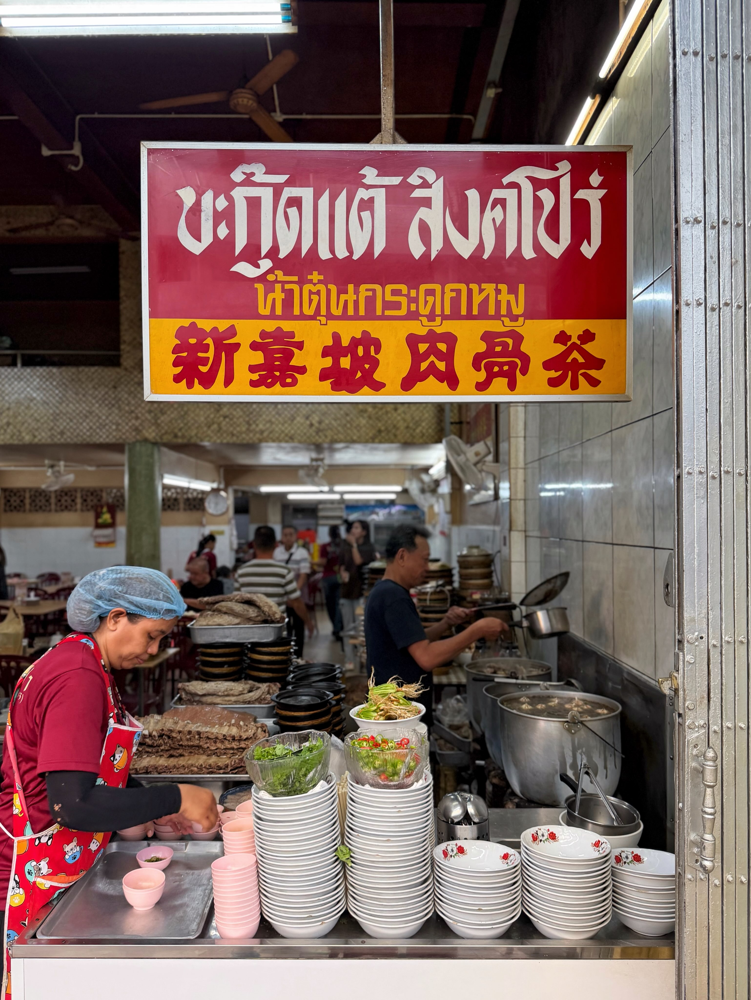
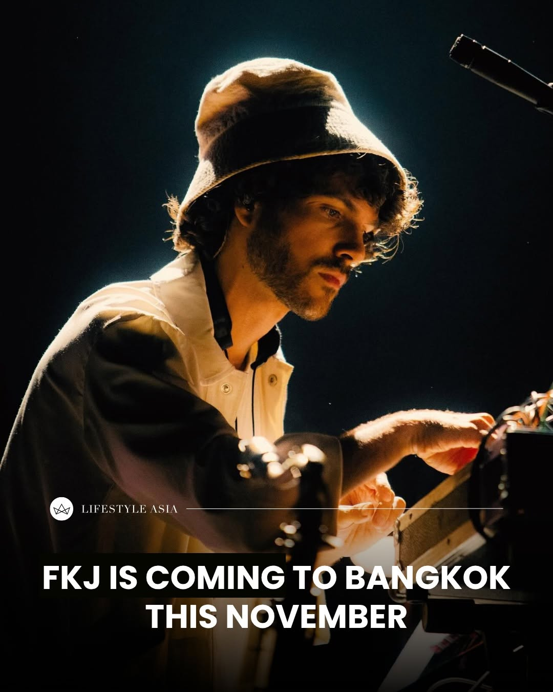
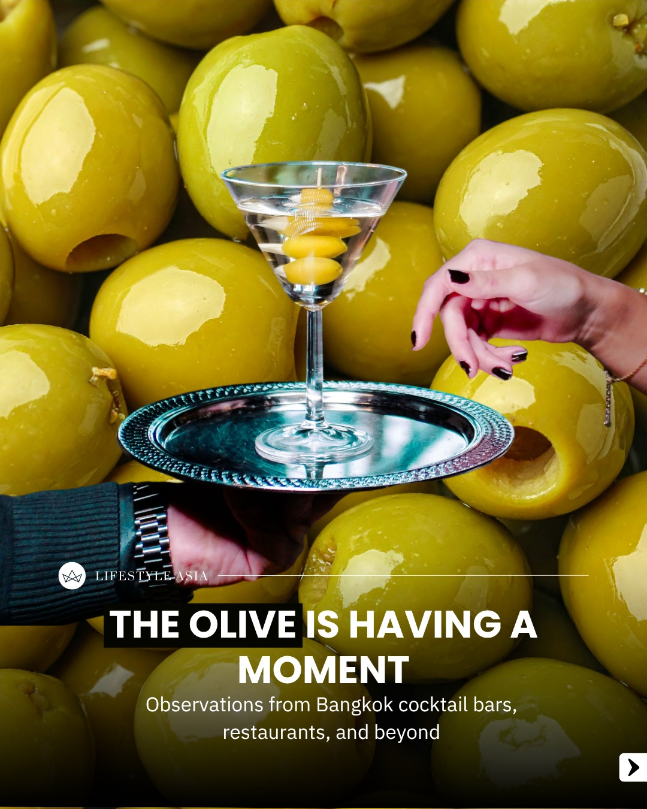
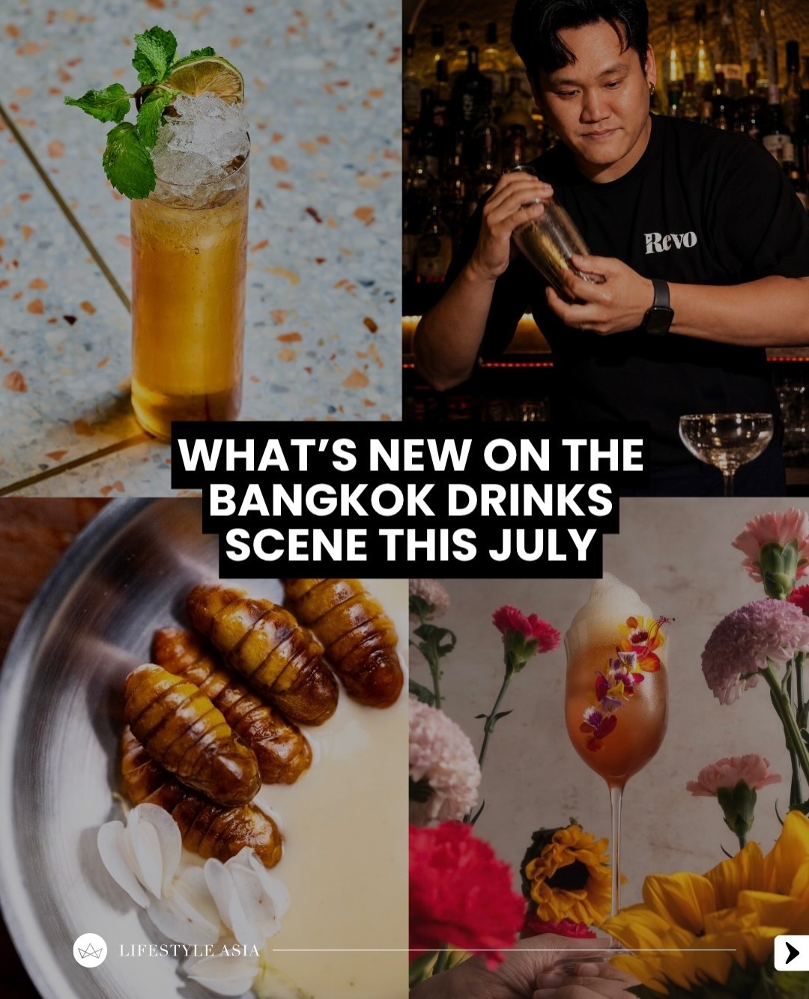
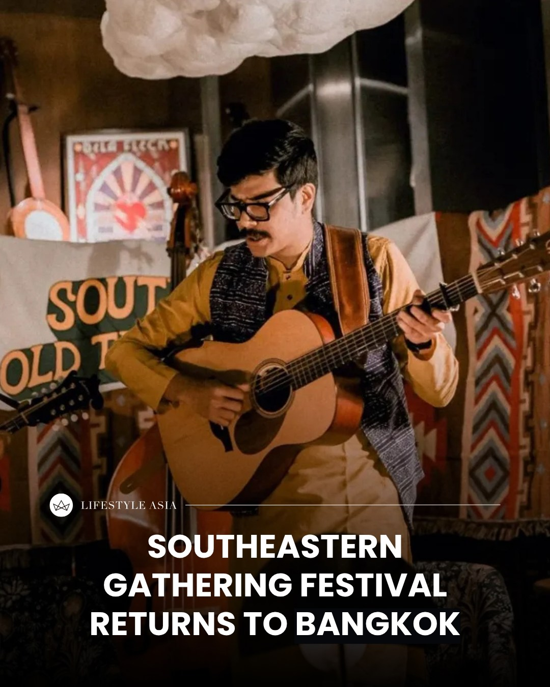
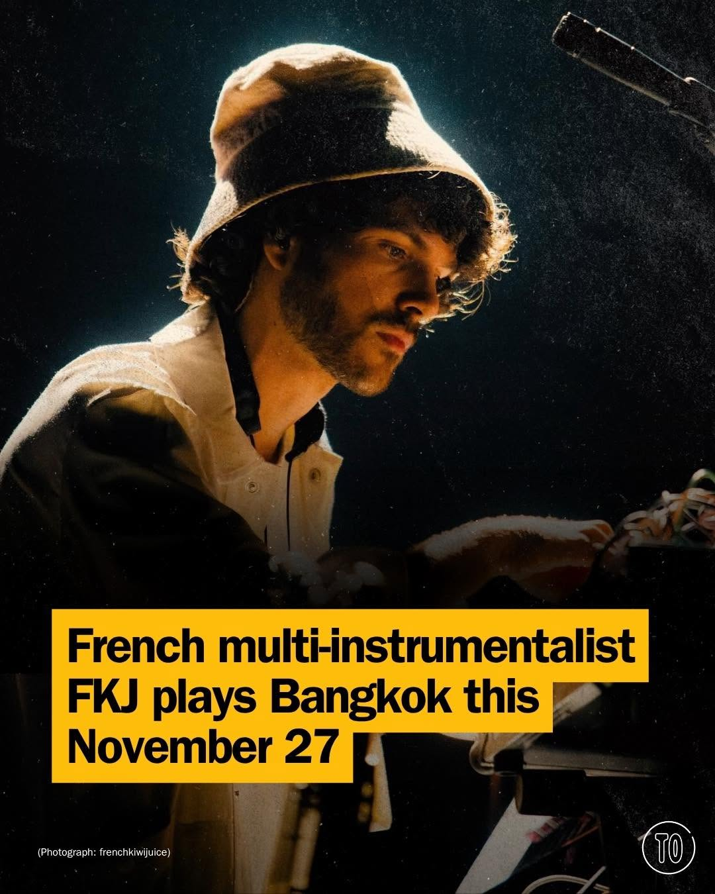
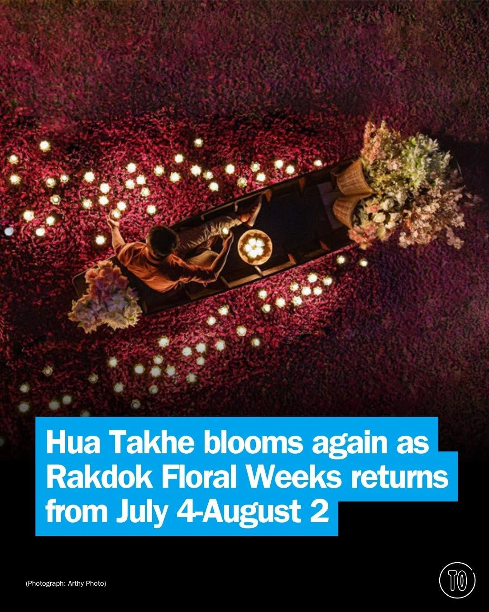
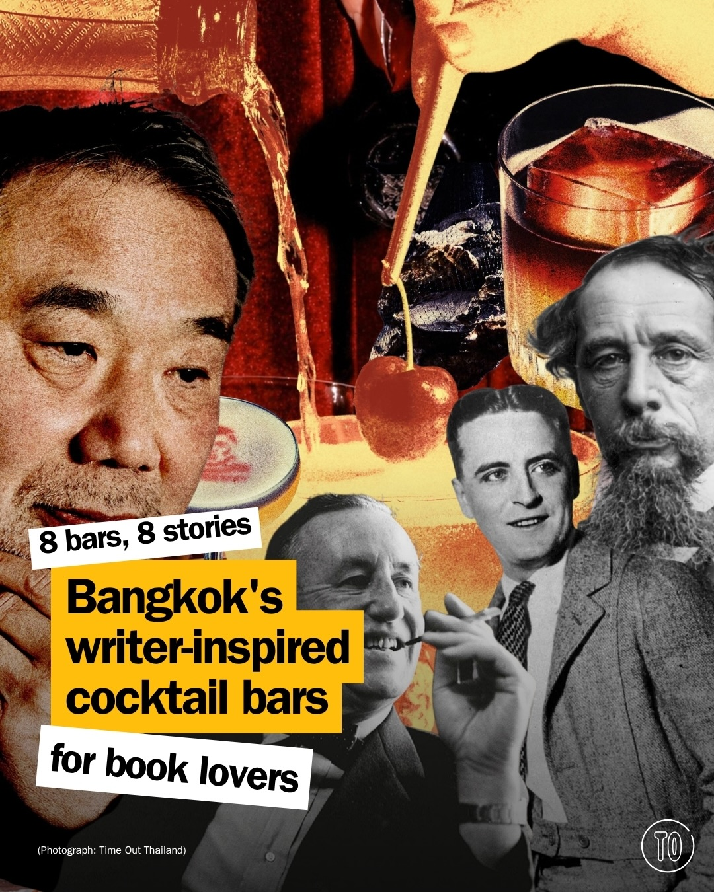

# 📸 2026-07-06 IG 新貼文彙整

## @jiranarong2 · 展覽

**地點：** 哈賴市　**約會指數：** 8/10　**風格：** 文青、熱鬧、美食

**摘要：** 這篇貼文描述了哈賴市的復甦與美食探索，提到當地的餐廳和市場，吸引了不少遊客。適合約會的地點，尤其是對於喜愛美食和散步的情侶。

> 1.เพิ่งกลับไปเยี่ยมหาดใหญ่และสงขลา หลังจากผ่านไปแล้ว 6 เดือน 2.นอกจากไล่กินร้านที่เคยกิน ตั้งแต่ร้านที่คนรู้จักอยู่แล้วยันร้านข้างทางที่ไม่ต…

🔗 https://www.instagram.com/p/DaasTuSE6Bo/

---

## @lifestyleasiath · 旅遊

**地點：** UOBB Live, Emsphere　**約會指數：** 9/10　**風格：** 熱鬧、音樂、活動

**摘要：** 法國歌手FKJ將於2026年11月27日在曼谷舉行音樂會，這是他亞洲巡演的第一站。這是一個適合音樂愛好者的熱鬧活動，非常適合約會。

> French singer, producer, and multi-instrumentalist FKJ (@frenchkiwijuice) is coming to Bangkok this November. Promoting his third studio alb…

🔗 https://www.instagram.com/p/DacC1W3nCvC/

---

## @lifestyleasiath · 旅遊

**地點：** 曼谷美食　**約會指數：** 6/10　**風格：** 美食、文青

**摘要：** 這篇貼文提到曼谷的美食趨勢，適合喜愛探索新口味的約會對象。雖然沒有具體的活動或地點，但可以作為約會的靈感來源。

> The olive has extended, well, an olive branch, to all fussy eaters. Here are a few instances we’ve observed from Bangkok’s food scene and be…

🔗 https://www.instagram.com/p/DabxTHyHAig/

---

## @lifestyleasiath · 旅遊

**地點：** 曼谷新飲品　**約會指數：** 7/10　**風格：** 熱鬧、時尚

**摘要：** 這篇貼文介紹了曼谷七月的新飲品，包括季節性菜單和競賽獲獎飲品，非常適合喜愛嘗鮮的約會者。可以透過連結了解更多資訊。

> From new seasonal menus over to big competition winners, here’s what’s new in drinks this July in Bangkok. Tap link in bio for more. #Cockta…

🔗 https://www.instagram.com/p/DaaDaM3E5cP/

---

## @lifestyleasiath · 旅遊

**地點：** Public House Bangkok　**約會指數：** 8/10　**風格：** 熱鬧、音樂、文化

**摘要：** 這是一個音樂節，名為 Southeastern Gathering，將於 10 月 20 日至 25 日在曼谷的 Public House 舉行。活動包含現場表演、工作坊和故事講述，非常適合熱愛音樂的情侶參加約會。

> This October, Bangkok’s acoustic music community will come together once again as Southeastern Gathering returns for its 2026 edition. Takin…

🔗 https://www.instagram.com/p/DaZu2a4nAEM/

---

## @timeoutbangkok · 市集

**地點：** UOB LIVE, Emsphere　**約會指數：** 8/10　**風格：** 熱鬧、音樂、戶外

**摘要：** 這是一場由法國多樂器演奏家 @frenchkiwijuice 主辦的音樂演出，將於11月27日在曼谷的UOB LIVE, Emsphere舉行，非常適合喜歡音樂的約會對象。票務資訊可透過 @livenationth 獲得。

> The French multi-instrumentalist @frenchkiwijuice – real name Vincent Fenton, the mind behind 'Tadow' and 'Ylang Ylang' – brings his Tyber T…

🔗 https://www.instagram.com/p/DacAOMIm-L4/

---

## @timeoutbangkok · 市集

**地點：** 華塔克老市場　**約會指數：** 8/10　**風格：** 文青、浪漫、熱鬧

**摘要：** 華塔克老市場正在舉辦為期一個月的花卉展覽，名為「Rakdok Floral Weeks 2026」，主題是「花朵傳遞微笑」。活動從7月4日到8月2日，每天10點到18點，免費入場，非常適合約會和拍照。

> When the first buds show up, Hua Takhe comes alive right alongside them 💐 All month the old riverside market dresses itself in blooms for R…

🔗 https://www.instagram.com/p/DaZzY6fm0uG/

---

## @timeoutbangkok · 市集

**地點：** 曼谷文學酒吧　**約會指數：** 8/10　**風格：** 文青、浪漫、熱鬧

**摘要：** 這篇貼文介紹了八間受作家啟發的酒吧，結合了書籍、酒精和氛圍，適合喜愛文學的約會對象。這些酒吧各具特色，從裝潢到音樂都能感受到文學的氛圍，非常適合約會。

> Some nights, a drink is the key that unlocks the story. Writers have long known their way around a bar, and Bangkok has plenty of places whe…

🔗 https://www.instagram.com/p/DaZlkNgk8es/

---

