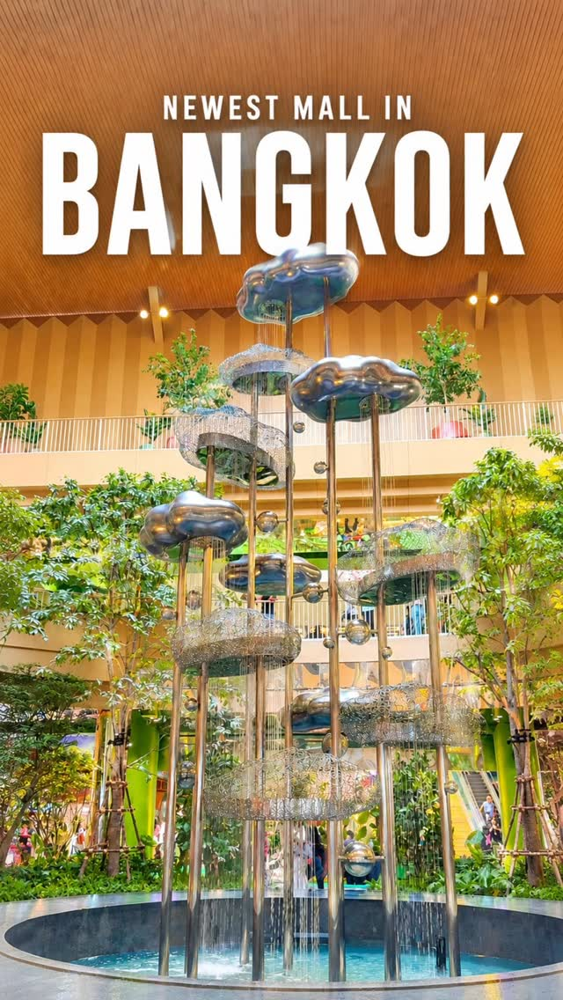
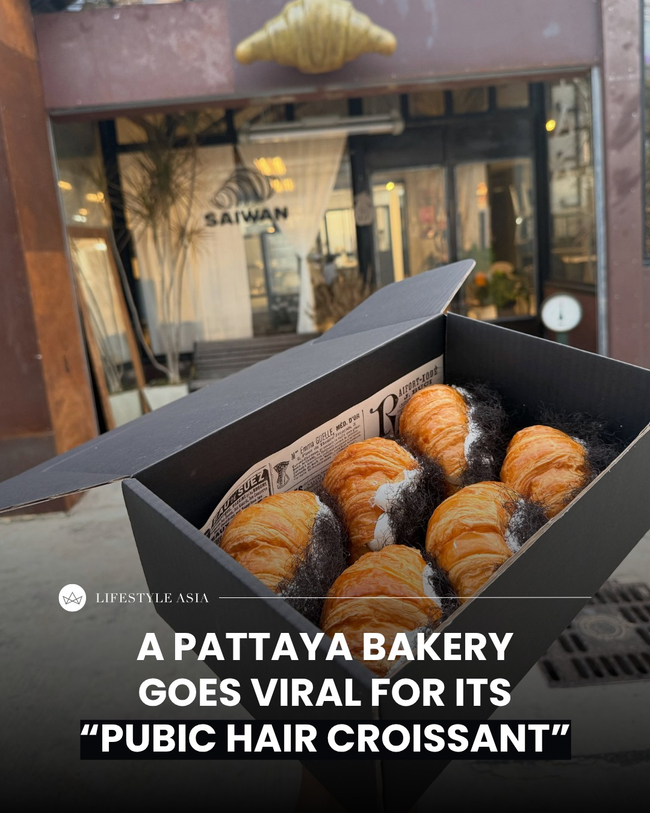
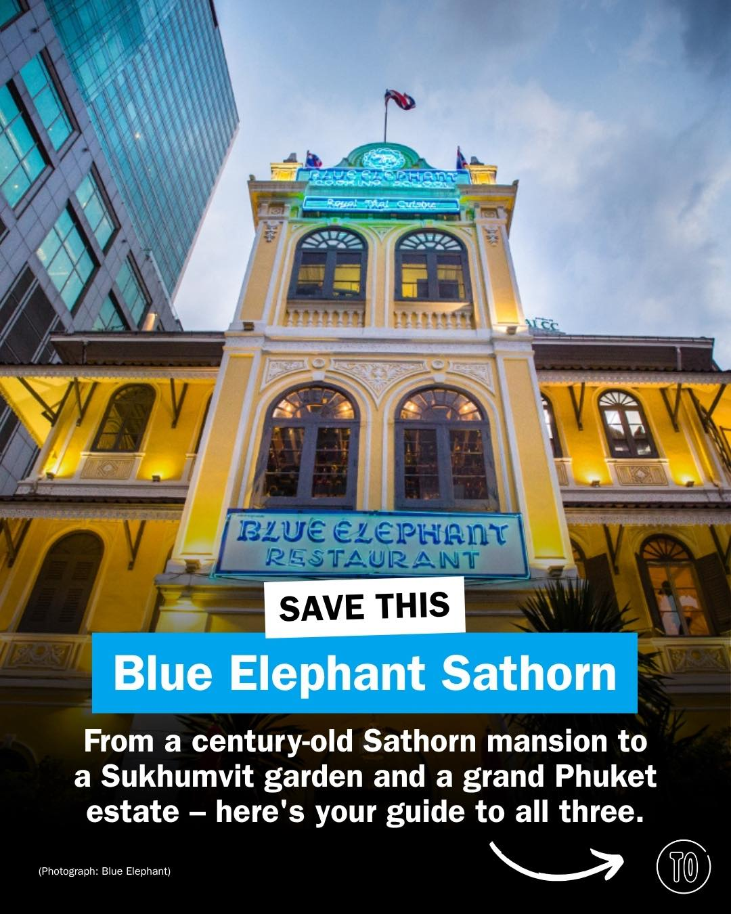
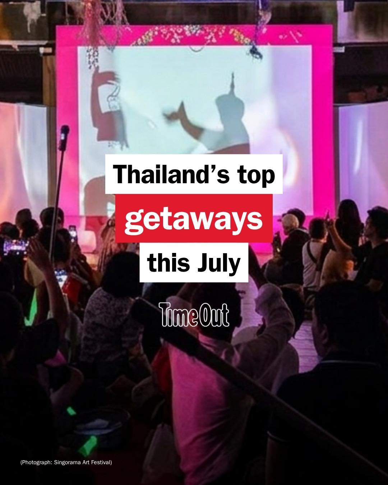
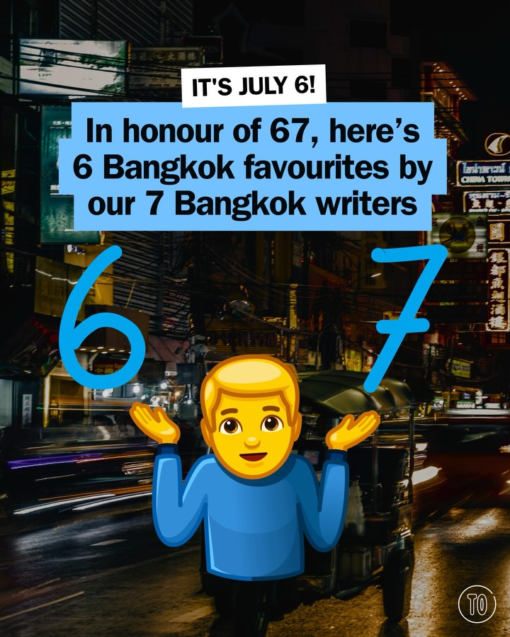
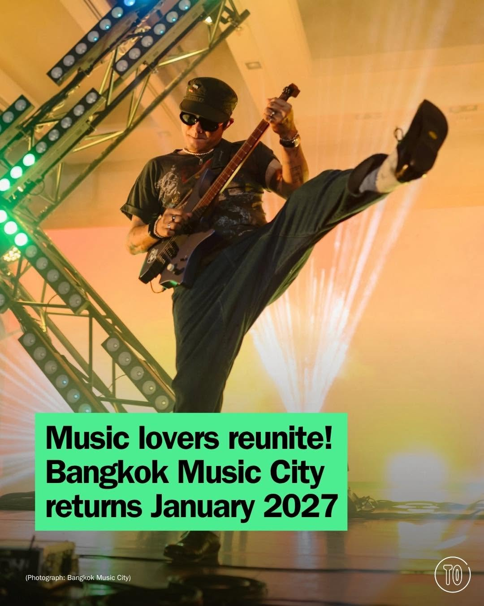

# 📸 2026-07-07 IG 新貼文彙整

## @richie.got.you · 旅遊

**地點：** Central Northville　**約會指數：** 7/10　**風格：** 熱鬧、購物

**摘要：** 這是一個位於曼谷的最新購物中心，適合喜歡購物和熱鬧氛圍的約會。可以一起探索各種商店和餐廳。

> Have you been to the newest mall in Bangkok? #bangkok #bangkokthailand #bangkoktravel #bangkokshopping 📍Central Northville

🔗 https://www.instagram.com/p/DadKePHTKNg/

---

## @lifestyleasiath · 旅遊

**地點：** 當地市場　**約會指數：** 5/10　**風格：** 熱鬧、趣味

**摘要：** 這則貼文提到在當地市場出現了一種新的流行趨勢，主要是關於可擠壓的玩具和貓咪。雖然這些玩具受到歡迎，但當局提醒這種趨勢可能有害且不可持續，適合喜歡新鮮事物的約會對象。

> Have you spotted the viral squishy cakes and cats at your local market yet? There’s a hot new trend around squishy toys in Thailand, and whi…

🔗 https://www.instagram.com/p/DaeWGsnHOuz/

---

## @lifestyleasiath · 旅遊

**地點：** 芭堤雅　**約會指數：** 6/10　**風格：** 熱鬧、運動

**摘要：** 這是一場泰森·富里在芭堤雅的熱身賽，對手是馬里烏斯·瓦赫，活動將在七月舉行。適合喜愛運動和拳擊的約會對象。

> Before his all-British showdown against Anthony Joshua, Tyson Fury is coming to Pattaya in July for a warm-up match against Mariusz Wach. Ta…

🔗 https://www.instagram.com/p/DacoOXzle3k/

---

## @lifestyleasiath · 旅遊

**地點：** 帕塔亞的Saiwan烘焙屋　**約會指數：** 6/10　**風格：** 熱鬧、有趣

**摘要：** 這是一家位於帕塔亞的烘焙屋，以其特別的「陰毛可頌」而聞名，吸引了許多網友和內容創作者前來拍攝。這裡適合喜歡嘗試新奇食物的約會對象。

> If your social media feed has recently served up a croissant that’s raising more than a few eyebrows, you’re not alone. A bakery in Pattaya …

🔗 https://www.instagram.com/p/Dacaj6oHDmB/

---

## @aj.some.more · 旅遊

**地點：** KinKin Seafood　**約會指數：** 8/10　**風格：** 熱鬧、美食

**摘要：** KinKin Seafood 位於曼谷的 Siam Paragon 美食廣場，提供多款新鮮海鮮料理，如百萬富翁蟹炒飯和迷你冬蔭麵。這裡的食物非常美味，適合約會時享受美食。

> I honestly didn’t expect to find seafood this good inside a food court. 😮🇹🇭 If you’re eating at Siam Paragon, don’t skip KinKin Seafood. …

🔗 https://www.instagram.com/p/DaechrRSU2p/

---

## @timeoutbangkok · 市集

**地點：** 藍象餐廳　**約會指數：** 8/10　**風格：** 文青、浪漫、美食

**摘要：** 藍象餐廳是一家提供泰國傳統美食的餐廳，位於曼谷的薩吞區，距離Surasak BTS僅需兩分鐘步行。這裡的綠咖哩和馬薩曼咖哩風味濃郁，非常適合約會享受美食。

> A hundred-odd years old, the colonial mansion in Sathorn stands a two-minute stroll from Surasak BTS, all dark teak, high ceilings and starc…

🔗 https://www.instagram.com/p/Daec1O9iAg2/

---

## @timeoutbangkok · 市集

**地點：** Singorama Art Fest　**約會指數：** 8/10　**風格：** 文青、戶外、熱鬧

**摘要：** Singorama Art Fest 是一個為期三天的戶外藝術展，將宋卡的老城區轉變為藝術畫廊，非常適合喜愛藝術的約會對象。活動時間在七月，適合與伴侶一起享受藝術氛圍。

> July brings five reasons to leave home 🧳 Sip wine on Pratumnak Hill with a buy-one-get-one deal at Kliff Beach Bistro & Bar (@kliff.beach),…

🔗 https://www.instagram.com/p/Dac7AcjG5BK/

---

## @timeoutbangkok · 市集

**地點：** 曼谷市集　**約會指數：** 7/10　**風格：** 熱鬧、文青

**摘要：** 這是曼谷的一個市集，聚集了多位作家的最愛地點，適合喜歡探索新事物的約會對象。雖然沒有具體的時間和價格資訊，但這樣的市集氛圍非常適合約會。

> It’s the 6th of July, which means only one thing… It’s 6 🫲🤪🫱 7 So what better than a round up of our 6 favourite spots from our 7 writers…

🔗 https://www.instagram.com/p/Dacsqutk9sC/

---

## @timeoutbangkok · 市集

**地點：** 曼谷音樂城　**約會指數：** 9/10　**風格：** 熱鬧、音樂、戶外

**摘要：** 曼谷音樂城是一個國際音樂展演節，將於2027年1月30日至31日舉行。這不僅是一場音樂節，還是藝術家、觀眾和音樂產業專業人士的交流平台，非常適合約會。

> Bangkok Music City 2027 returns! Come see your favourite Thai and international artists at Thailand’s most major international music showcas…

🔗 https://www.instagram.com/p/DacolSEm75q/

---

## @timeoutbangkok · 市集

**地點：** 隆比尼公園附近的咖啡廳和麵包店　**約會指數：** 7/10　**風格：** 文青、熱鬧、戶外

**摘要：** 隆比尼公園是一個適合晨跑和晚間活動的熱鬧地點，附近有多家咖啡廳和麵包店，非常適合約會後享用美食。這裡的餐點選擇多樣，適合喜愛碳水化合物的人士。

> Running shows no sign of slowing in Bangkok. Morning, evening or after dark, Lumpini Park is full of people clocking kilometres and chasing …

🔗 https://www.instagram.com/p/DacSUQsk_3Q/

---

