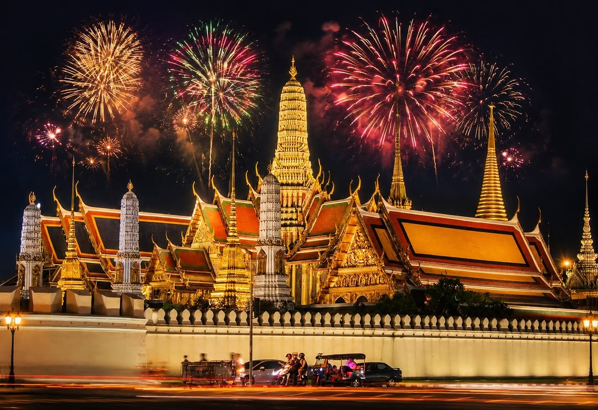
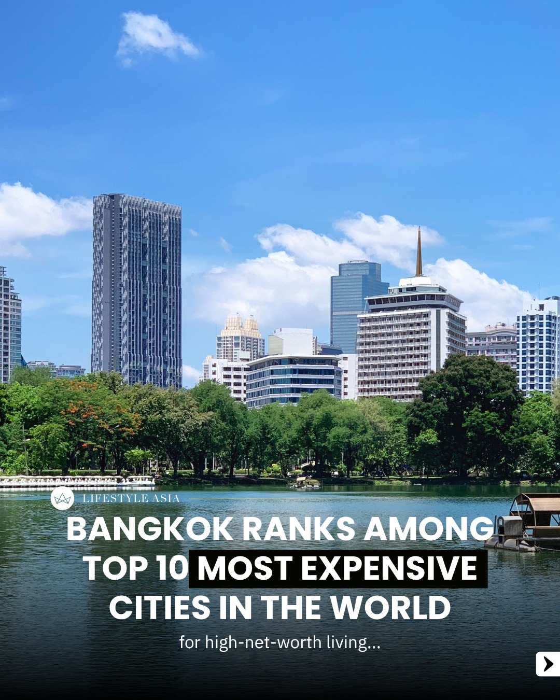
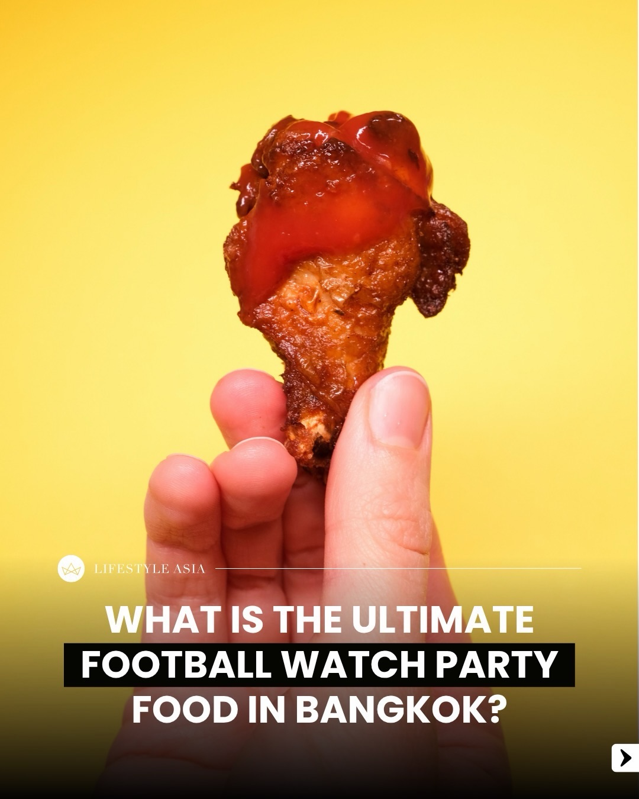
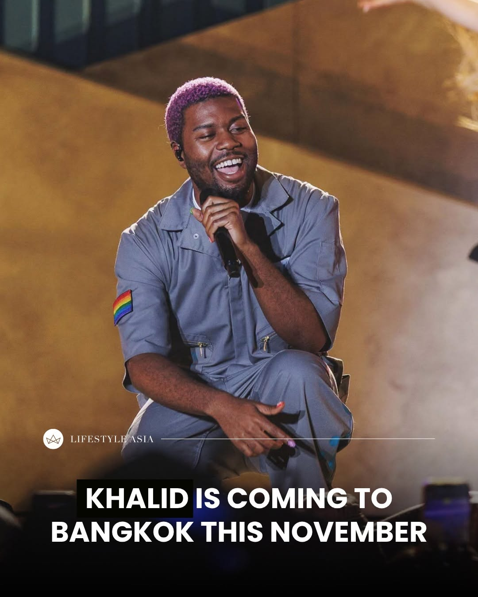
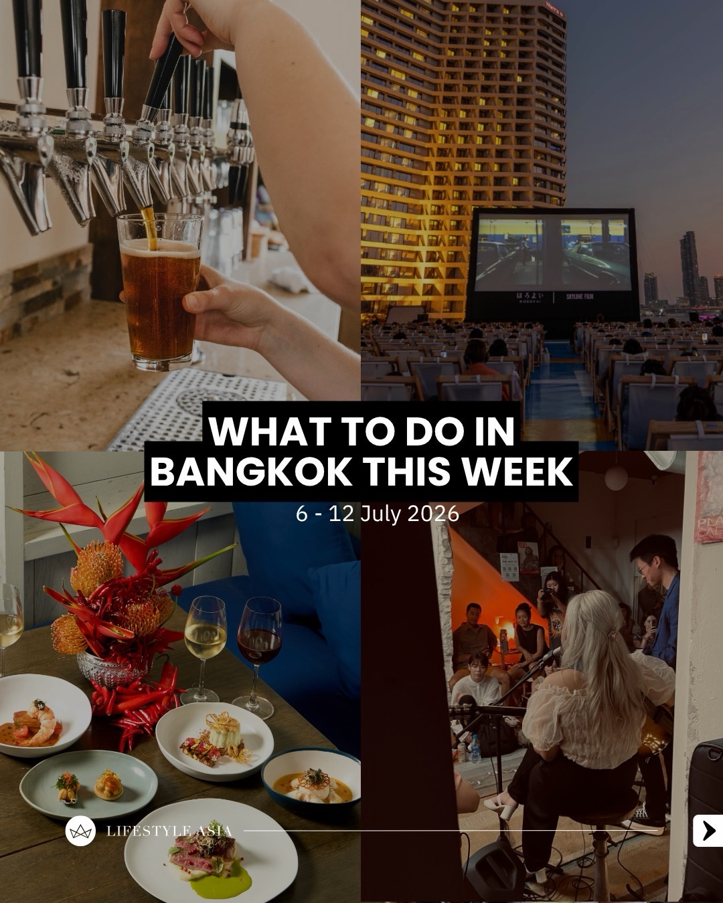
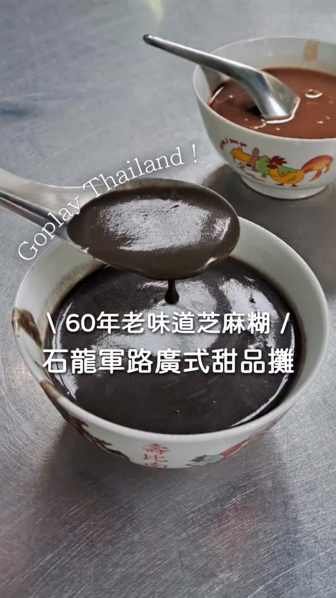
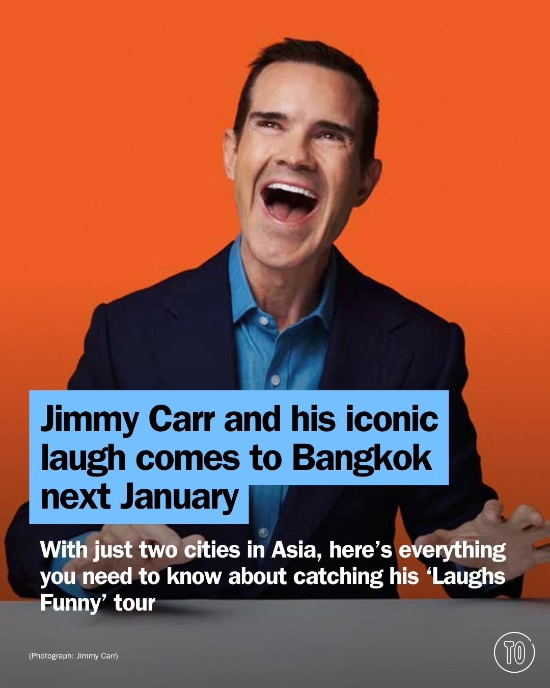
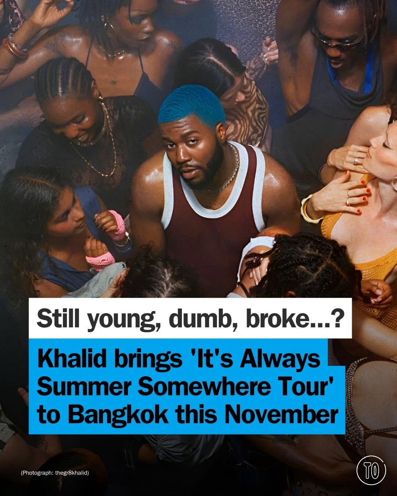

# 📸 2026-07-08 IG 新貼文彙整

## @bangkok_insiders · 展覽

**地點：** 翡翠佛寺　**約會指數：** 7/10　**風格：** 浪漫、靜謐、文化

**摘要：** 這是一個關於翡翠佛寺夜間煙火的貼文，展現了寺廟的壯麗景色。適合喜愛文化和浪漫氛圍的約會對象。

> The temple of the emerald Buddha by night of the fireworks #bkk #bangkok #amazing #travel #temple

🔗 https://www.instagram.com/p/DafDKlvByqF/

---

## @lifestyleasiath · 旅遊

**地點：** 曼谷　**約會指數：** 5/10　**風格：** 都市、奢華

**摘要：** 根據最新的 Julius Baer 全球財富與生活方式報告，曼谷已成為全球十大高淨值生活最昂貴城市之一。這裡適合喜愛奢華生活的約會。

> According to the newly released Julius Baer Global Wealth and Lifestyle Report 2026, Bangkok now ranks among the world's 10 most expensive c…

🔗 https://www.instagram.com/p/Dag65b6HFTh/

---

## @lifestyleasiath · 旅遊

**地點：** 泰國　**約會指數：** 7/10　**風格：** 熱鬧、運動

**摘要：** 這則貼文提到泰國的世界盃足球賽熱潮，無論是半夜還是清晨，球迷們聚在一起觀看比賽。適合喜愛運動和熱鬧氣氛的約會。

> While the hours may be wild for us, there’s no denying that Thailand has caught the World Cup bug. Midnight, 3am, or long into the morning r…

🔗 https://www.instagram.com/p/Dae_KLwE2qi/

---

## @lifestyleasiath · 旅遊

**地點：** UOB Live, Emsphere　**約會指數：** 8/10　**風格：** 熱鬧、音樂、活動

**摘要：** Khalid 將於 11 月 29 日在曼谷的 UOB Live, Emsphere 舉行世界巡演演唱會，適合喜歡音樂的約會對象。這是一個熱鬧的活動，讓你和伴侶一起享受音樂的魅力。

> Khalid is bringing his ‘It’s Always Summer Somewhere’ world tour to Asia. With stops in Singapore, Hong Kong, Taipei, Tokyo, Seoul, and Kual…

🔗 https://www.instagram.com/p/DafDTtgFW5h/

---

## @lifestyleasiath · 旅遊

**地點：** 曼谷活動　**約會指數：** 7/10　**風格：** 熱鬧、戶外

**摘要：** 這篇貼文介紹了在曼谷的最佳活動，包括卡拉OK嘟嘟車和移動音樂會，適合喜歡熱鬧氛圍的約會對象。活動時間為2026年7月6日至12日。

> From a karaoke tuk-tuk run to an on-the-go concert, here are the best things to do in Bangkok from 6-12 July 2026. Tap the link in bio for d…

🔗 https://www.instagram.com/p/Dae8M4kk0Qj/

---

## @goplaybangkok · 旅遊

**地點：** Ji Ma Wu　**約會指數：** 8/10　**風格：** 文青、熱鬧、美食

**摘要：** 這是一家位於曼谷的老字號甜品攤位，專賣正宗廣式芝麻糊、紅豆沙及廣式粽子。營業時間為11:30至16:30，人氣極高，適合約會後享受甜品。

> \ #曼谷也吃得到正宗廣式芝麻糊・超過 60 年老字號秒殺甜品☕🖤 / 你知道嗎？在曼谷居然也能吃到相當正宗的廣式傳統甜品 #芝麻糊！位在石龍軍路上、傳承超過 60 年的老字號攤位「Ji Ma Wu」被公認為是曼谷少數仍保有正宗廣東老味道的甜品攤之一 😋 攤子專賣芝麻糊、紅豆…

🔗 https://www.instagram.com/p/DafhfHiSeuM/

---

## @timeoutbangkok · 市集

**地點：** MEME FEST　**約會指數：** 8/10　**風格：** 熱鬧、創意、音樂

**摘要：** MEME FEST 是一個結合網路幽默與現場音樂的盛會，將於10月17日至18日在 Union Hall, Union Mall 舉行。活動有超過30位表演者，適合喜歡熱鬧氛圍的約會對象。

> Ever fired off a meme before you can manage actual words? Then MEME FEST has your name all over it 🎤 YUEDPAO Presents @memefest.official sm…

🔗 https://www.instagram.com/p/DahBGrym3B2/

---

## @timeoutbangkok · 市集

**地點：** MuangThai Rachadalai Theatre　**約會指數：** 8/10　**風格：** 熱鬧、幽默

**摘要：** 這是一場由喜劇演員 Jimmy Carr 主辦的喜劇表演，將於 2027 年 1 月 16 日在 MuangThai Rachadalai Theatre 舉行。這個活動適合喜歡幽默和喜劇的約會對象，建議提前購票。

> @jimmycarr is coming to Bangkok this January with his new ‘Laughs Funny’ tour. Set to show at MuangThai Rachadalai Theatre on January 16, 20…

🔗 https://www.instagram.com/p/DafC5TTG02U/

---

## @timeoutbangkok · 市集

**地點：** UOB Live Bangkok　**約會指數：** 8/10　**風格：** 熱鬧、音樂、活動

**摘要：** 著名歌手 Khalid 將於 11 月 29 日在 UOB Live Bangkok 舉行一場演唱會。票價從 2,800 泰銖到 3,300 泰銖，非常適合喜愛音樂的情侶約會。

> @thegr8khalid, the voice behind ‘Location’, ‘Young Dumb & Broke’ and ‘Talk’, is coming to Bangkok for one night only on November 29 at @uobl…

🔗 https://www.instagram.com/p/Daex0C2G-P5/

---

