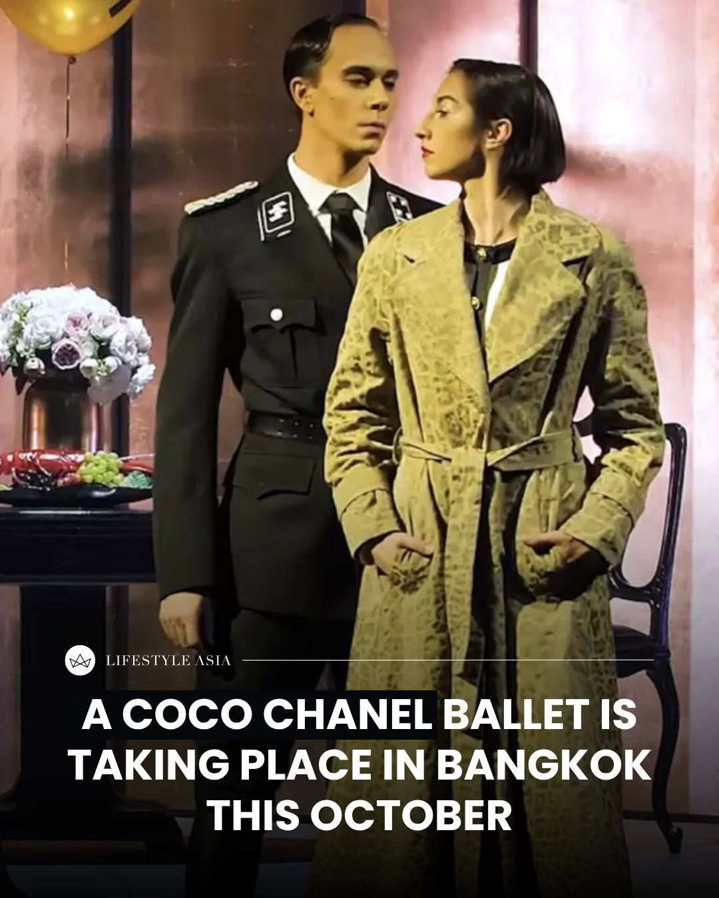
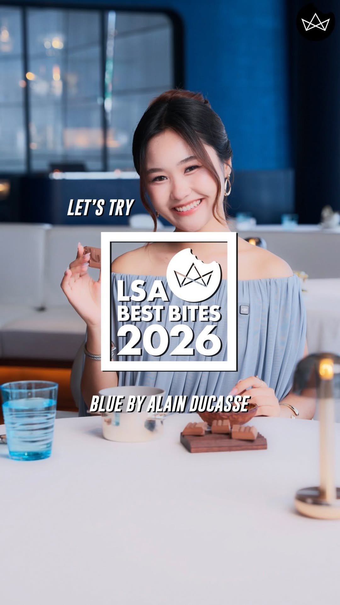
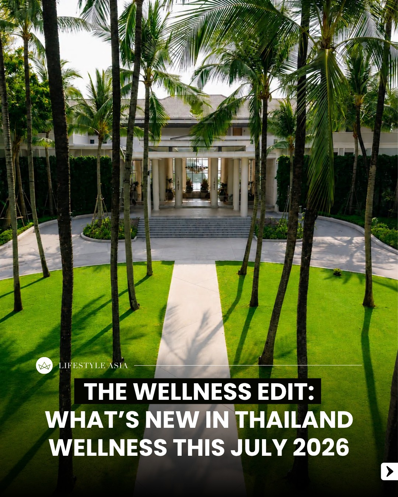
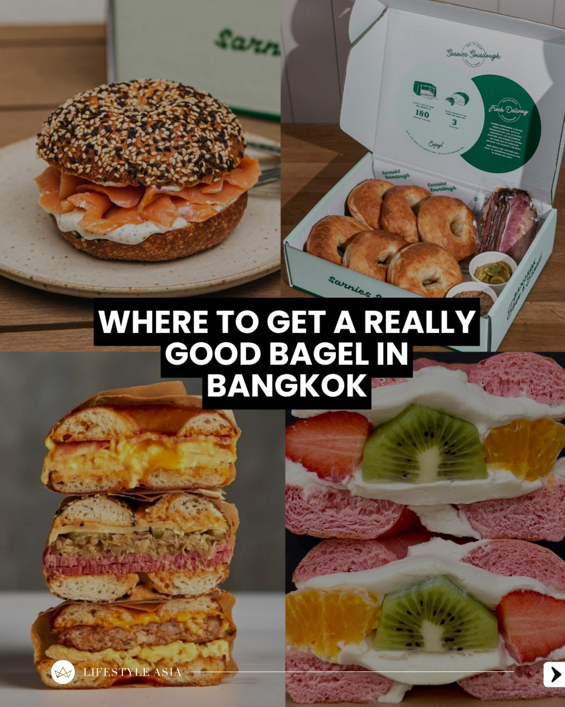
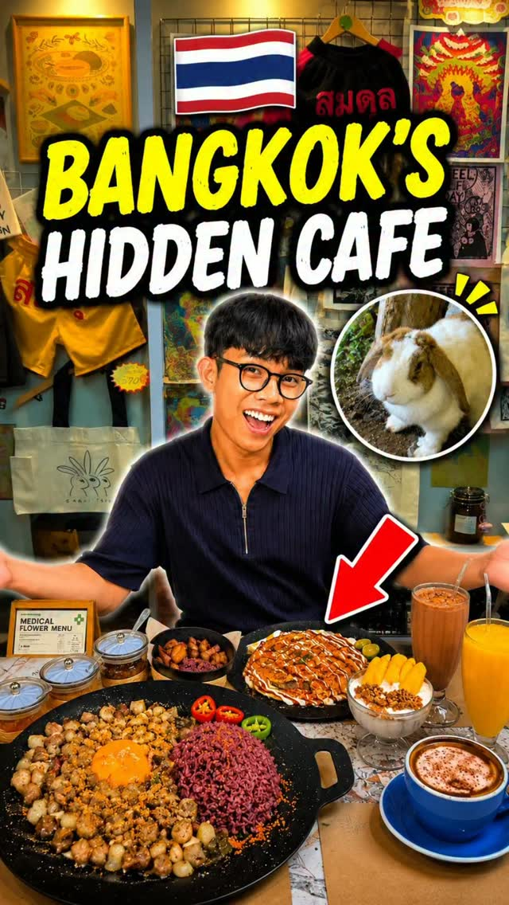
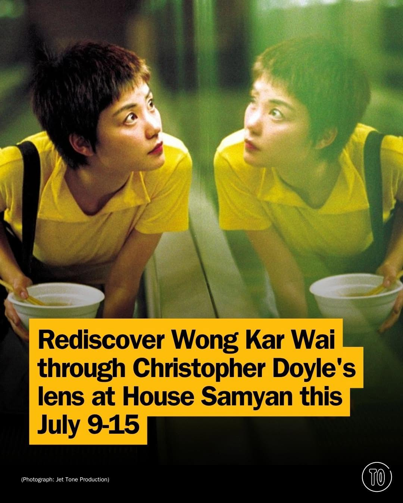
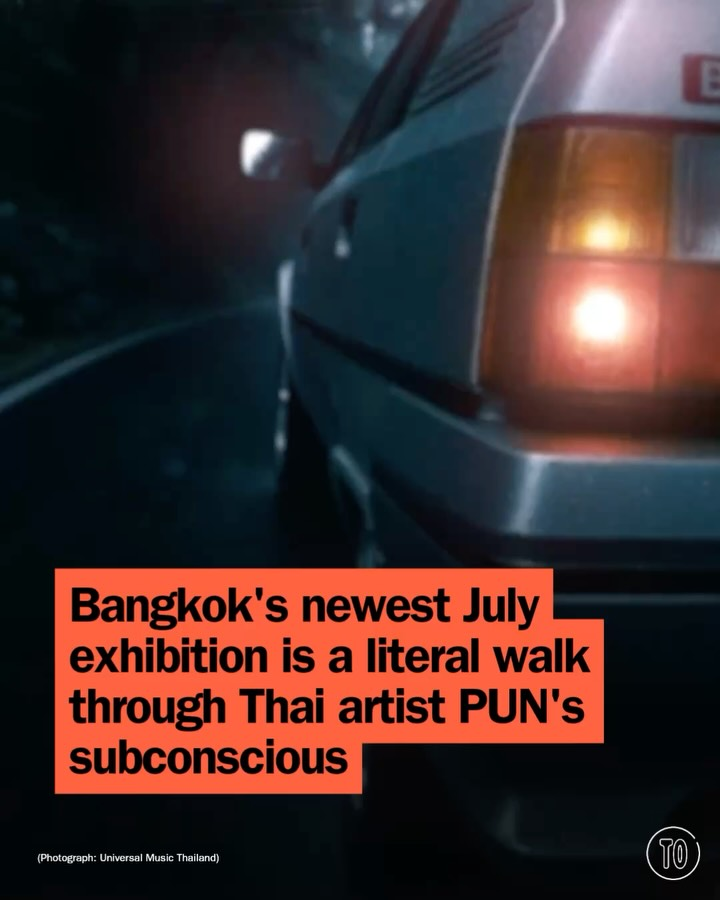
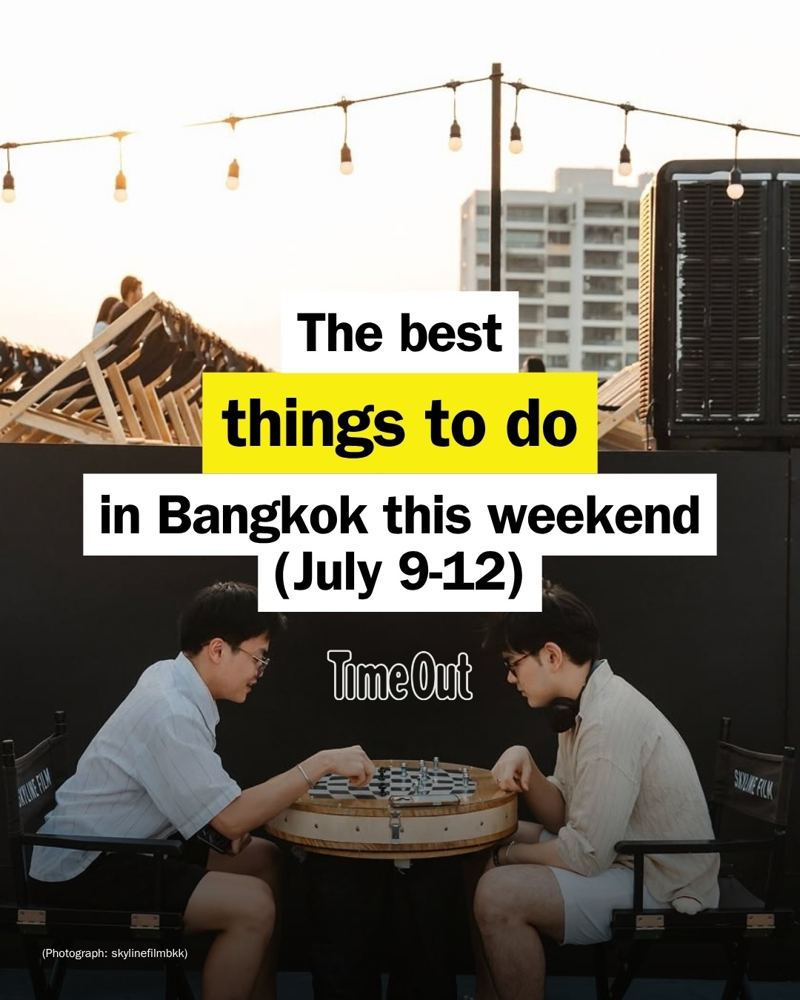
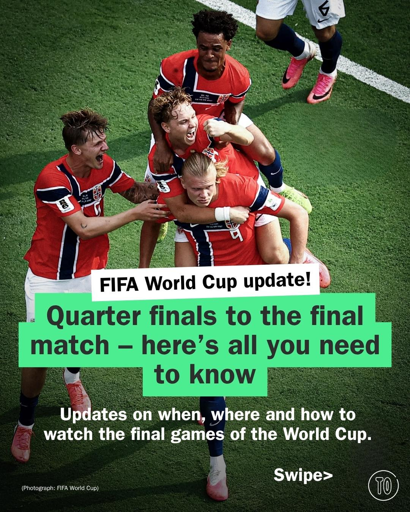

# 📸 2026-07-09 IG 新貼文彙整

## @lifestyleasiath · 旅遊

**地點：** 曼谷當代芭蕾舞表演　**約會指數：** 8/10　**風格：** 藝術、浪漫、文化

**摘要：** 這是一場以可可香奈兒為主題的當代芭蕾舞表演，將於十月在曼谷舉行。適合喜愛藝術與文化的情侶前來約會。

> Few fashion figures have shaped modern style quite like Coco Chanel. This October, her remarkable story will take centre stage in Bangkok th…

🔗 https://www.instagram.com/p/Dajfs2EHGvj/

---

## @lifestyleasiath · 旅遊

**地點：** Blue by Alain Ducasse　**約會指數：** 9/10　**風格：** 浪漫、高級、靜謐

**摘要：** 這是一家位於購物中心的高級餐廳，提供法式料理與秘魯風味的結合。適合約會，享受精緻的用餐體驗。

> Fine dining... in a shopping mall? 👀✨ LSA Best Bites Let's Try visits @bluebyalainducasse to experience Chef @evens_lopez's Summer 2026 sea…

🔗 https://www.instagram.com/p/Dah4qFsyqC6/

---

## @lifestyleasiath · 旅遊

**地點：** The Ice Bath Club Bangkok　**約會指數：** 7/10　**風格：** 健康、運動、放鬆

**摘要：** 這則貼文介紹了曼谷的冰浴俱樂部，適合喜愛健康與運動的人士。這裡提供放鬆的環境，非常適合約會時一起探索新的健身體驗。

> Our July edition of “The Wellness Edit” spotlights the opening of The Ice Bath Club Bangkok and Vault Fitness, alongside a limited-time soma…

🔗 https://www.instagram.com/p/DahyIzrnL7R/

---

## @lifestyleasiath · 旅遊

**地點：** 曼谷貝果三明治　**約會指數：** 7/10　**風格：** 美食、熱鬧

**摘要：** 這篇貼文介紹了曼谷的最佳貝果三明治選擇，適合喜愛美食的約會對象。雖然沒有具體的時間或地點，但這裡的熱鬧氛圍適合約會。

> Who makes the best bagel sandwich in Bangkok? Here are our top contenders. #Bagels #Bangkok #LifestyleAsia #LifestyleAsiaTH

🔗 https://www.instagram.com/p/DahdTNmliQP/

---

## @aj.some.more · 旅遊

**地點：** Sabai Tayo　**約會指數：** 8/10　**風格：** 文青、靜謐、美食

**摘要：** Sabai Tayo 是一家位於曼谷的咖啡廳，提供美味的菲律賓料理和手沖咖啡，非常適合約會時享受悠閒的時光。這裡環境優美，讓人能夠在藝術和自然中放鬆心情。

> Not every hidden gem in Bangkok is a rooftop or a night market. Sometimes it’s a place where you can slow down, enjoy great food, sip Philip…

🔗 https://www.instagram.com/p/Dah256whqEe/

---

## @timeoutbangkok · 市集

**地點：** House Samyan　**約會指數：** 8/10　**風格：** 文青、浪漫、靜謐

**摘要：** 這是一個在 House Samyan 放映經典電影的活動，包括《春光乍洩》、《花樣年華》等。活動時間為 7 月 9 日至 15 日，非常適合約會。

> Five legendary classics return once again 🎬 Neon bleeding through rain. The loneliness of a city that never stops moving. Conversations tha…

🔗 https://www.instagram.com/p/Dajmq2CG83t/

---

## @timeoutbangkok · 市集

**地點：** Somnia 音樂體驗展　**約會指數：** 8/10　**風格：** 文青、浪漫、藝術

**摘要：** 這是一個以泰國音樂家 @pun___official 的音樂為主題的沉浸式體驗展，展期從7月25日到8月8日。每個房間代表生命中的不同篇章，適合喜愛音樂和藝術的情侶約會。

> Some songs you listen to. This one you walk through. @pun___official’s ‘Museum of Somnia’ is an embodied music experience built entirely aro…

🔗 https://www.instagram.com/p/Dah6JTEE_cu/

---

## @timeoutbangkok · 市集

**地點：** 曼谷活動　**約會指數：** 6/10　**風格：** 熱鬧、文青

**摘要：** 這個週末在曼谷有各種活動，可以讓你的社交日曆不再空虛。適合喜歡探索新事物的約會對象。

> Social calendar looking a bit empty? We’ve got you. There’s always something happening in Bangkok, and this weekend is no different – so let…

🔗 https://www.instagram.com/p/Dahw8qTky-D/

---

## @timeoutbangkok · 市集

**地點：** 慢速組合藝術展　**約會指數：** 8/10　**風格：** 文青、互動、藝術

**摘要：** 這是一個結合尖端科技與藝術的互動展覽，位於慢速組合的第三層。展覽每週五至週日開放，票價450泰銖，學生票200泰銖，12歲以下免費，適合約會時享受藝術氛圍。

> The world spins faster every day and technology keeps sprinting ahead of us all. Fancy slowing things down for an afternoon? @thebitstudio i…

🔗 https://www.instagram.com/p/DahrNF7CsJB/

---

## @timeoutbangkok · 市集

**地點：** 曼谷　**約會指數：** 7/10　**風格：** 熱鬧、運動

**摘要：** 這篇貼文介紹了在曼谷觀看世界盃足球賽的地點和資訊。活動在七月舉行，非常適合喜愛運動的情侶約會。

> The end is nigh! ⚽ Here’s all you need to know about the final weeks of the FIFA World Cup and where to catch all the big games in Bangkok t…

🔗 https://www.instagram.com/p/DahiSeyG-KG/

---

