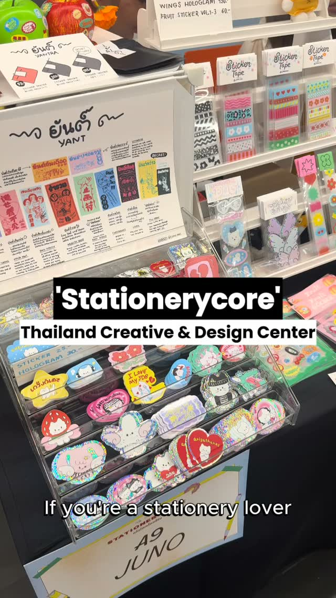
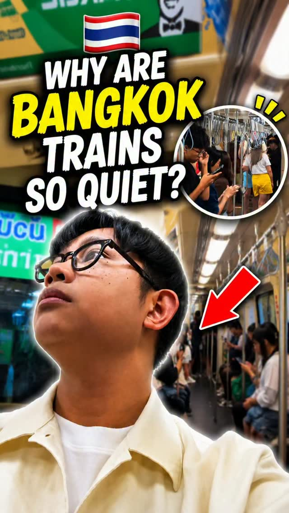
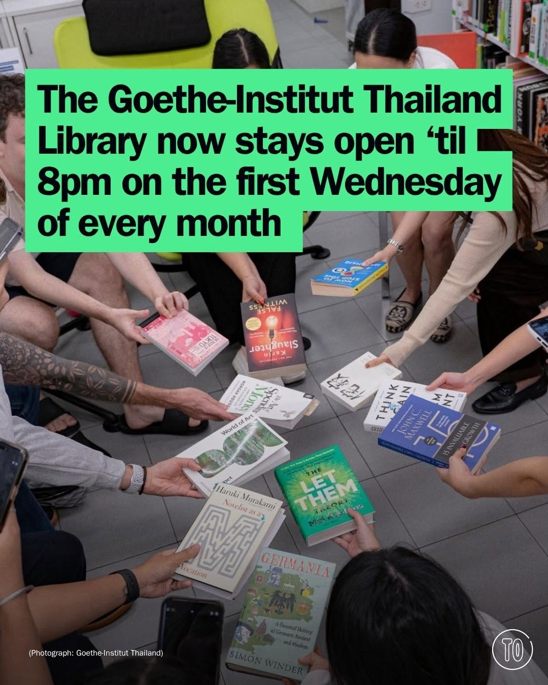
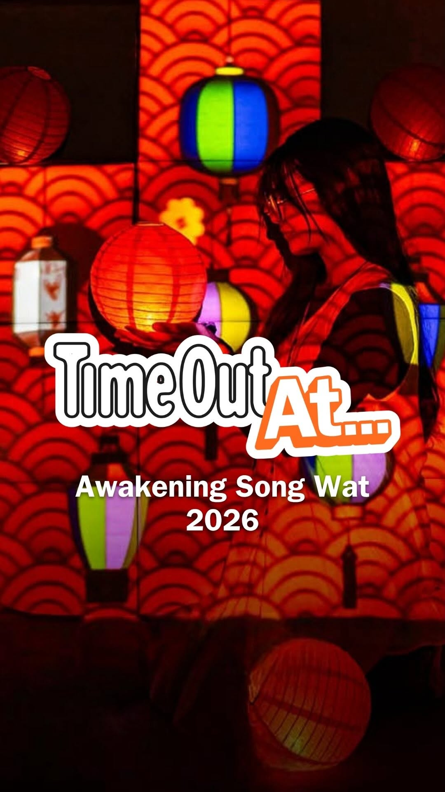

# 📸 2026-07-10 IG 新貼文彙整

## @lifestyleasiath · 旅遊

**約會指數：** 1/10　

**摘要：** 這則貼文介紹了 Meta Muse Image 的推出，並提供了如何禁止使用 Instagram 個人檔案創建 AI 圖像的資訊。這不是約會地點或活動，因此不適合約會。

> The launch of Meta Muse Image allows anyone to use your Instagram profile to create AI images. Here’s how you can prohibit that. Tap link in…

🔗 https://www.instagram.com/p/DamEa9ynM97/

---

## @lifestyleasiath · 旅遊

**地點：** 曼谷的溫布頓比賽觀賞地點　**約會指數：** 7/10　**風格：** 熱鬧、運動

**摘要：** 這篇貼文介紹了在曼谷可以觀賞溫布頓比賽的幾個地點，非常適合喜愛網球的情侶一起前往。若你們想享受比賽的熱情氛圍，這是一個不錯的約會選擇。

> Catch the last few games of the Wimbledon Tournament in one of these places here in Bangkok. Tap link in bio for details. #LifestyleAsia #Li…

🔗 https://www.instagram.com/p/DakP-mZlVEg/

---

## @lifestyleasiath · 旅遊

**地點：** 曼谷文具店　**約會指數：** 6/10　**風格：** 文青、熱鬧

**摘要：** 這是一個專為文具愛好者設計的場所，適合喜歡文具的人士前來探索。雖然沒有具體的時間或價格資訊，但這樣的地點通常適合約會。

> Bangkok stationery lovers, this is for you. #Stationery #StationeryLover #Bangkok #LifestyleAsia #LifestyleAsiaTH

🔗 https://www.instagram.com/p/DakCMMZAFoG/

---

## @goplaybangkok · 旅遊

**地點：** 1981 SOUL&SOLD　**約會指數：** 8/10　**風格：** 文青、復古、熱鬧

**摘要：** 1981 SOUL&SOLD 是一個以復古主題為基調的複合式生活空間，提供古著服飾、底片相機等多樣商品，適合喜愛挖寶的年輕人。這裡的社交氛圍也非常適合約會，特別是想避開人潮的情侶。

> \ #曼谷賽博龐克風格百貨・1981SOUL&SOLD 復古主題商場 🪩🎰 / 如果你逛膩了曼谷市中心那些過度觀光化的大型百貨，那這間今年 7 月剛開幕的 1981 SOUL&SOLD，絕對值得你親自來探索！ 由舊百貨再生的複合式生活空間，以強烈的復古美學作為靈感基調。主視覺…

🔗 https://www.instagram.com/p/DakrHagyX40/

---

## @aj.some.more · 旅遊

**地點：** 曼谷　**約會指數：** 5/10　

**摘要：** 這篇貼文提到泰國曼谷，並鼓勵追蹤帳號以獲取更多旅遊小貼士和當地資訊。曼谷是一個充滿活力的城市，適合喜愛探索的約會對象。

> Have you noticed this too? 👀🇹🇭 Follow @aj.some.more for more Bangkok tips and local insights.

🔗 https://www.instagram.com/p/Dakc1cGSv02/

---

## @timeoutbangkok · 市集

**地點：** 歌德學院泰國圖書館　**約會指數：** 7/10　**風格：** 文青、靜謐、社交

**摘要：** 歌德學院泰國圖書館每月第一個星期三延長開放至晚上8點，名為「深夜圖書館」。這是一個適合聊天、練習德語和與朋友聚會的好機會，免費對所有人開放，非常適合約會。

> Night owls with library cards, this one's for you. 📚 The Goethe-Institut Thailand Library now stays open till 8pm on the first Wednesday of…

🔗 https://www.instagram.com/p/DamMFZDGxuk/

---

## @timeoutbangkok · 市集

**地點：** 曼谷美食市集　**約會指數：** 8/10　**風格：** 熱鬧、美食、文青

**摘要：** 這個週的曼谷美食市集聚集了多家餐廳，提供各式美味佳餚，包括法國和義大利的夏季松露及廣東風味的石斑魚菜單，非常適合約會。各種新穎的美食選擇，讓人不容錯過。

> This week’s food news comes with birthdays, seasonal ingredients and a few unexpected twists. LARDER (@larderbkk) marks four years with KA N…

🔗 https://www.instagram.com/p/DakXb9dG_rA/

---

## @timeoutbangkok · 市集

**地點：** 普吉島市集　**約會指數：** 7/10　**風格：** 熱鬧、文青、音樂

**摘要：** 這是一位普吉島的青少年音樂家在市集上表演的故事，吸引了眾多遊客的目光。市集的氛圍熱鬧，非常適合約會時享受音樂與美食。

> Another Thai name takes the world stage 🎤 Phuket teenager @neneroyalmusic performs 'Zombie' by The Cranberries on America's Got Talent, and…

🔗 https://www.instagram.com/p/DakAnHQG7wn/

---

## @timeoutbangkok · 市集

**地點：** 曼谷河濱夜市　**約會指數：** 8/10　**風格：** 文青、熱鬧、戶外

**摘要：** 曼谷最古老的河濱區再次舉辦夜市，展出21個燈光裝置和數位作品，免費入場。活動時間為7月3日至12日，每晚6點至11點，非常適合約會。

> Bangkok's oldest riverside quarter puts on its evening face again as Awakening Song Wat returns for a second year ✨🏮 Stay out late and Soi …

🔗 https://www.instagram.com/p/Daj2_IMHb-v/

---

