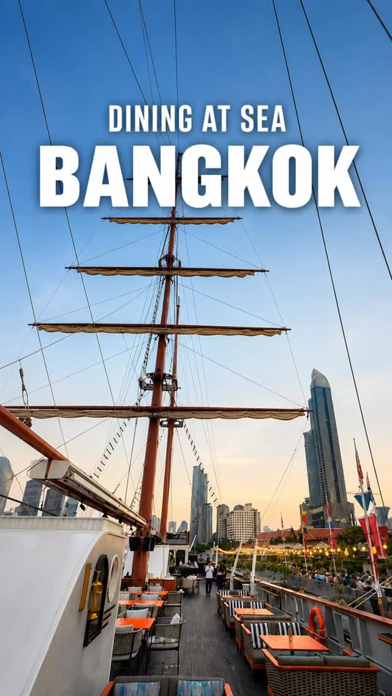
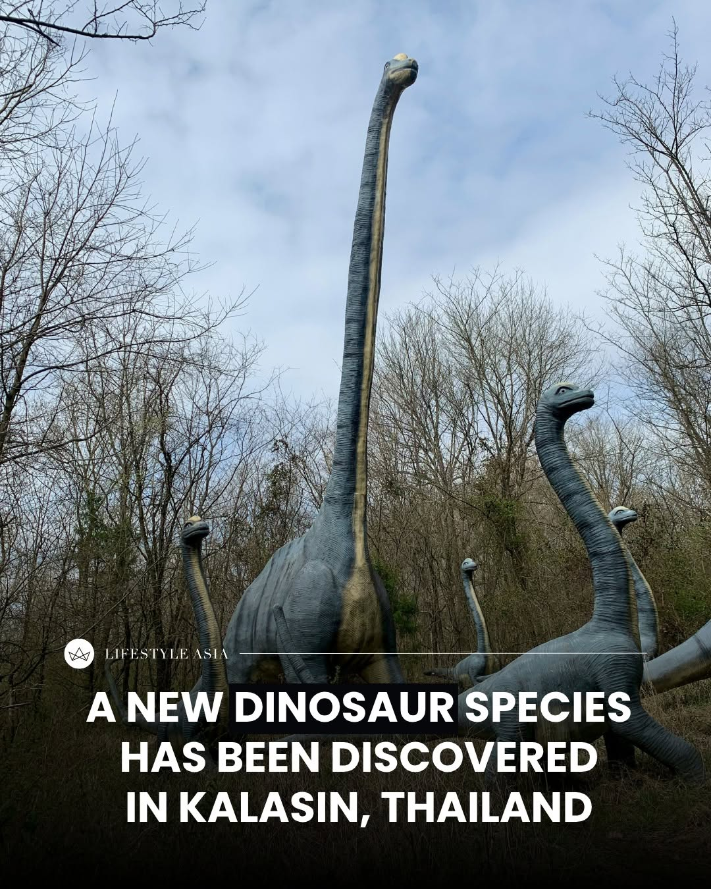
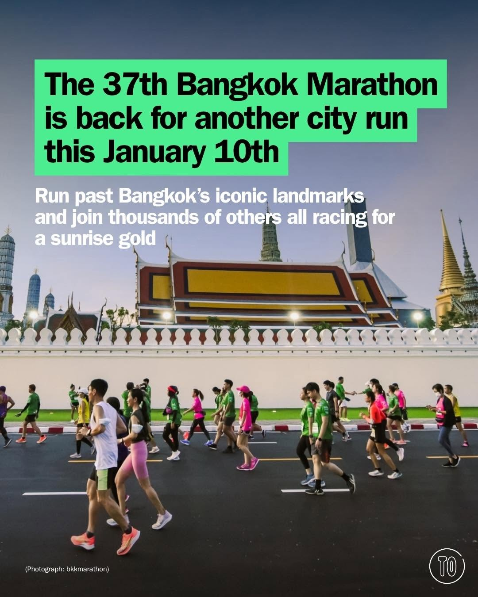
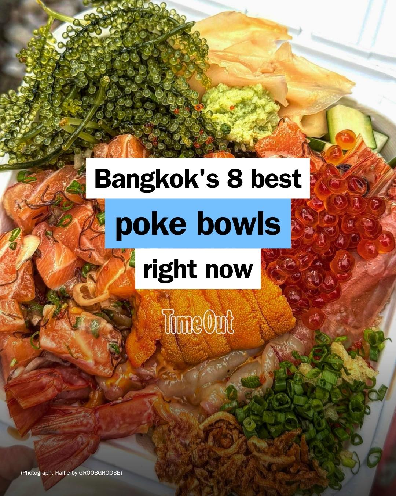
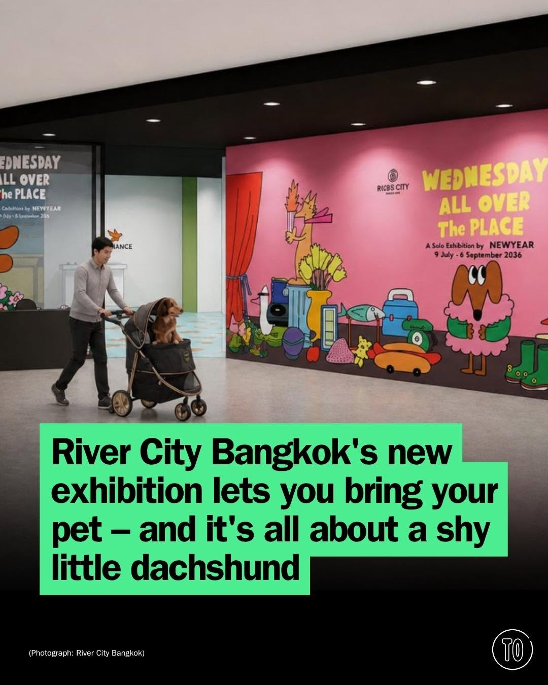

# 📸 2026-07-11 IG 新貼文彙整

## @richie.got.you · 旅遊

**地點：** Sirimahannop　**約會指數：** 8/10　**風格：** 文青、浪漫、熱鬧

**摘要：** 這是一個位於曼谷的獨特用餐體驗，適合喜歡新奇和浪漫氛圍的約會。地點在 ASIATIQUE，非常適合情侶前往享受美食。

> This might be the most unique dining experience in Bangkok #bangkok #bangkokthailand #bangkoktravel #bangkokfood 📍Sirimahannop | ASIATIQUE

🔗 https://www.instagram.com/p/Dam_ZCNT1pQ/

---

## @lifestyleasiath · 旅遊

**地點：** 海灘　**約會指數：** 7/10　**風格：** 夏日、時尚、戶外

**摘要：** 這是一則關於夏季海灘包的貼文，展示了幾款受歡迎的貝殼包。適合喜歡海灘和時尚的約會對象，讓約會充滿夏日氛圍。

> She sells seashells by the seashore, but has she seen these seashell bags? More than a good tongue twister, here are our favourite summery s…

🔗 https://www.instagram.com/p/DaowE_cE8C0/

---

## @lifestyleasiath · 旅遊

**地點：** 泰國　**約會指數：** 5/10　

**摘要：** 這則貼文提到在泰國發現了一種全新的恐龍物種，對恐龍迷來說是一個令人興奮的消息。雖然沒有具體的約會地點，但對於喜歡自然和科學的情侶來說，這是一個值得關注的話題。

> We have news that Ross Geller would be thrilled about: a brand-new dinosaur species has been discovered in Thailand. Here’s all you need to …

🔗 https://www.instagram.com/p/Dam7Y97lXIY/

---

## @lifestyleasiath · 旅遊

**地點：** 溫布頓皇家包廂　**約會指數：** 6/10　**風格：** 時尚、浪漫

**摘要：** 這篇貼文提到溫布頓皇家包廂的穿著規定，並且介紹了安德魯·加菲爾德的手錶。雖然沒有具體的約會建議，但這裡的氛圍適合喜愛時尚和高雅的情侶。

> Wimbledon’s Royal Box has rules for a reason: lounge suits, ties, no hats blocking the view. What it can’t legislate is what shows up on som…

🔗 https://www.instagram.com/p/Damm5BZnAad/

---

## @aj.some.more · 旅遊

**約會指數：** 1/10　

**摘要：** 這則貼文提到如何用泰文說謝謝，但沒有具體的地點或活動資訊，適合對泰國文化有興趣的人。此貼文不適合約會。

> Siri: how to say Thank you in Thai? 🫠🇹🇭

🔗 https://www.instagram.com/p/Dam65qqy_K-/

---

## @timeoutbangkok · 市集

**地點：** 曼谷馬拉松　**約會指數：** 8/10　**風格：** 熱鬧、戶外

**摘要：** 曼谷馬拉松將於1月10日舉行，適合各種程度的跑者參加。這是一個充滿活力的活動，非常適合約會時一起參加，享受運動的樂趣。

> The 37th Bangkok Marathon is back for another city run this January 10 🏃‍♀️💨 From first-time participants taking on their first 5K to seas…

🔗 https://www.instagram.com/p/Daoxea0m6cP/

---

## @timeoutbangkok · 市集

**地點：** 曼谷的 poke 餐廳　**約會指數：** 7/10　**風格：** 文青、熱鬧、美食

**摘要：** 這篇貼文介紹了曼谷的 poke 餐廳，讓人感受到海灘假期的氛圍。適合約會的美食探索，特別是喜愛新鮮生魚片的人。

> Ask a Bangkok local when the city fell for poke and you'll probably get a history lesson or a shrug. One thing is certain: what started in H…

🔗 https://www.instagram.com/p/Dam_2D5G0v8/

---

## @timeoutbangkok · 市集

**地點：** 曼谷河濱藝術中心　**約會指數：** 8/10　**風格：** 文青、浪漫、寵物友善

**摘要：** 這是一個名為「Wednesday: All Over the Place」的展覽，展示了一隻小腊腸狗的冒險故事，展期從7月9日至9月6日，每天10點到20點。票價為100泰銖，帶寵物的票價為150泰銖，非常適合喜歡藝術和寵物的約會。

> Some dogs win a city by being fearless. Wednesday, the little brown dachshund who has charmed Bangkok by being anything but, now gets her bi…

🔗 https://www.instagram.com/p/DamaibLm3nZ/

---

