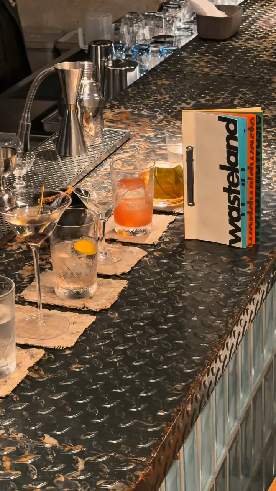
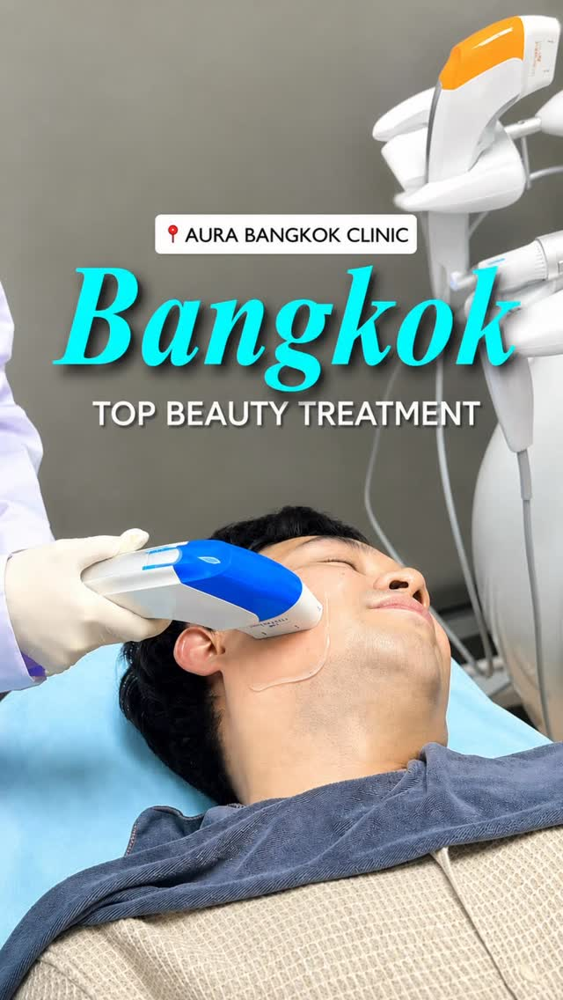
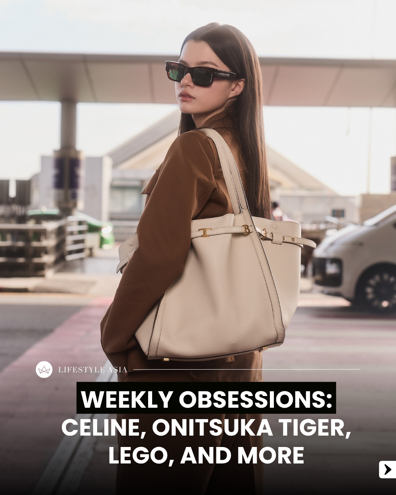
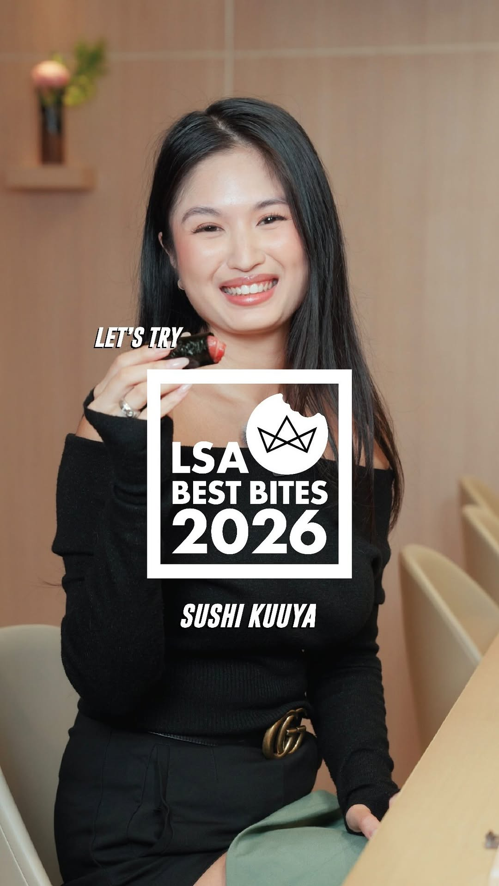
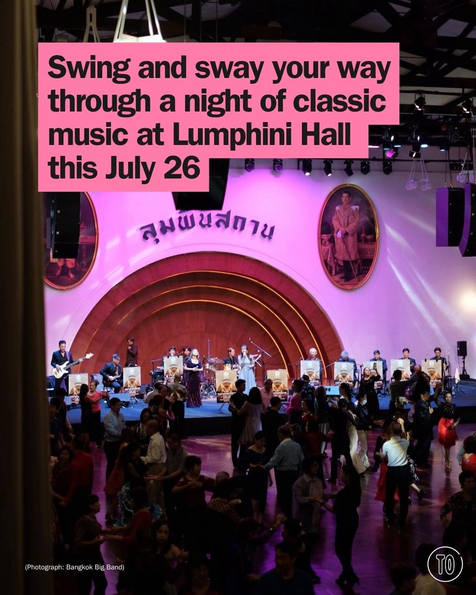
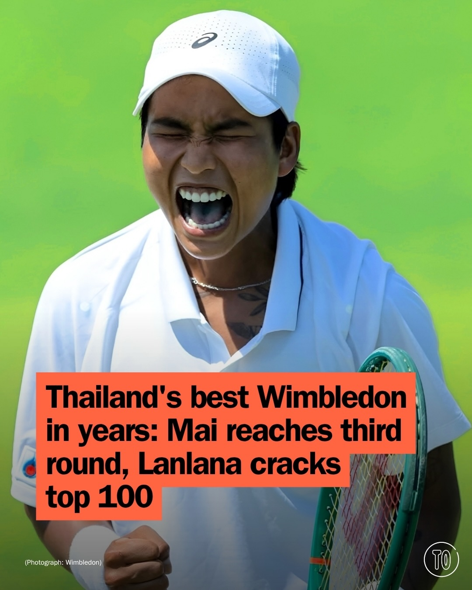
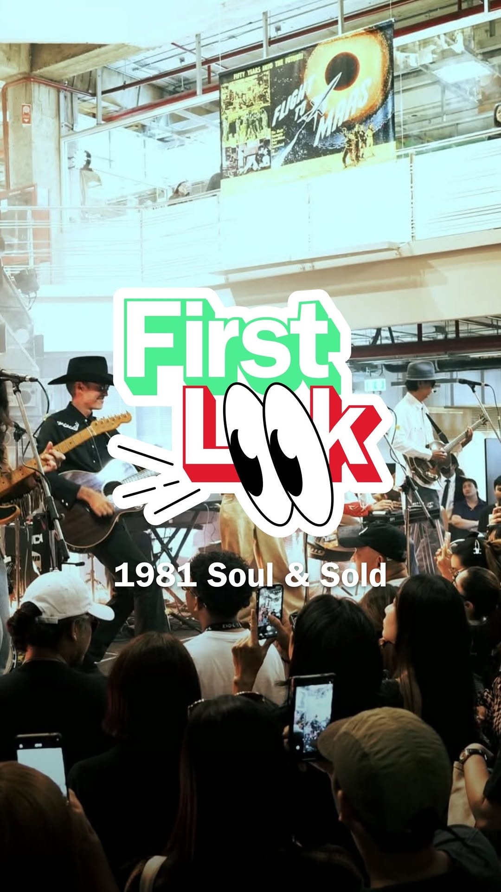
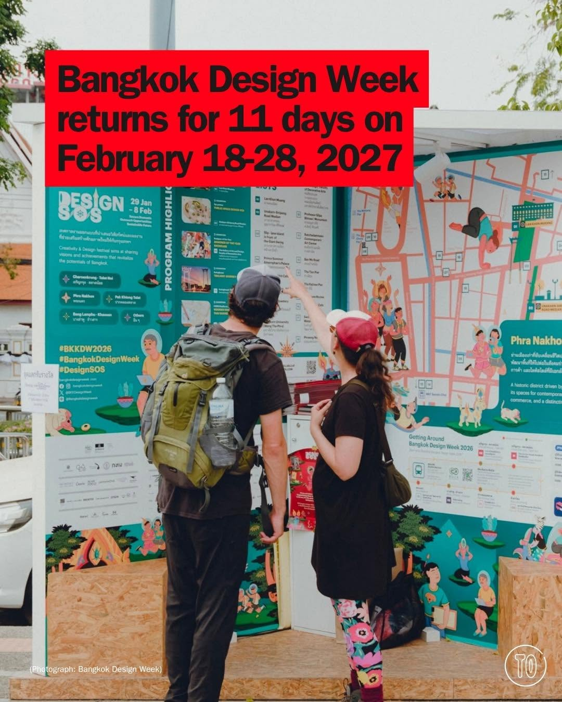

# 📸 2026-07-12 IG 新貼文彙整

## @jiranarong2 · 展覽

**地點：** Wasteland 酒吧　**約會指數：** 8/10　**風格：** 文青、創意、熱鬧

**摘要：** Wasteland 是一家創意酒吧，專注於環保與有機食材的使用，提供獨特的飲品體驗。這裡的飲品使用了各種廢棄食材，適合喜歡新奇與環保的約會對象。

> Wasteland เป็นบาร์ที่เจ๋งตรง เขามีวิธีจัดการกับขยะก่อนจะทิ้งเสมอ เปลือกผัก ผลไม้ ก้างปลา หัวกุ้ง แม้แต่รังต่อถูกจับมาเป็นเครื่องดื่มได้หมด แ…

🔗 https://www.instagram.com/p/Dappv4LTK8p/

---

## @richie.got.you · 旅遊

**地點：** Aura Bangkok Clinic　**約會指數：** 8/10　**風格：** 文青、浪漫、靜謐

**摘要：** Aura Bangkok Clinic 是位於暹羅廣場的一家美容診所，非常適合約會時享受自我保養的時光。這裡提供舒適的環境和專業的服務，讓你放鬆心情。

> Thinking about a beauty day in Bangkok? ✨Save Aura Bangkok for your next self-care stop. 📍Aura Bangkok Clinic | Siam Square One 🚊BTS Siam …

🔗 https://www.instagram.com/p/DapyOB1TBru/

---

## @lifestyleasiath · 旅遊

**地點：** 時尚與生活展　**約會指數：** 6/10　**風格：** 時尚、熱鬧

**摘要：** 這是一個以時尚和生活為主題的展覽，展出最新的時尚合作和創意產品。適合對時尚感興趣的約會對象，能夠一起享受熱鬧的氛圍。

> From the cool fashion collabs to alien Lego sets, here are our #WeeklyObsessions this week. #FallWinter #Fashion #Beauty #LifestyleAsia #Lif…

🔗 https://www.instagram.com/p/DarU6xhHIa4/

---

## @lifestyleasiath · 旅遊

**地點：** Sushi Kuuya　**約會指數：** 8/10　**風格：** 文青、浪漫、美食

**摘要：** 這是一家名為 Sushi Kuuya 的壽司店，提供充滿故事的美食體驗。店家位於曼谷，適合喜愛美食的約會情侶。無論是品嚐壽司或與廚師交流，都是一個浪漫的選擇。

> Every bite tells a story. 🍣✨ In this episode of LSA Best Bites: Let's Try, we return to @sushikuuyabkk to chat with @sushikuuyachef about h…

🔗 https://www.instagram.com/p/DapnCeMEY0W/

---

## @timeoutbangkok · 市集

**地點：** Lumphini Hall　**約會指數：** 8/10　**風格：** 熱鬧、浪漫、舞蹈

**摘要：** 這是一個在Lumphini Hall舉辦的舞會，時間是7月26日下午5點。活動需要提前報名，適合喜歡舞蹈的情侶參加。

> Bangkok Ballroom Dance wants you in your best shoes, your finest frock and out on that floor where the old standards still hold court 🎷👞 I…

🔗 https://www.instagram.com/p/DarXR0ym2EV/

---

## @timeoutbangkok · 市集

**地點：** 溫布頓網球賽　**約會指數：** 7/10　**風格：** 熱鬧、運動

**摘要：** 這是一個關於泰國網球選手在溫布頓網球賽中的表現的貼文。這場賽事吸引了眾多觀眾，非常適合喜愛運動的情侶前來觀賽。

> Two career-best runs, one landmark Wimbledon fortnight for Thai tennis 🇹🇭🎾 @mananchaya.s became only the second Thai woman to reach Wimbl…

🔗 https://www.instagram.com/p/Dape8crk1bw/

---

## @timeoutbangkok · 市集

**地點：** 1981 Soul&Sold　**約會指數：** 8/10　**風格：** 文青、熱鬧、復古

**摘要：** 1981 Soul&Sold 是一個全新改裝的社區商場，結合了復古魅力與現代生活需求，提供各式復古服飾、手作工藝品及互動活動。這裡適合約會，能夠享受購物、用餐及藝術活動，開放時間為每天上午11點至晚上11點。

> Calling all retro lovers and collectors, a newly renovated community mall just opened in Ramkhamhaeng and it is a vintage haven you don’t wa…

🔗 https://www.instagram.com/p/DapFQFTDRlS/

---

## @timeoutbangkok · 市集

**地點：** 曼谷設計週　**約會指數：** 9/10　**風格：** 文青、熱鬧、創意

**摘要：** 曼谷設計週是一個探索設計如何影響生活的活動，將於2027年2月18日至28日舉行。活動包括藝術、工作坊和裝置，適合喜愛創意和靈感的人士，非常適合約會。

> Ten years in and @bangkokdesignweek still asks the same question. 'What can design do?' Quite a lot, as it turns out 🖼️ Design isn't only a…

🔗 https://www.instagram.com/p/Dao90Vum3z2/

---

