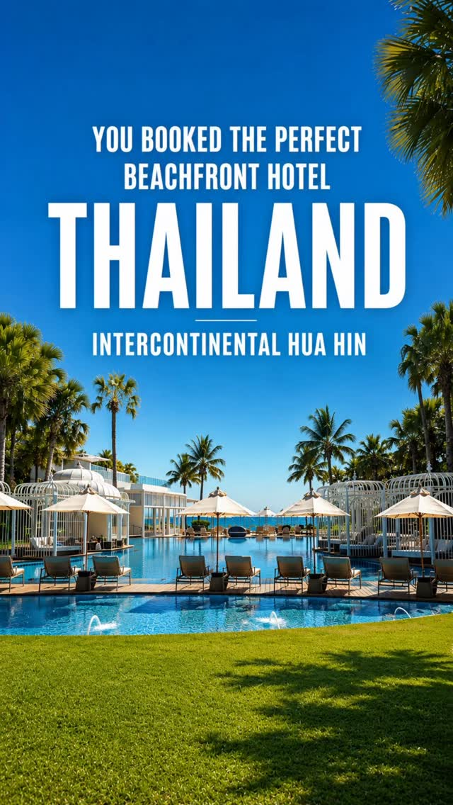
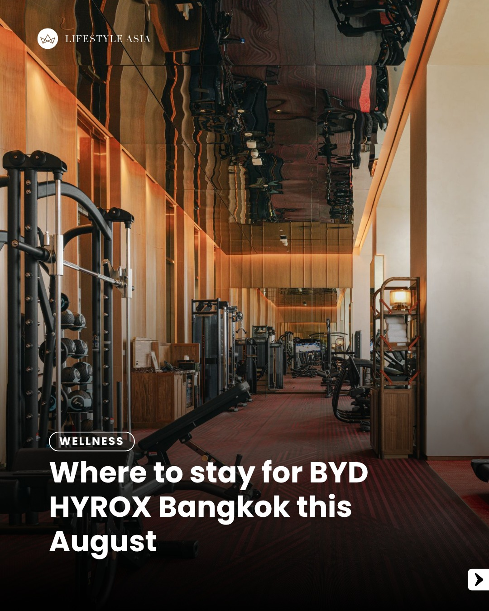
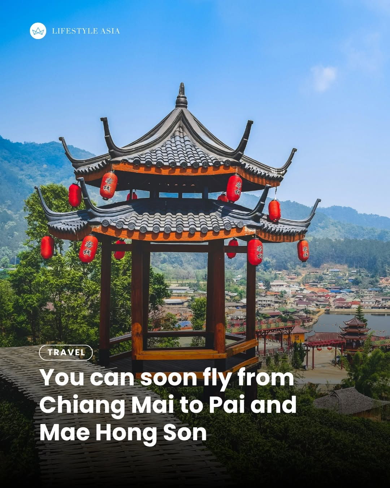
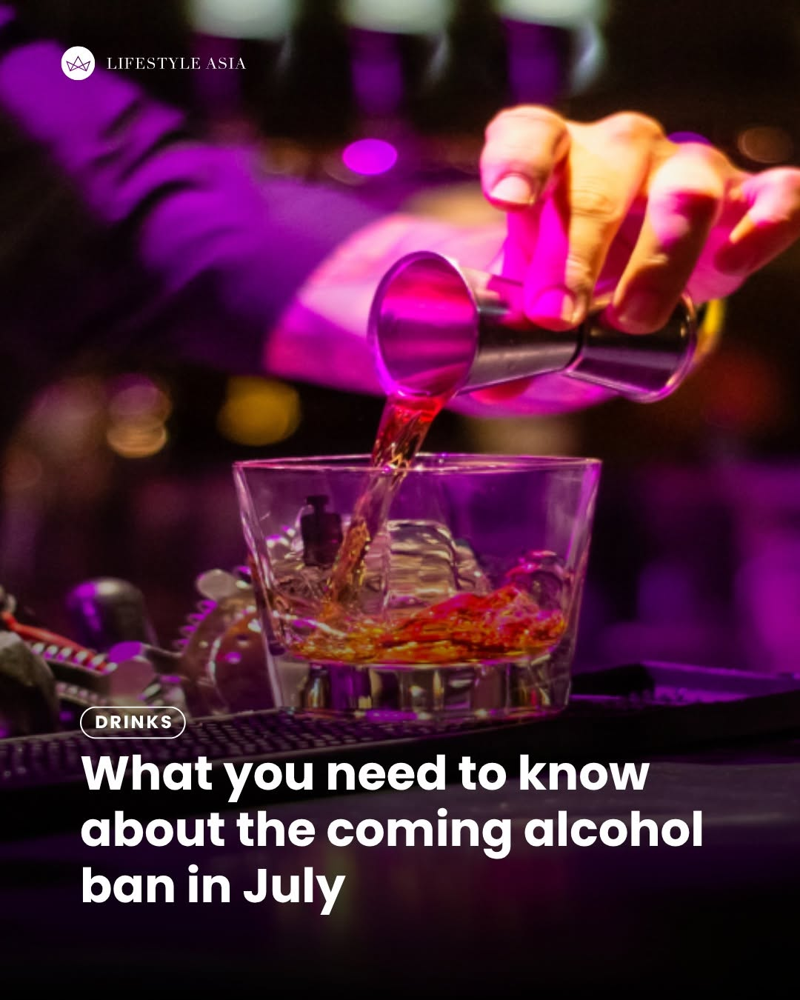
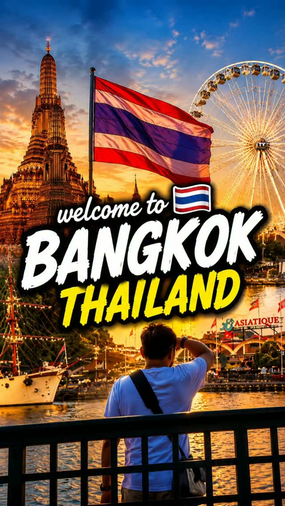
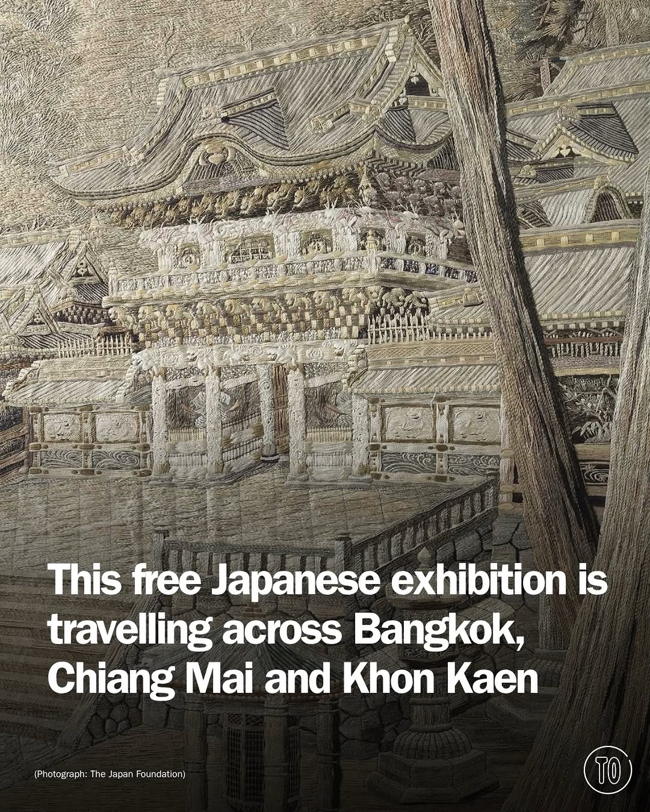
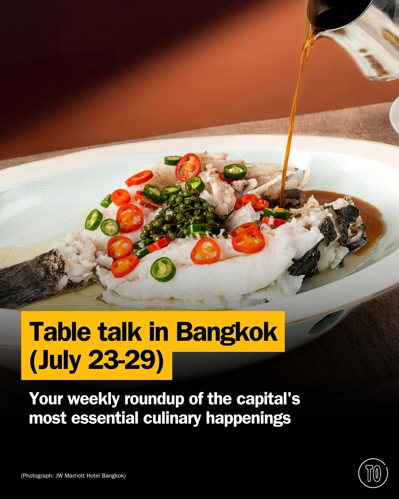
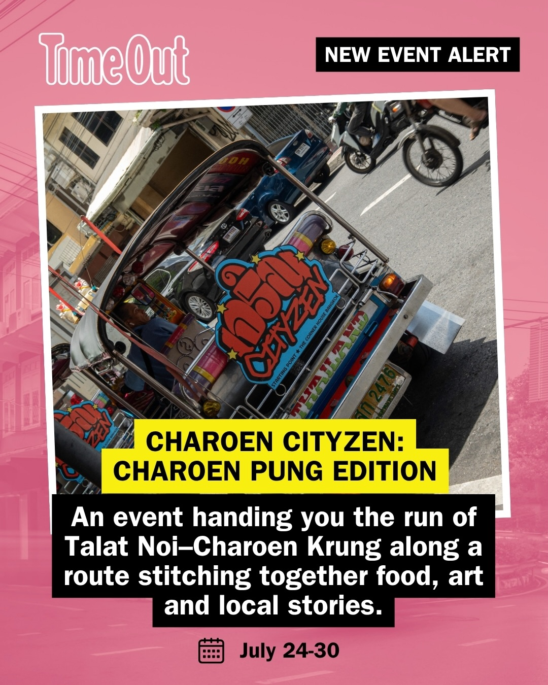

# 📸 2026-07-24 IG 新貼文彙整

## @richie.got.you · 旅遊

**地點：** 華欣洲際酒店　**約會指數：** 9/10　**風格：** 浪漫、海灘、放鬆

**摘要：** 這是一家位於泰國華欣的海濱酒店，適合享受浪漫的海灘假期。透過 Agoda 預訂時可以使用特定代碼獲得優惠，非常適合情侶約會。

> You booked the perfect beachfront hotel in Thailand 😲 Book this hotel on Agoda and use my code: RICHIEGOTYOU 📍Intercontinental Hua Hin #ag…

🔗 https://www.instagram.com/p/DbIrVUgT31z/

---

## @lifestyleasiath · 旅遊

**地點：** BYD HYROX 曼谷　**約會指數：** 7/10　**風格：** 熱鬧、運動、旅遊

**摘要：** 這是一個在曼谷舉行的健身活動，時間為 2026 年 8 月 13 日至 16 日。適合喜愛運動和健身的情侶參加，並可順便享受曼谷的旅遊魅力。

> While almost any reason is a good reason to visit Bangkok, many are planning their trip around arguably the most popular fitness event in th…

🔗 https://www.instagram.com/p/DbKHnksjMpB/

---

## @lifestyleasiath · 旅遊

**地點：** 清邁至派和美宏松的直飛航班　**約會指數：** 7/10　**風格：** 旅遊、冒險

**摘要：** 從2026年10月開始，EZY航空將推出清邁至派和美宏松的直飛航班，讓旅客不再需要經歷曲折的山路。這對於喜愛旅遊的情侶來說，是個方便的選擇。

> Starting in October 2026, EZY Airlines will launch direct flights from Chiang Mai to Pai and Mae Hong Son. Instead of tackling the famously …

🔗 https://www.instagram.com/p/DbIZ6Zrlf_j/

---

## @lifestyleasiath · 旅遊

**地點：** 曼谷　**約會指數：** 5/10　

**摘要：** 這則貼文提醒即將到來的七月長週末將實施酒精禁令，適合對於計劃在曼谷旅遊的人士注意。雖然沒有具體的約會地點，但這可能影響約會計劃。

> Heads up: an alcohol ban will take effect during the coming long weekend in July. Here’s what you need to know. Tap the link in bio for deta…

🔗 https://www.instagram.com/p/DbITJH_FUB6/

---

## @lifestyleasiath · 旅遊

**地點：** 曼谷至阿育陀耶通勤火車服務　**約會指數：** 7/10　**風格：** 文青、旅遊

**摘要：** 從2026年8月1日起，曼谷至阿育陀耶的通勤火車服務將正式啟用，讓旅行變得更加方便和便宜。這是一個適合約會的旅遊選擇，特別是對於喜愛探索新地方的情侶。

> From 1 August 2026, getting from Bangkok to Ayutthaya gets even easier, and considerably cheaper, with the launch of a new daily commuter tr…

🔗 https://www.instagram.com/p/DbIFY0wFT8V/

---

## @goplaybangkok · 旅遊

**地點：** 曼谷幫親子自由行 Plus 方案　**約會指數：** 8/10　**風格：** 親子、放鬆、旅遊

**摘要：** 這是一個針對親子出遊的曼谷幫自由行方案，提供五星級飯店住宿及全程包車服務。適合家庭旅遊，讓你輕鬆享受曼谷與芭達雅的美好時光。

> \ #親子4人玩泰國首選・飯店包車自由行超值方案🤩🧡 / 留言 #親子 傳連結給你！ 4人或親子出遊不用再訂兩間雙人房啦，推薦你曼谷幫的親子自由行 Plus 方案！ 全程住五星級飯店😙超寬敞的兩房一廳or家庭大套房，既保有隱私空間又能一起玩～簡直不要太讚！無邊際泳池、海景酒…

🔗 https://www.instagram.com/p/DbIuTa1SAsf/

---

## @aj.some.more · 旅遊

**地點：** 曼谷　**約會指數：** 8/10　**風格：** 浪漫、戶外、熱鬧

**摘要：** 曼谷是一個充滿感覺的旅遊目的地，擁有金色日落、河邊散步、古老寺廟和城市燈光。非常適合約會，特別是喜歡戶外和浪漫氛圍的情侶。

> Bangkok isn’t just a destination… it’s a feeling. 🇹🇭✨ Golden sunsets, riverside walks, ancient temples, and city lights all in one place. …

🔗 https://www.instagram.com/p/DbBDHHZS0Rv/

---

## @timeoutbangkok · 市集

**地點：** TCDC 曼谷　**約會指數：** 8/10　**風格：** 文青、藝術、靜謐

**摘要：** 這是一個展示日本工藝的展覽，從明治時代到現代的藝術作品都在這裡展出。入場免費，適合喜愛藝術的約會對象。展覽在曼谷的 TCDC 進行，開放時間為每天 10:30 至 19:00，週一休館。

> Japan has always known that craft and play aren’t opposites. The Superlative Artistry of Japan makes the case beautifully, gathering Japanes…

🔗 https://www.instagram.com/p/DbKOAufz1V0/

---

## @timeoutbangkok · 市集

**地點：** 曼谷美食市集　**約會指數：** 8/10　**風格：** 熱鬧、文青、戶外

**摘要：** 這是一個曼谷的美食市集，提供多樣的餐飲選擇，適合與朋友或伴侶一起享受美食。活動中有多家餐廳參與，讓你可以品嚐到不同風味的料理，非常適合約會。

> This week’s food news brings playful scoops, punchy bowls and plenty of reasons to head out hungry. Daddy Don't Know (@daddy.dont.know) open…

🔗 https://www.instagram.com/p/DbIfBlFm8Zc/

---

## @timeoutbangkok · 市集

**地點：** Talat Noi-Charoen Krung　**約會指數：** 8/10　**風格：** 文青、熱鬧、戶外

**摘要：** 這是一個結合美食、藝術和社區故事的市集，適合喜歡探索的約會對象。活動免費，時間是7月24日至30日，每天11am至7pm，週一休息，非常適合約會。

> Explore Talat Noi and Charoen Krung, one delicious flavour at a time 🍜🍽️ At Talat Noi-Charoen Krung, wander its narrow lanes and you find …

🔗 https://www.instagram.com/p/DbIJlcqky1y/

---

## @timeoutbangkok · 市集

**地點：** 曼谷市集　**約會指數：** 8/10　**風格：** 熱鬧、戶外、文青

**摘要：** 這個週末在曼谷有許多活動可以參加，包括畫廊、現場音樂、長午餐或電影放映，非常適合約會。無論你喜歡什麼樣的活動，都能找到合適的選擇。

> Social calendar looking thin? Bangkok fixes that without much fuss. This weekend offers plenty of reasons to leave the house, whether your i…

🔗 https://www.instagram.com/p/DbH33stm2Kn/

---

