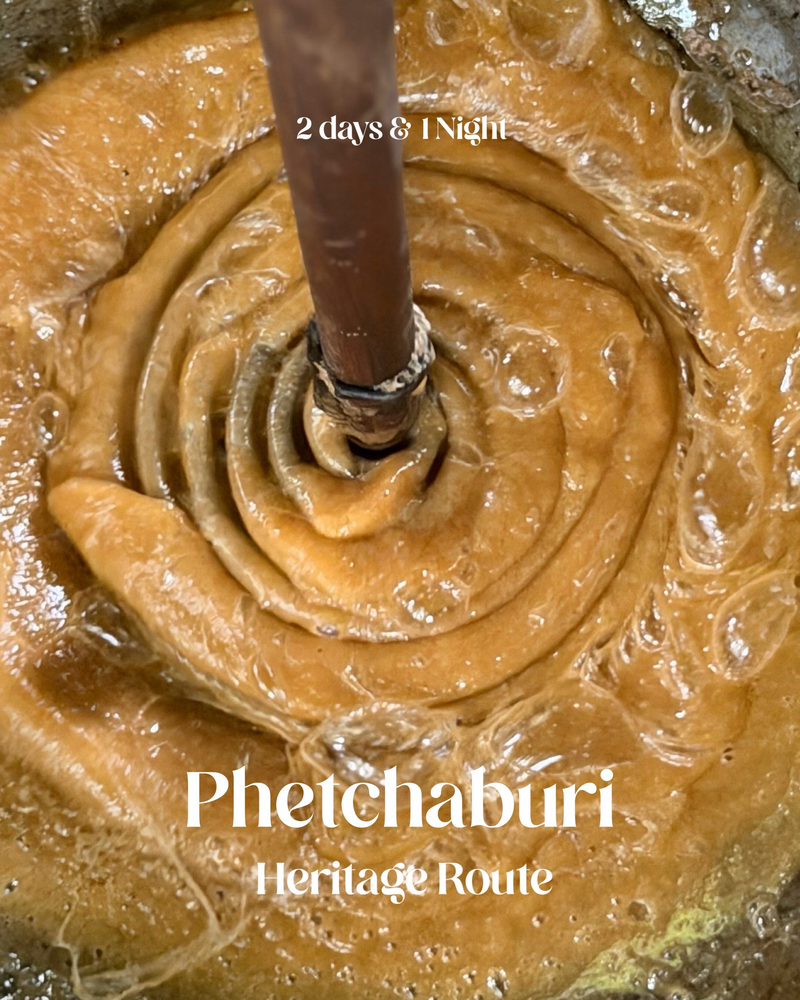
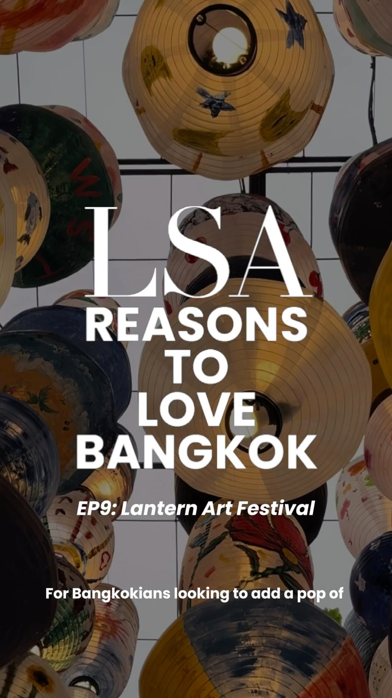
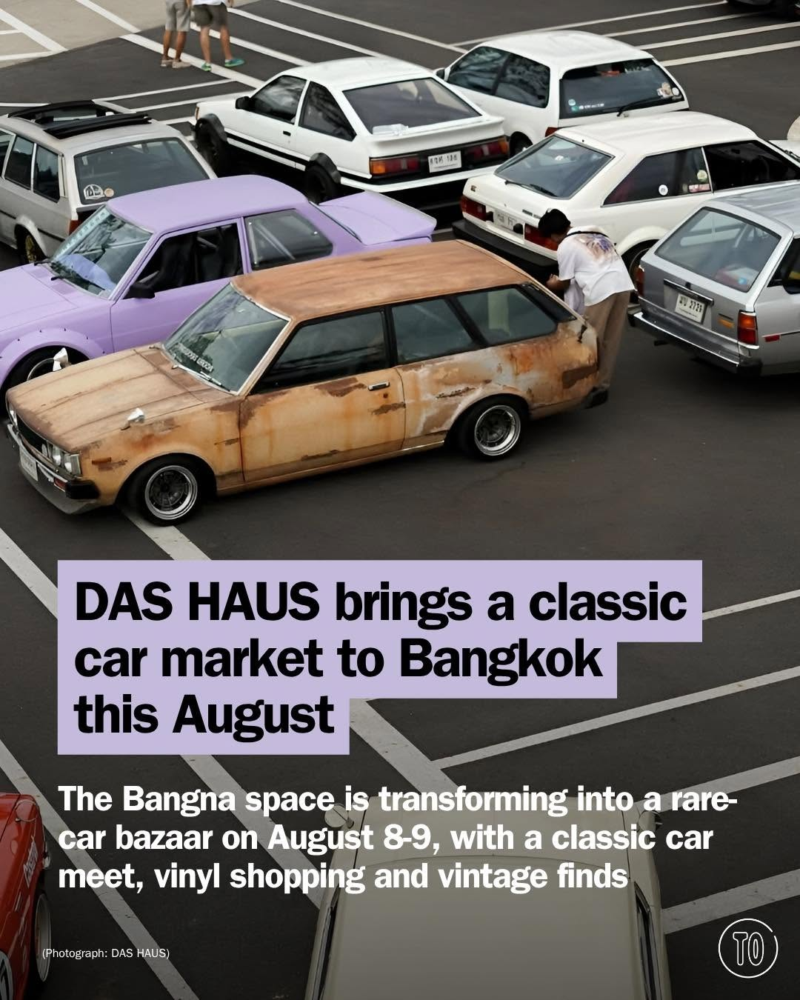
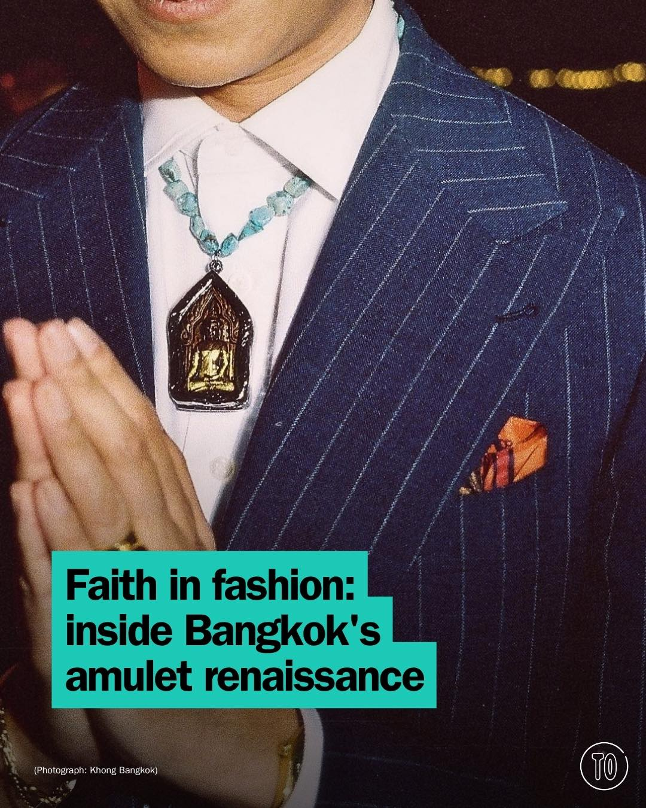
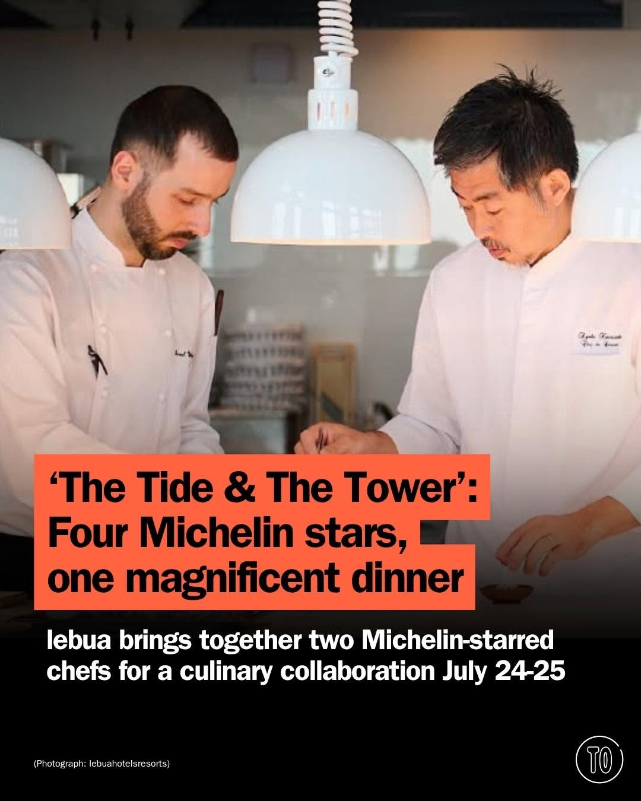

# 📸 2026-07-25 IG 新貼文彙整

## @jiranarong2 · 展覽

**地點：** เพชรบุรี文化與環境復甦之旅　**約會指數：** 8/10　**風格：** 文青、戶外、文化

**摘要：** 這是一個以文化和環境復甦為主題的旅遊行程，包含多個當地特色店家與活動，如傳統糖廠、農場餐廳等。適合喜愛自然和文化的約會對象，並且提供多樣化的體驗。

> เพชรบุรี 2 วัน 1 คืน แบบเที่ยวสายฟื้นฟูวัฒนธรรม และสิ่งแวดล้อม 1.ไร่เรา ที่นี่เป็นแบรนด์น้ำตาลแท้ ความดีงามคือ เขารับซื้อน้ำตาลโตนดจากญาติ แ…

🔗 https://www.instagram.com/p/DbLdVEVExrO/

---

## @lifestyleasiath · 旅遊

**地點：** Samyan Mitrtown　**約會指數：** 8/10　**風格：** 文青、熱鬧、戶外

**摘要：** 這是位於 Samyan Mitrtown 的「燈籠藝術節」，免費入場，適合散步欣賞。活動會持續到7月31日，每天下午3點到午夜亮燈，非常適合約會。

> The “Lantern Art Festival” at Samyan Mitrtown doesn’t cost a dime, just a stroll. Back for its fifth edition, the area has been transformed …

🔗 https://www.instagram.com/p/DbLEJ9fTk32/

---

## @lifestyleasiath · 旅遊

**地點：** CeraVe 泰國　**約會指數：** 5/10　**風格：** 時尚、生活風格

**摘要：** CeraVe 在泰國宣布了中國演員張凌赫為其首位亞太區品牌大使，這是與身體護理相關的活動。這個活動適合對護膚品感興趣的約會對象。沒有具體的時間或價格資訊。

> CeraVe (@ceravethailand) has officially named top Chinese actor "Zhang Linghe" (@zhanglinghe__1230) as their first-ever APAC Brand Ambassado…

🔗 https://www.instagram.com/p/DbKcQXpFeka/

---

## @aj.some.more · 旅遊

**地點：** 曼谷　**約會指數：** 5/10　**風格：** 幽默、旅遊

**摘要：** 這則貼文分享了一個幽默的旅行瞬間，提到在曼谷的冒險。雖然沒有具體的約會地點，但提到的旅行情境適合喜歡輕鬆幽默的約會。

> Me: I’ll just take the bus to work. Also me: accidentally boards an airplane. ✈️😂 Anyone else suddenly becomes fully awake when it’s time t…

🔗 https://www.instagram.com/p/DbK2MK9yl3M/

---

## @timeoutbangkok · 市集

**地點：** DAS HAUS BKK 古典車市集　**約會指數：** 8/10　**風格：** 熱鬧、文青、戶外

**摘要：** 這是一個以古典車為主題的市集，將於8月8日至9日在Bangna舉行。市集將提供復古購物、美食、DJ表演及車主聚會，非常適合喜愛汽車和復古風格的人士約會。

> Rare metal, stacks of vinyl and a whole weekend built around them: DAS HAUS BKK’s first classic car market rolls into Bangna on Aug 8-9. Exp…

🔗 https://www.instagram.com/p/DbM0JBcG1_c/

---

## @timeoutbangkok · 市集

**地點：** 曼谷時尚與信仰市集　**約會指數：** 7/10　**風格：** 文青、熱鬧

**摘要：** 這是一個結合時尚與信仰的市集，展出佛像、十字架和其他泰國精神象徵的珠寶設計。適合喜愛獨特手作與文化的約會對象，讓你們在熱鬧的氛圍中交流。

> This Bangkok story begins where fashion meets faith: with someone distracted by a Buddha stall outside a temple. This time, the distraction …

🔗 https://www.instagram.com/p/DbLKF-HDKMu/

---

## @timeoutbangkok · 市集

**地點：** Mezzaluna by lebua　**約會指數：** 9/10　**風格：** 浪漫、高級、美食

**摘要：** 這是一個高級的美食活動，邀請了兩位米其林星級廚師合作，提供六道菜的晚餐。活動僅在7月24日至25日舉行，非常適合約會。

> ‘The Tide & The Tower’: a Michelin-starred meeting of two culinary worlds this weekend only at lebua! For two nights only, lebua brings toge…

🔗 https://www.instagram.com/p/DbK9z-zm4KU/

---

