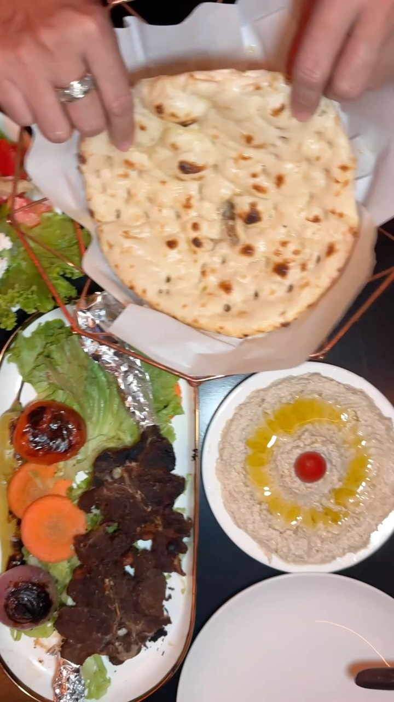
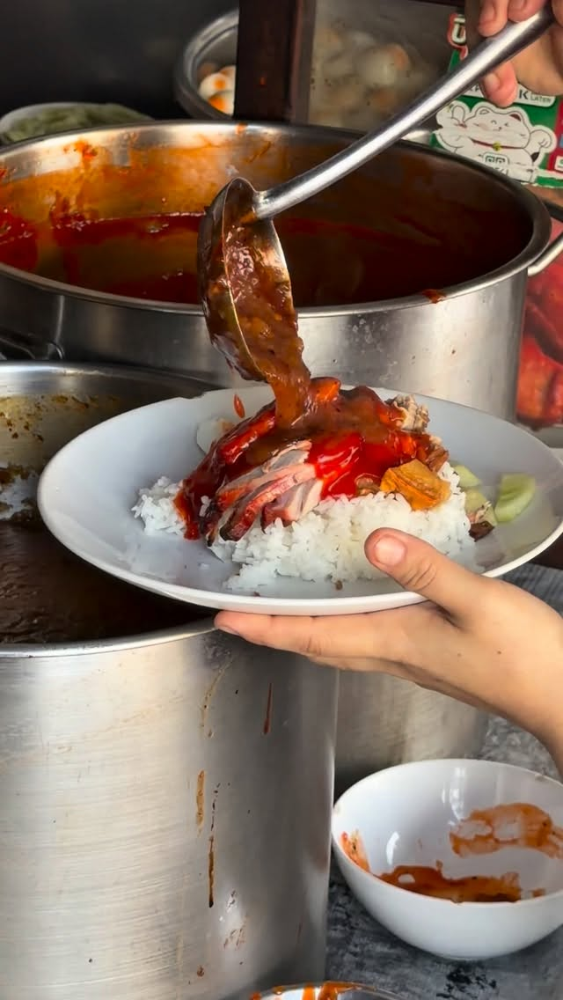
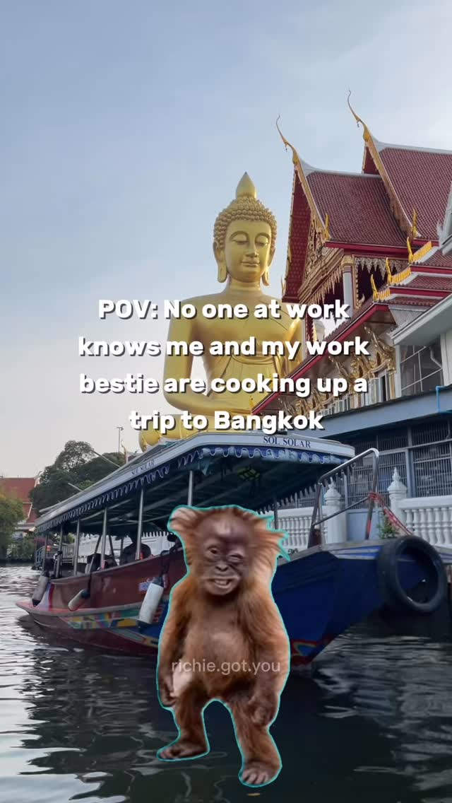
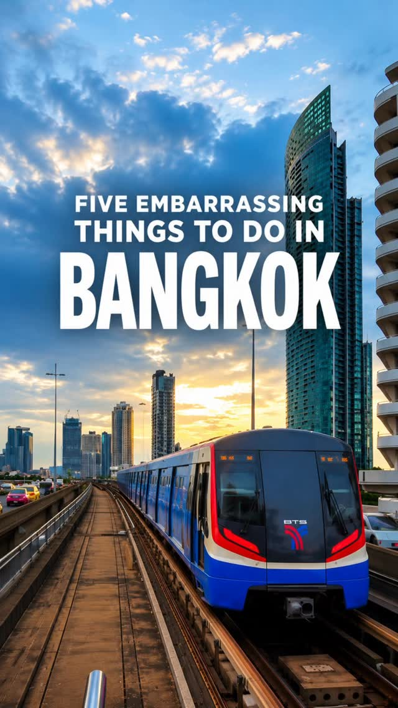
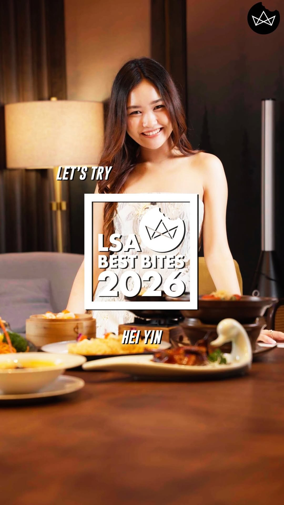
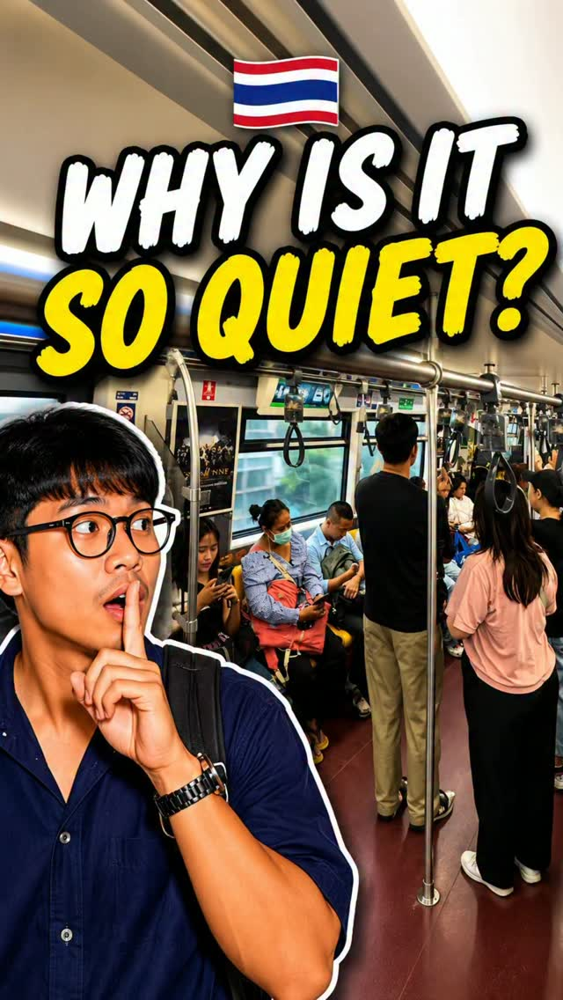
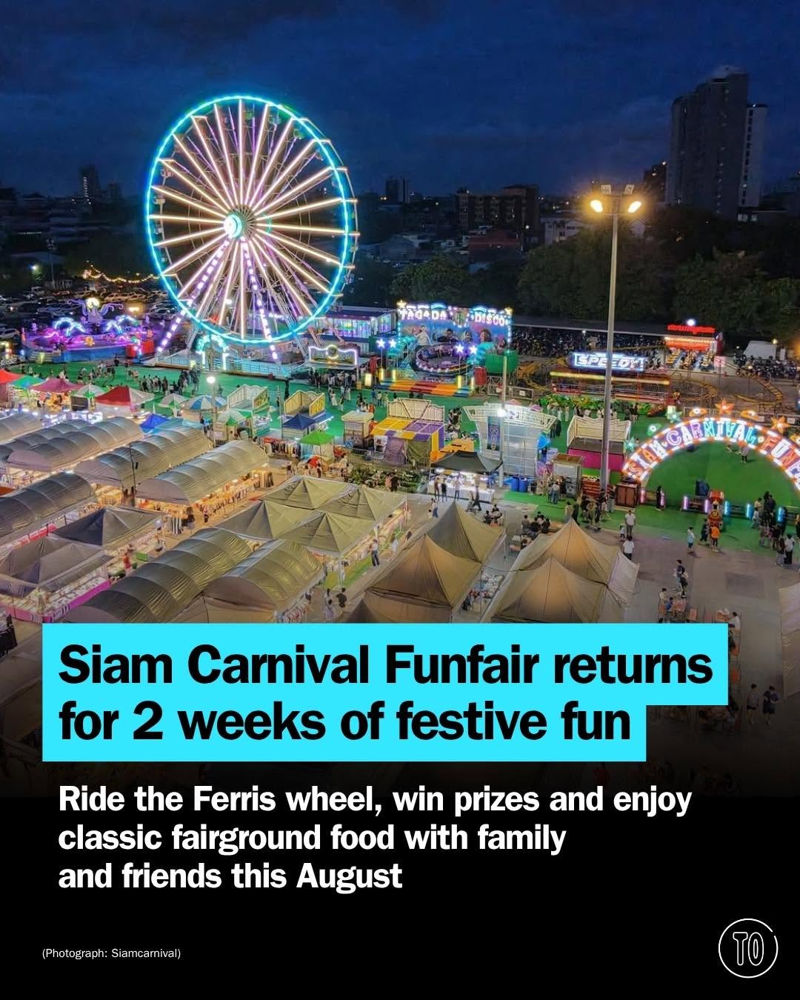
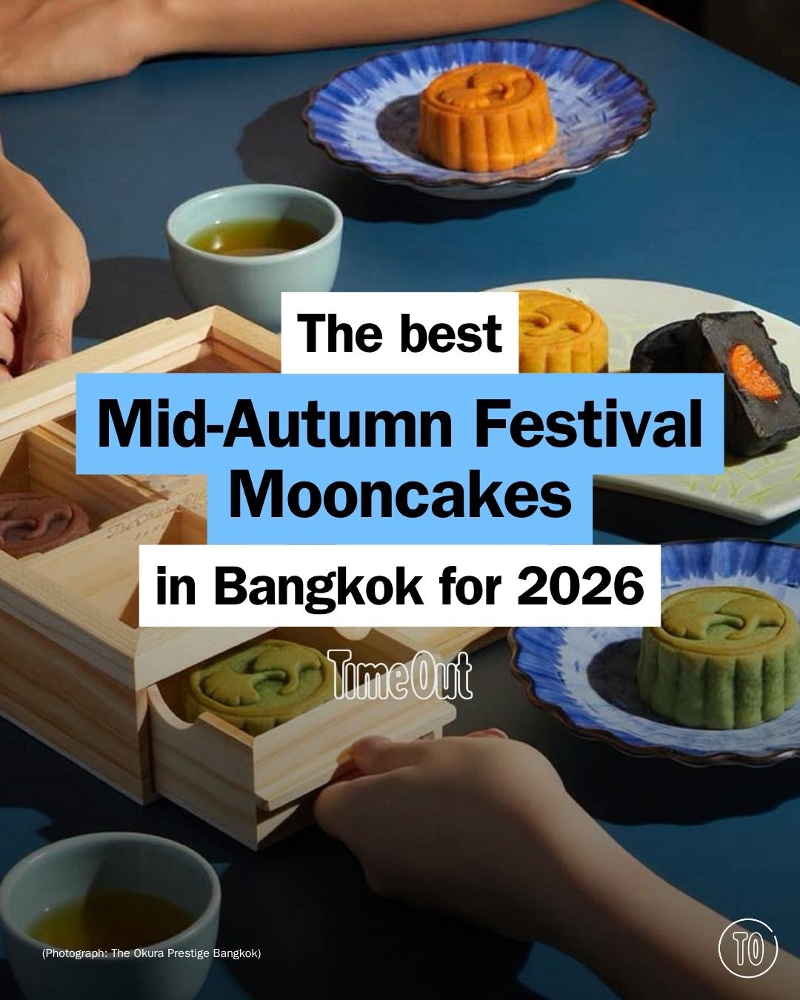
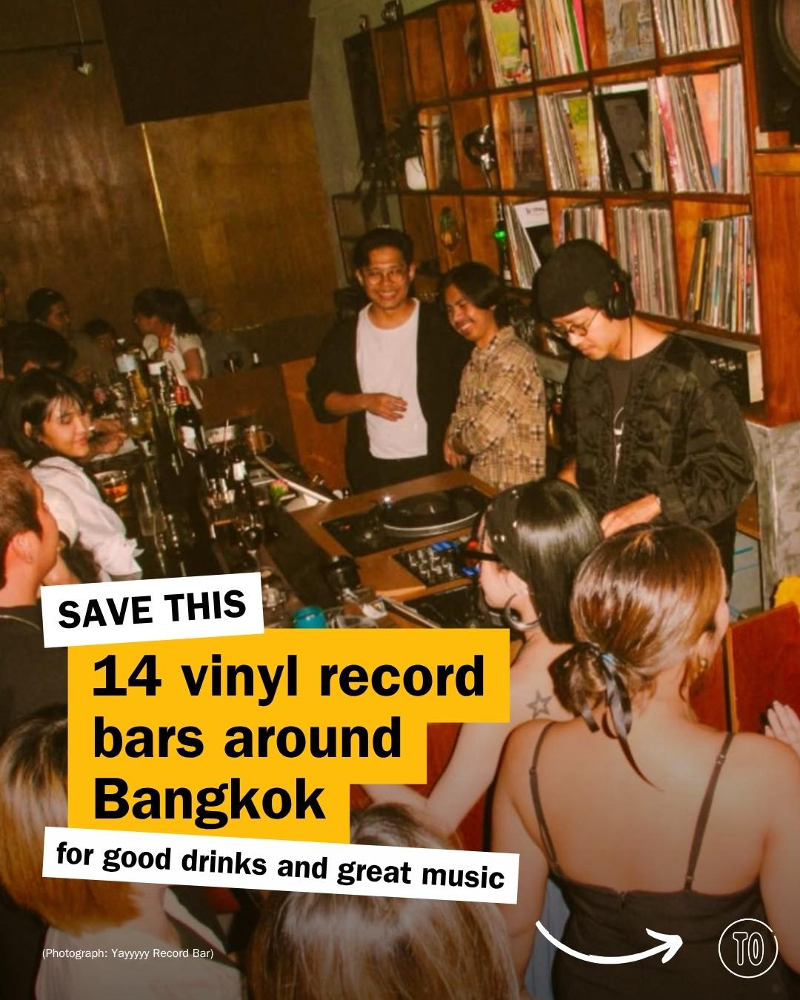
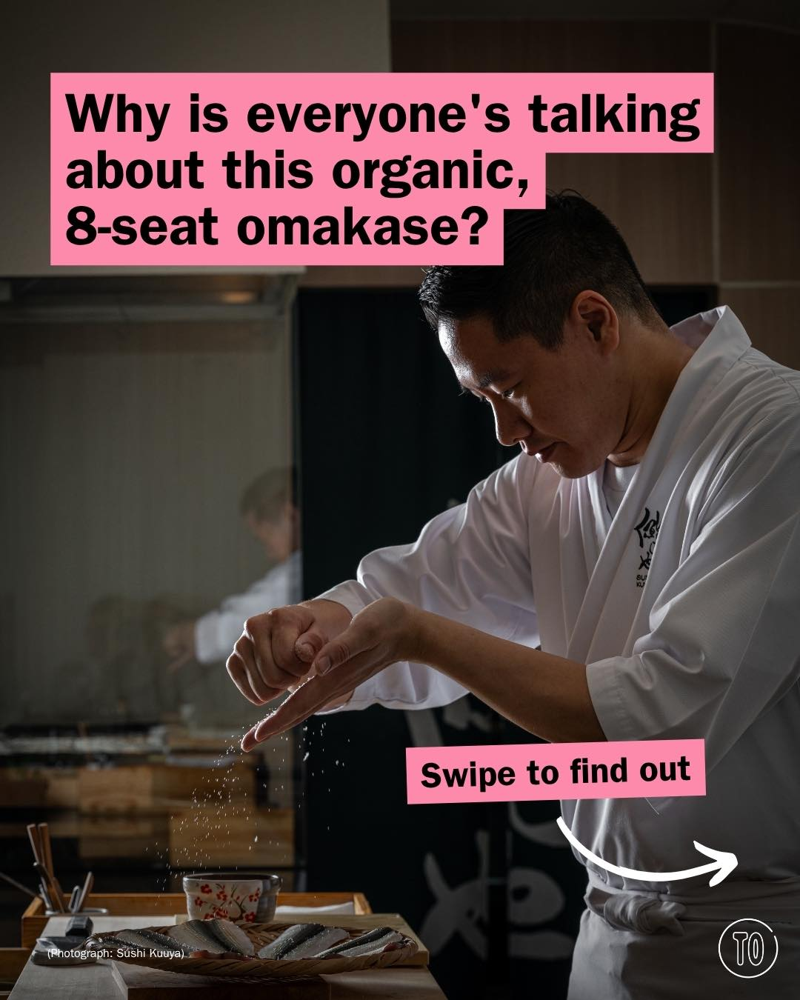

# 📸 2026-07-26 IG 新貼文彙整

## @bangkok_insiders · 展覽

**地點：** Aladeen 餐廳與咖啡廳　**約會指數：** 7/10　**風格：** 浪漫、靜謐、異國風情

**摘要：** Aladeen 餐廳與咖啡廳提供正宗的印度、阿拉伯和巴基斯坦美食，並擁有放鬆的水煙休息區。這裡適合約會，特別是喜歡異國料理的情侶。

> @aladeenbkk Aladeen Restaurant & Cafe in Bangkok is a 100% halal dining spot serving authentic Indian, Arabic, and Pakistani dishes alongsid…

🔗 https://www.instagram.com/p/DbN7AtZytR3/

---

## @jiranarong2 · 展覽

**地點：** สุพรรณบุรี的豬肉飯店　**約會指數：** 7/10　**風格：** 美食、熱鬧

**摘要：** 這是一家位於泰國蘇彭府的豬肉飯店，以獨特的醬汁和多樣的菜品聞名。適合喜愛美食的約會對象，特別是對於喜歡辛辣食物的人。

> ขับรถไปสุพรรณบุรี เลยอยากโดนข้าวหมูแดงแบบรสร้อนลิ้นขึ้นมา หมูแดงแถวนี่มีเอกลักษณ์พิเศษคือมีน้ำราดที่ใส่น้ำพริกเผา มีหลายเจ้าที่ชอบ เจ้าเรือเ…

🔗 https://www.instagram.com/p/DbPNtm6zEQE/

---

## @richie.got.you · 旅遊

**地點：** 曼谷　**約會指數：** 6/10　**風格：** 熱鬧、旅遊

**摘要：** 這篇貼文提到曼谷，適合喜歡熱鬧和旅遊的人。若計畫前往，這裡有許多值得探索的景點，適合約會。

> Who has secret plans to go to Bangkok? 😁 #bangkok #bangkokthailand #bangkoktravel #bangkoktrip

🔗 https://www.instagram.com/p/DbPGptmzGe0/

---

## @richie.got.you · 旅遊

**地點：** 曼谷　**約會指數：** 5/10　**風格：** 文青、熱鬧

**摘要：** 這篇貼文提供了在曼谷搭乘BTS或MRT的禮儀小技巧，非常適合旅遊者參考。雖然不是約會地點，但了解當地交通禮儀能讓約會更加順利。

> Visiting Bangkok? 🇹🇭 Before you hop on the BTS or MRT, make sure you know these train etiquette tips. A little courtesy goes a long way! �…

🔗 https://www.instagram.com/p/DbODiVoT6gX/

---

## @lifestyleasiath · 旅遊

**摘要：** （分析失敗：terminated）

> From a Thailand limited edition timepiece to a fun shoe collaboration, here are our #WeeklyObsessions this week. #Fashion #Beauty #Lifestyle…

🔗 https://www.instagram.com/p/DbPYGhWHMsB/

---

## @lifestyleasiath · 旅遊

**摘要：** （分析失敗：terminated）

> The more people you bring, the better it gets. 🥢✨ LSA Best Bites Let’s Try visits @heiyinbangkok at Gaysorn Centre, where authentic Cantone…

🔗 https://www.instagram.com/p/DbNqQoVDwKz/

---

## @aj.some.more · 旅遊

**地點：** 曼谷地鐵　**約會指數：** 5/10　**風格：** 靜謐、文青

**摘要：** 這篇貼文提到曼谷地鐵的安靜氛圍，讓人能夠享受平靜的乘車體驗。雖然是公共交通，但適合喜歡靜謐環境的約會對象。

> One thing I noticed after living in Bangkok… The trains are surprisingly quiet. 🤫 Everyone just minds their own business, gives each other …

🔗 https://www.instagram.com/p/DbNM87ASlWj/

---

## @timeoutbangkok · 市集

**地點：** 暹邏嘉年華遊樂會　**約會指數：** 9/10　**風格：** 熱鬧、刺激、戶外

**摘要：** 暹邏嘉年華遊樂會將於7月31日至8月16日回歸，提供刺激的遊樂設施和經典的嘉年華遊戲，還有各式美食。這是泰國最大的移動遊樂園，非常適合約會。

> Siam Carnival Funfair is back July 31-August 16 🎡🎠🎢 Returning from its seven-year hiatus, there’s thrilling rides, classic carnival games…

🔗 https://www.instagram.com/p/DbPZ3M-GyDU/

---

## @timeoutbangkok · 市集

**地點：** 曼谷月餅市集　**約會指數：** 7/10　**風格：** 熱鬧、美食、節慶

**摘要：** 這是一個專門介紹曼谷中秋節月餅的市集，提供各式經典和創新口味的月餅，非常適合作為送禮或自用的選擇。活動將在2026年中秋節期間舉行，適合與朋友或家人一起前往。

> Mooncake season is finally here 🥮 From timeless classics to creative new flavours crafted by top chefs and leading brands, we’ve rounded th…

🔗 https://www.instagram.com/p/DbNkll_m1tu/

---

## @timeoutbangkok · 市集

**地點：** 曼谷黑膠酒吧　**約會指數：** 8/10　**風格：** 文青、熱鬧、放鬆

**摘要：** 這篇貼文介紹了14家曼谷的黑膠酒吧，提供優質音樂和飲品，適合想要放鬆的夜晚。這些酒吧是享受音樂和社交的好去處，非常適合約會。

> Skip the playlist and let the records do the talking tonight 🎶🍸 Time Out rounds up 14 Bangkok vinyl bars where carefully chosen records, q…

🔗 https://www.instagram.com/p/DbNMPpfm5H0/

---

## @timeoutbangkok · 市集

**地點：** Sushi Kuuya　**約會指數：** 9/10　**風格：** 浪漫、靜謐、美食

**摘要：** Sushi Kuuya 是一家隱藏在 Langsuan 的八人座位壽司店，由擁有超過 18 年經驗的主廚 Goji Kobayashi 主理。這裡的 omakase 以簡約和精緻著稱，適合喜愛美食的約會對象。

> Why is everyone talking about this organic, eight-seat omakase? Because sometimes, the best restaurants let the food speak for itself. Hidde…

🔗 https://www.instagram.com/p/DbNAQlZmwXu/

---

