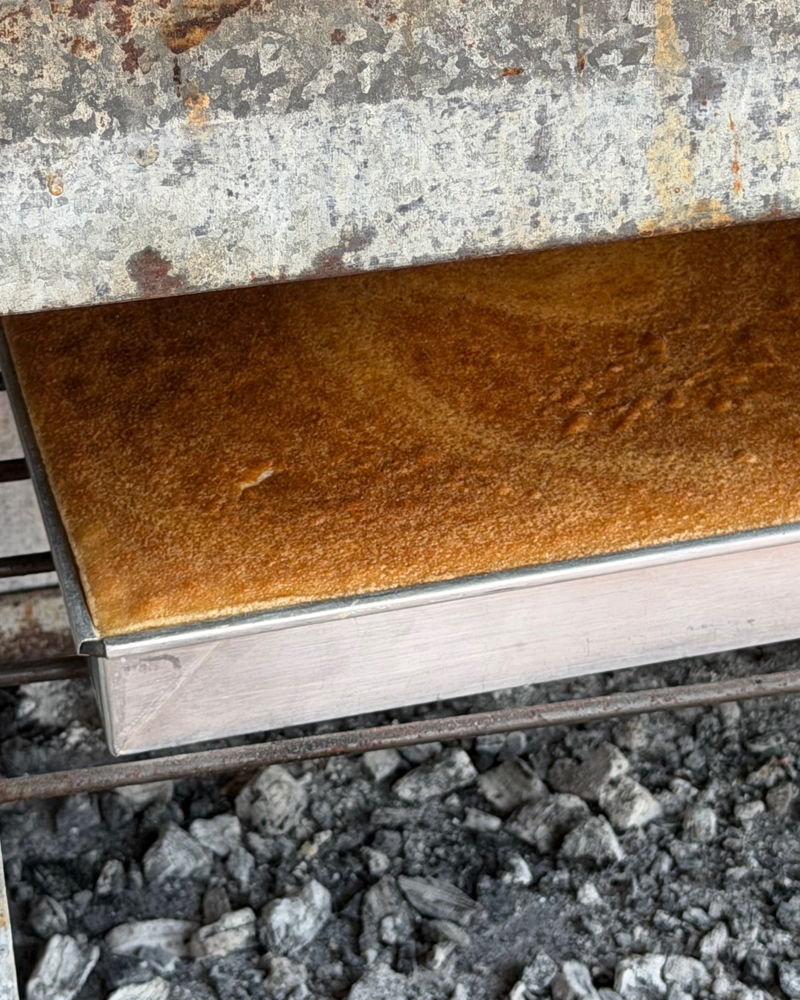
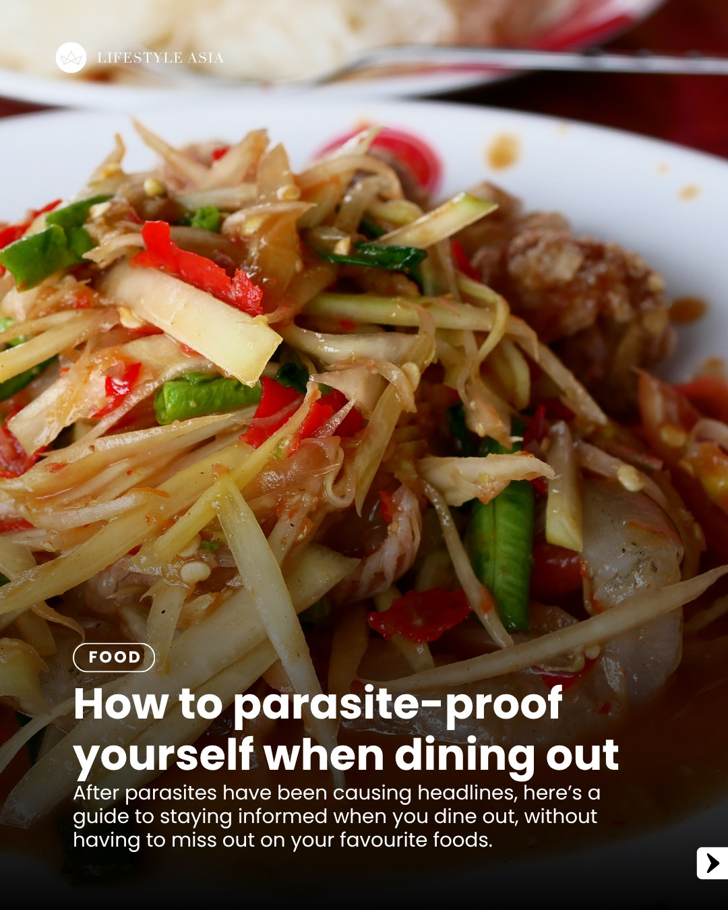
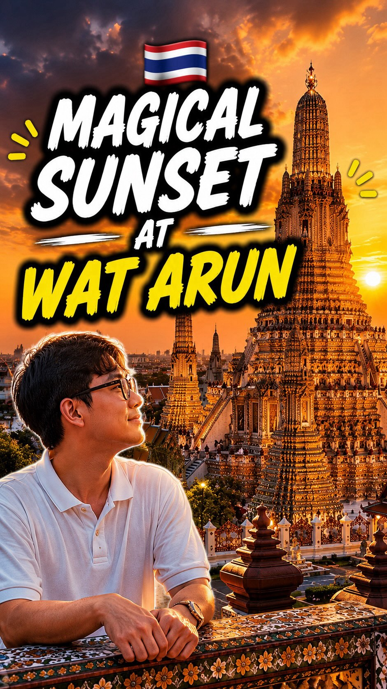
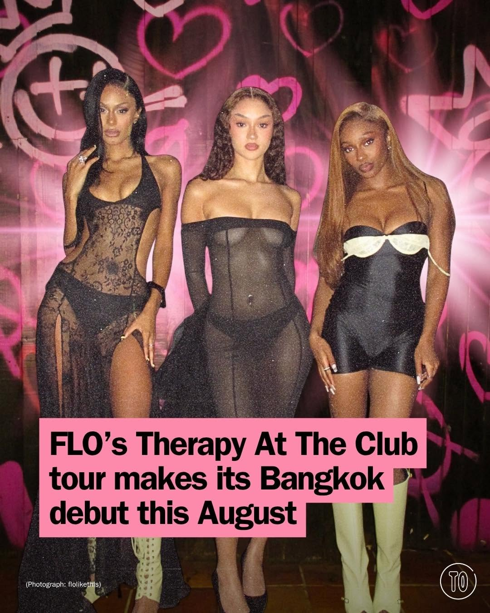
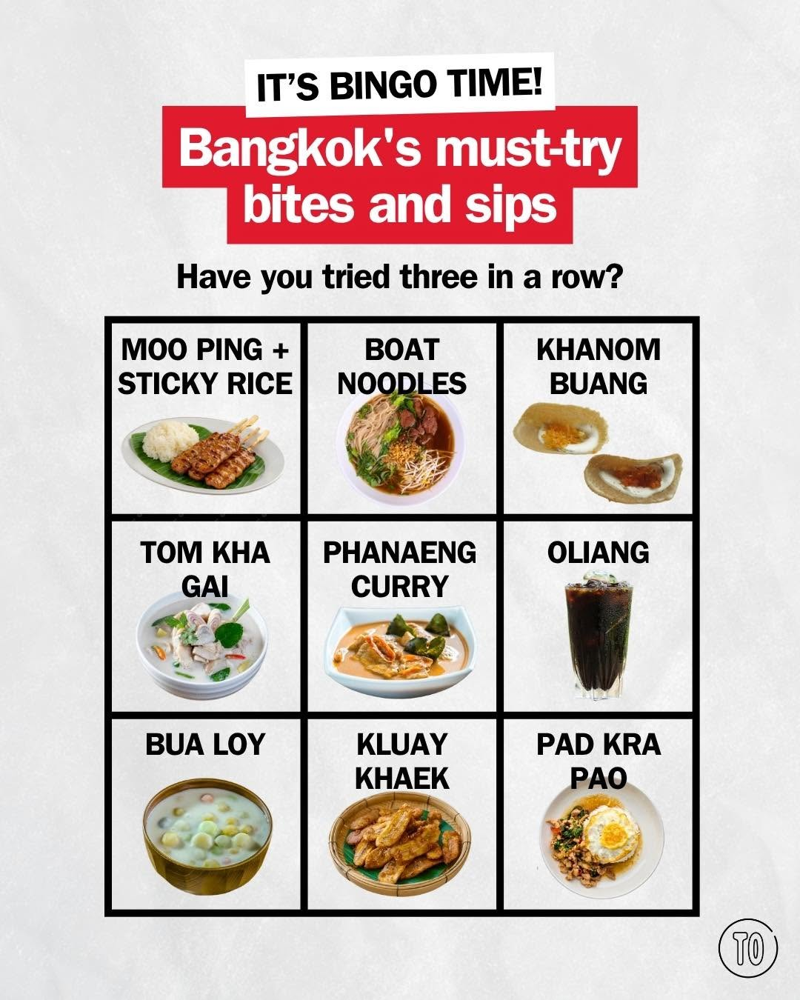

# 📸 2026-07-28 IG 新貼文彙整

## @jiranarong2 · 展覽

**地點：** 市場　**約會指數：** 7/10　**風格：** 文青、熱鬧、美食

**摘要：** 這篇貼文提到在泰國的市場可以找到傳統的甜點——馬卡龍，特別是用大盤子製作的版本。這裡的氛圍熱鬧，適合約會時一起享受美食的樂趣。

> เคยได้ยินคนทำขนมหม้อแกงบอกว่า ทำแบบถาดใหญ่ๆ แล้วตัก อร่อยกว่าทำแบบถาดเล็กๆ ผมจำคำตอบที่ชัดเจนไม่ได้ แต่คิดว่ามันน่าจะเรื่องการที่ถาดใหญ่กว่า…

🔗 https://www.instagram.com/p/DbTYmc_k9TI/

---

## @lifestyleasiath · 旅遊

**地點：** 泰國餐廳　**約會指數：** 6/10　**風格：** 美食、文化

**摘要：** 這篇貼文探討了泰國食物文化，特別是生魚和發酵魚的歷史與演變。雖然沒有具體的餐廳名稱，但適合喜愛泰國美食的約會對象。

> Thai food culture has survived and evolved around raw and fermented fish for centuries, and the shift happening now isn't about abandoning t…

🔗 https://www.instagram.com/p/DbUhqIPHBzW/

---

## @aj.some.more · 旅遊

**地點：** 白金購物中心　**約會指數：** 6/10　**風格：** 熱鬧、購物

**摘要：** 這是一則關於在曼谷白金購物中心的最後購物經歷的貼文。這裡是個熱鬧的購物地點，適合喜歡購物的情侶。雖然這裡有很多商品，但不一定是約會的最佳選擇。

> POV: It’s your last day in Bangkok and suddenly you remember all the things you “forgot” to buy. 😂🛍️🇹🇭 One last shopping spree at Platin…

🔗 https://www.instagram.com/p/DbUln9PyPtY/

---

## @aj.some.more · 旅遊

**地點：** 鄭王廟　**約會指數：** 9/10　**風格：** 浪漫、靜謐、戶外

**摘要：** 鄭王廟是曼谷著名的景點，特別適合在日落時分前來欣賞。建議在黃金時刻之前抵達，既可以探索周圍，也能享受美麗的日落景色，非常適合約會。

> One of the most magical times to see Wat Arun 🇹🇭✨ Come before sunset and watch the Temple of Dawn glow as the sky changes. Definitely one …

🔗 https://www.instagram.com/p/DbSkYDAyJpN/

---

## @timeoutbangkok · 市集

**地點：** Sphere Hall at EmSphere　**約會指數：** 8/10　**風格：** 熱鬧、音樂、活動

**摘要：** 這是一場由英國 R&B 三人組 @flolikethis 帶來的音樂會，將於 8 月 29 日在 Sphere Hall 舉行。票價從 B2,800 起，適合喜愛音樂的約會對象。

> Bangkok, this is not a drill: @flolikethis are finally coming our way. ✨ The Grammy-nominated British R&B trio bring their Therapy At The Cl…

🔗 https://www.instagram.com/p/DbSYQ95G_b5/

---

## @timeoutbangkok · 市集

**地點：** 曼谷美食市集　**約會指數：** 7/10　**風格：** 熱鬧、文青

**摘要：** 這是一個在曼谷舉辦的美食市集，適合喜歡探索新口味的約會對象。市集氛圍熱鬧，適合與朋友或伴侶一起享受美食。具體的時間和地點未提及。

> How many can you claim? Spill exactly where… we're not doing this good-eats hunt alone! #TimeOutBangkok

🔗 https://www.instagram.com/p/DbSKiZDgT4R/

---

