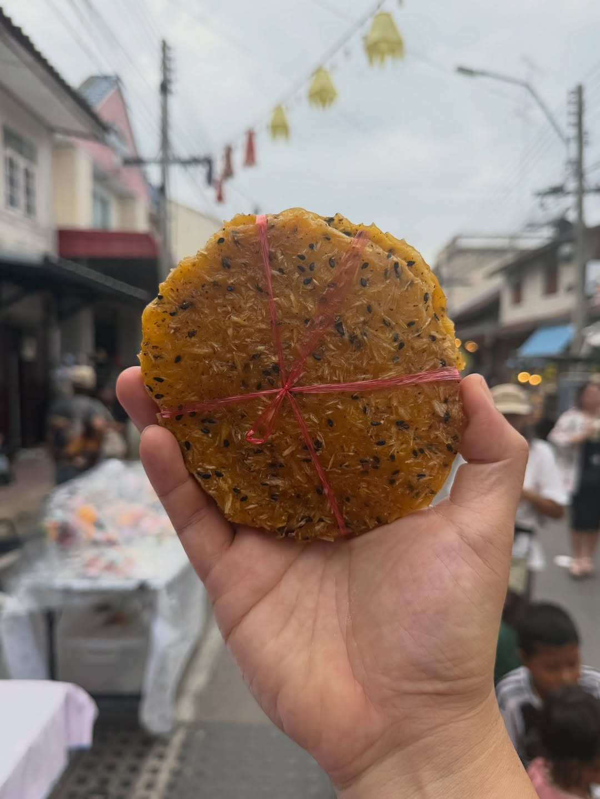
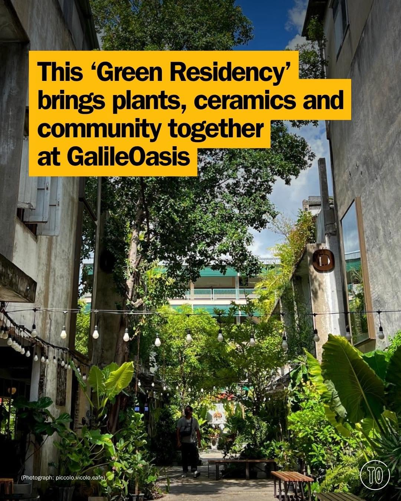
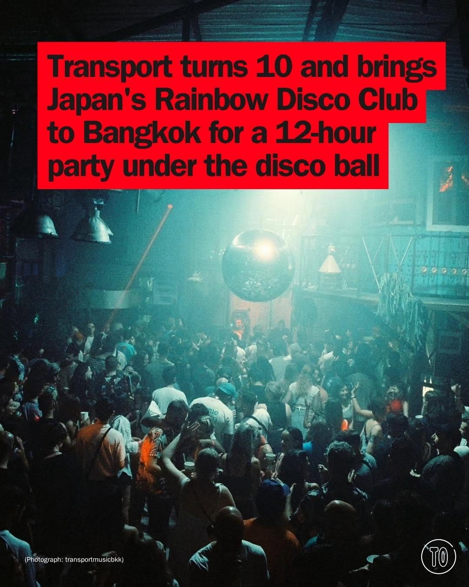
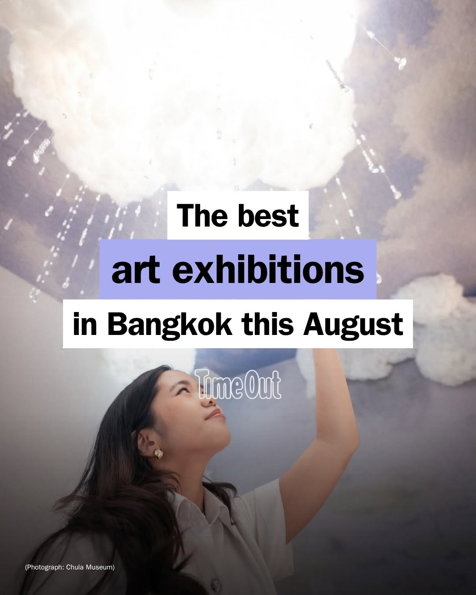

# 📸 2026-08-10 IG 新貼文彙整

## @jiranarong2 · 展覽

**摘要：** （分析失敗：GitHub Models is temporarily unavailable as part of a scheduled retirement brownout.）

> ถ้าถามว่าขนมที่เป็นของฝากขึ้นชื่อของเพชรบุรีคืออะไร? มีใครตอบข้าวเกรียบงาน้ำตาลโตนด ก่อนขนมหม้อแกงไหม คิดว่าถ้าเจอกันผมน่าจะต้องยกมือไหวเลยล…

🔗 https://www.instagram.com/p/Db0Fi2kE_DA/

---

## @lifestyleasiath · 旅遊

**摘要：** （分析失敗：GitHub Models is temporarily unavailable as part of a scheduled retirement brownout.）

> How smart are your sunglasses? Powered by intelligence, fuelled by good looks: here are the smart glasses that should be on your radar. #Sma…

🔗 https://www.instagram.com/p/Db15JxInCEx/

---

## @lifestyleasiath · 旅遊

**摘要：** （分析失敗：GitHub Models is temporarily unavailable as part of a scheduled retirement brownout.）

> Coffee lovers are spoilt for choice in this city. It seems that every week, a new cafe is popping up in some alley, mall, or corner of the B…

🔗 https://www.instagram.com/p/Db0LPRIll6E/

---

## @lifestyleasiath · 旅遊

**摘要：** （分析失敗：GitHub Models is temporarily unavailable as part of a scheduled retirement brownout.）

> The Mid-Autumn Festival is almost here. These are the best spots to buy mooncakes in Bangkok to celebrate. เทศกาลไหว้พระจันทร์ใกล้เข้ามาแล้ว…

🔗 https://www.instagram.com/p/Dbz2k1dk6Vz/

---

## @aj.some.more · 旅遊

**摘要：** （分析失敗：GitHub Models is temporarily unavailable as part of a scheduled retirement brownout.）

> Would you pay around US$250 for all of this in Bangkok? 👀🇹🇭 I stayed at AETAS Lumpini and this is definitely more than just a room. You g…

🔗 https://www.instagram.com/p/Db0c48wB2aB/

---

## @timeoutbangkok · 市集

**摘要：** （分析失敗：GitHub Models is temporarily unavailable as part of a scheduled retirement brownout.）

> Bangkok’s river is about to host one of Thailand’s rarest spectacles. On November 6, 52 royal barges and 2,200 oarsmen will form a processio…

🔗 https://www.instagram.com/p/Db0P4ltCZVz/

---

## @timeoutbangkok · 市集

**摘要：** （分析失敗：GitHub Models is temporarily unavailable as part of a scheduled retirement brownout.）

> The Green Residency takes over @galileoasis for two weeks turning the place into a lush pop-up 🌿☕️ Browse rare plants, discover beautiful c…

🔗 https://www.instagram.com/p/Dbz8ycwGFjh/

---

## @timeoutbangkok · 市集

**摘要：** （分析失敗：GitHub Models is temporarily unavailable as part of a scheduled retirement brownout.）

> Another one for the Bangkok dance floor. @transportmusicbkk turns 10 this year and marks it by hauling Japan's @rainbowdiscoclub to Chang Ch…

🔗 https://www.instagram.com/p/DbzpZ-KGKBn/

---

## @timeoutbangkok · 市集

**摘要：** （分析失敗：GitHub Models is temporarily unavailable as part of a scheduled retirement brownout.）

> Need an excuse to duck the next downpour? Go gallery hopping with our guide to Bangkok’s best art exhibitions this August. 🔗 Tap the link i…

🔗 https://www.instagram.com/p/DbfDft6k-ny/

---

