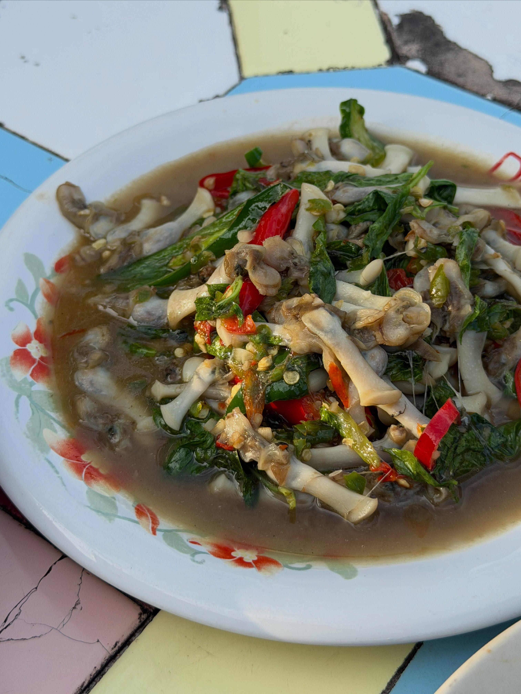
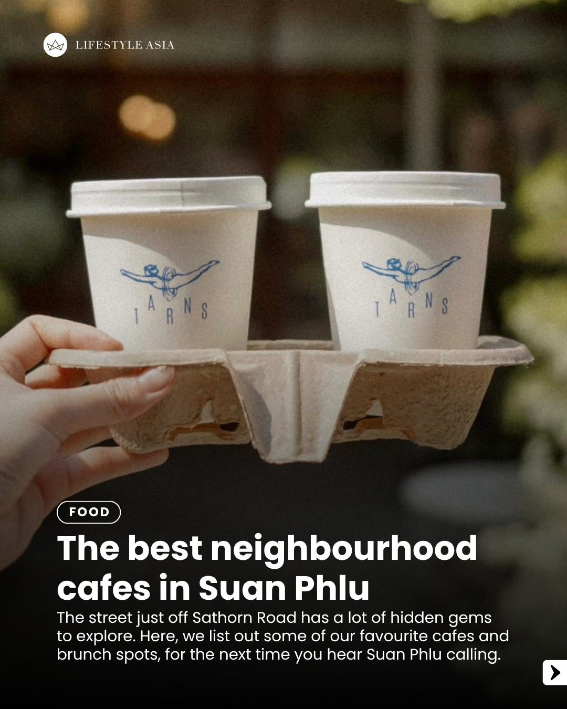
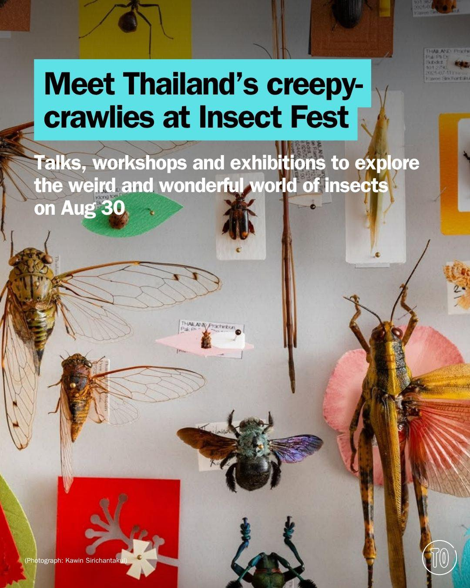

# 📸 2026-08-20 IG 新貼文彙整

## @jiranarong2 · 展覽

**摘要：** （分析失敗：GitHub Models is temporarily unavailable as part of a scheduled retirement brownout.）

> ครัวเคียงคลอง เพชรบุรี ร้านอาหารริมแม่น้ำเพชร ต้องซอกแซกเข้าไปแถวนามอญ ร้านนี้เจอเพราะเดินเล่นไปเรื่อย แล้วต้องเดินผ่านร้านนี้ เห็นเป็นร้านอ…

🔗 https://www.instagram.com/p/DcPeo9CkxNZ/

---

## @lifestyleasiath · 旅遊

**摘要：** （分析失敗：GitHub Models is temporarily unavailable as part of a scheduled retirement brownout.）

> The street just off Sathorn Road has a lot of hidden gems to explore. Here, we list out some of our favourite cafes and brunch spots, for th…

🔗 https://www.instagram.com/p/DcPpHVQFcS7/

---

## @lifestyleasiath · 旅遊

**摘要：** （分析失敗：GitHub Models is temporarily unavailable as part of a scheduled retirement brownout.）

> Bangkok has a new dessert obsession. Have you tried it? #NekoPudding #KatsuMidori #Bangkok #LifestyleAsia #LifestyleAsiaTH

🔗 https://www.instagram.com/p/DcNmwL5DeLT/

---

## @lifestyleasiath · 旅遊

**摘要：** （分析失敗：GitHub Models is temporarily unavailable as part of a scheduled retirement brownout.）

> The Maasverse community has been going feral since the titles for Books 6 & 7 in the “A Court of Thorns and Roses” series were revealed two …

🔗 https://www.instagram.com/p/DcNaqllEyHC/

---

## @aj.some.more · 旅遊

**摘要：** （分析失敗：GitHub Models is temporarily unavailable as part of a scheduled retirement brownout.）

> 🇹🇭 They call Thailand the “Land of Smiles”… but what is it about Bangkok that keeps making people come back? ❤️ Now I want to hear from yo…

🔗 https://www.instagram.com/p/DcNM7SdSrzu/

---

## @timeoutbangkok · 市集

**摘要：** （分析失敗：GitHub Models is temporarily unavailable as part of a scheduled retirement brownout.）

> The weekend is yours – now you just need to decide what to do with it. Bangkok has plenty on, from Japanese heritage and hands-on printmakin…

🔗 https://www.instagram.com/p/DcN6t2YmJbW/

---

## @timeoutbangkok · 市集

**摘要：** （分析失敗：GitHub Models is temporarily unavailable as part of a scheduled retirement brownout.）

> Reckon Thailand's electronic scene deserves a bigger audience? So does 'ThaiBeats'. The new project pushes homegrown electronic music out to…

🔗 https://www.instagram.com/p/DcNu6bcAmAF/

---

## @timeoutbangkok · 市集

**摘要：** （分析失敗：GitHub Models is temporarily unavailable as part of a scheduled retirement brownout.）

> One of Thailand’s biggest music festivals is back – with a new look and home 🐮🎶 @bigmountainmusicfestival lands at Farm Chokchai 3 in Khao…

🔗 https://www.instagram.com/p/DcNeEPDmG6L/

---

## @timeoutbangkok · 市集

**摘要：** （分析失敗：GitHub Models is temporarily unavailable as part of a scheduled retirement brownout.）

> See Thailand’s tiniest creatures in a whole new light at Insect Fest, with talks, insect-themed booths, workshops and an exhibition explorin…

🔗 https://www.instagram.com/p/DcNLDLCGF24/

---

