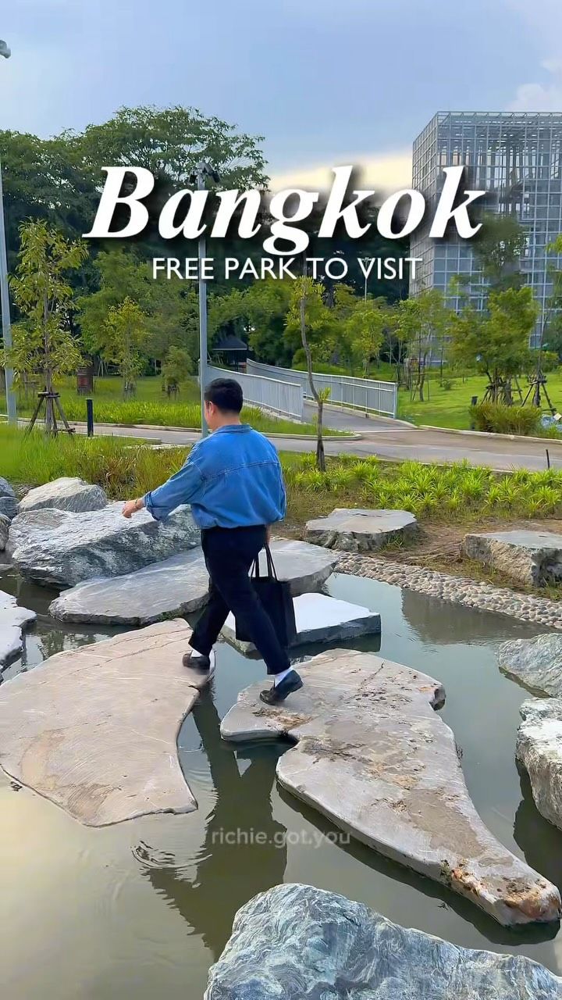
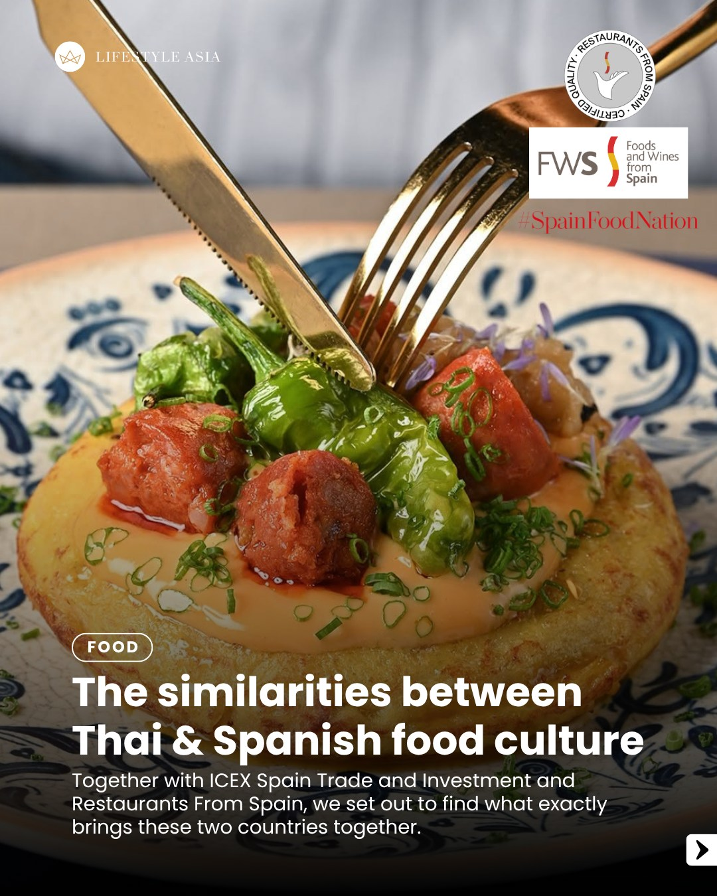
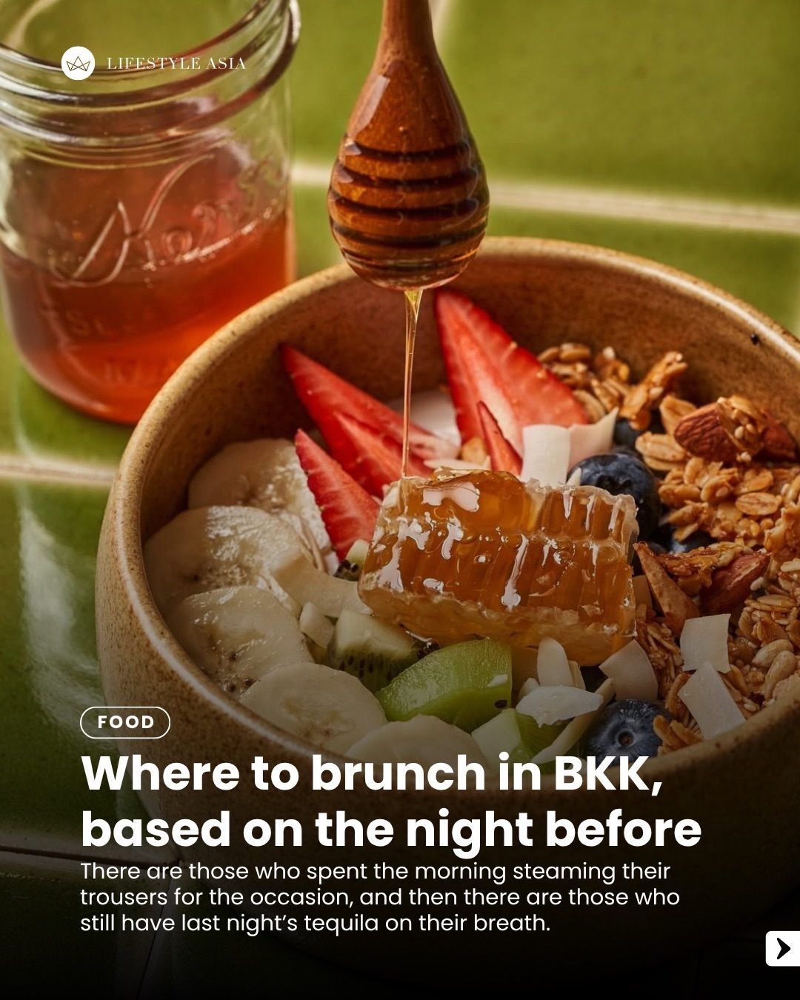
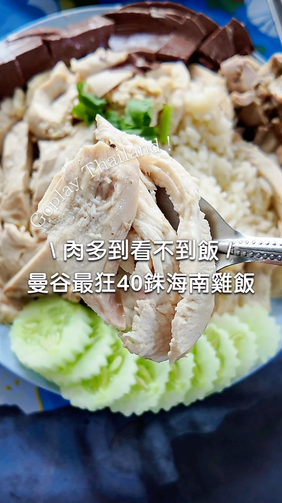
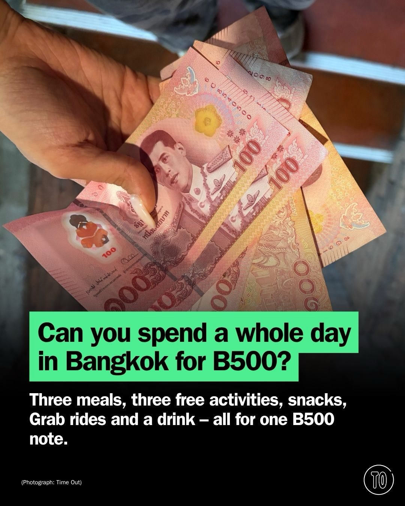
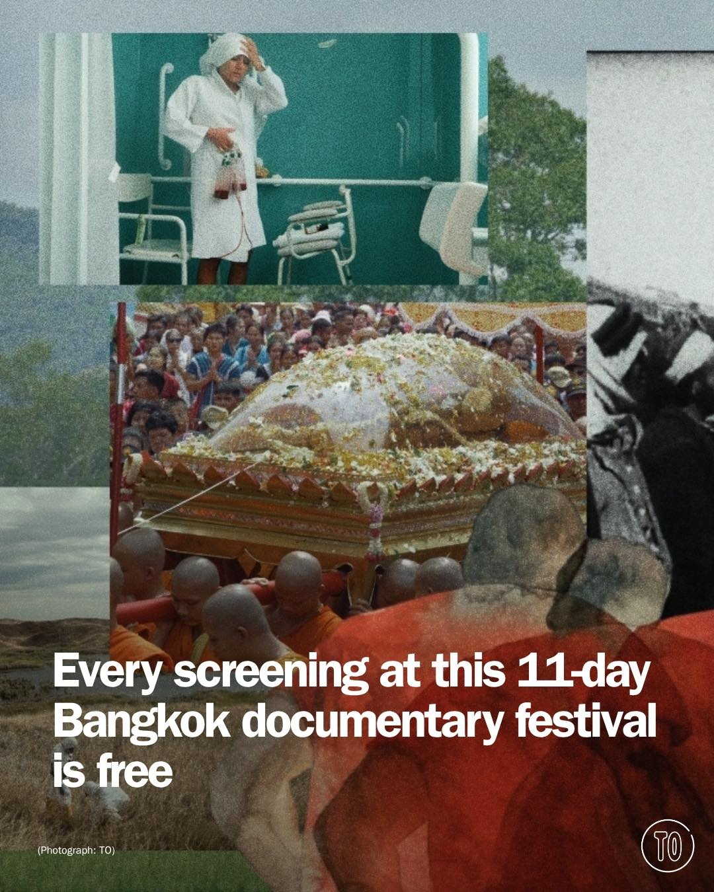
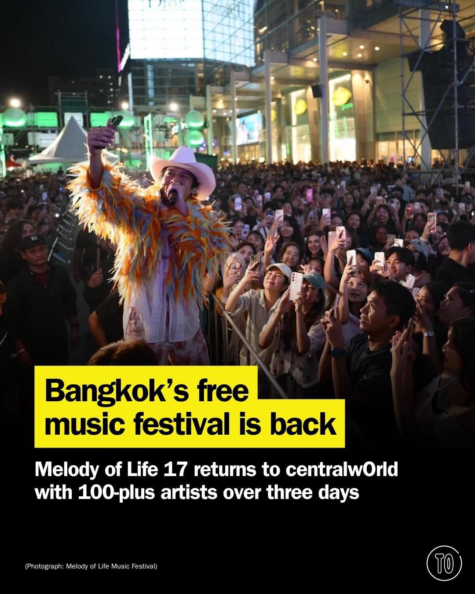
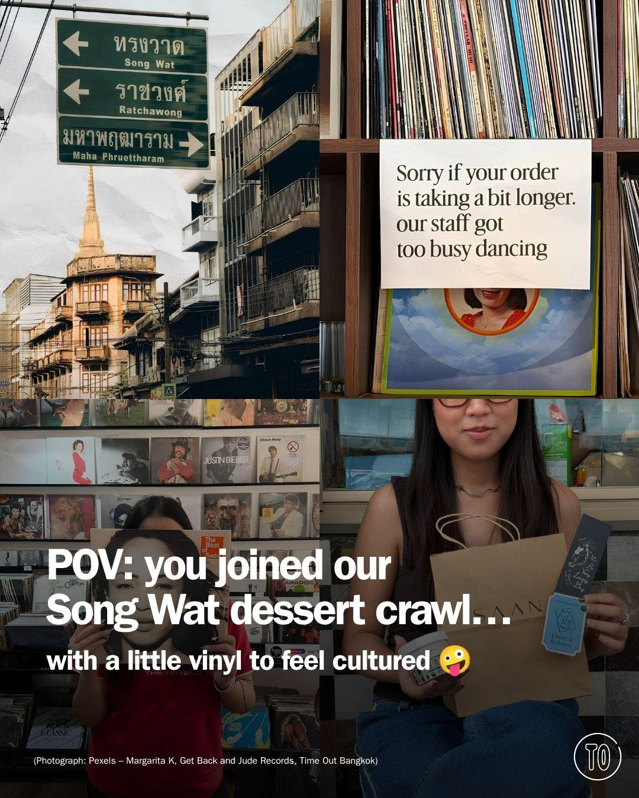

# 📸 2026-09-02 IG 新貼文彙整

## @richie.got.you · 旅遊

**摘要：** （分析失敗：GitHub Models is temporarily unavailable as part of a scheduled retirement brownout.）

> Bangkok free park to visit 🫶 Save this for your next Bangkok trip this 2026 #bangkok #bangkokthailand #bangkoktravel 📍 Pupha Mahanatee Gar…

🔗 https://www.instagram.com/p/DcvX-P6Thmd/

---

## @lifestyleasiath · 旅遊

**摘要：** （分析失敗：GitHub Models is temporarily unavailable as part of a scheduled retirement brownout.）

> While almost 10,000 kilometres separate Thailand from Spain, a shared love for good food knows no distance. Together with @spainfoodwine, we…

🔗 https://www.instagram.com/p/DcxRw-ajOEy/

---

## @lifestyleasiath · 旅遊

**摘要：** （分析失敗：GitHub Models is temporarily unavailable as part of a scheduled retirement brownout.）

> We don’t judge. Whether you went for a run this morning or whether you just rolled out of bed, there’s a Bangkok brunch spot for every occas…

🔗 https://www.instagram.com/p/DcvaMCek_7N/

---

## @goplaybangkok · 旅遊

**摘要：** （分析失敗：GitHub Models is temporarily unavailable as part of a scheduled retirement brownout.）

> \ #曼谷40泰銖海南雞飯・看到價格跟份量真的嚇一跳也太佛心🐔🍚 / 鄉親ㄚ這麼大一盤才 $40 泰銖～！店家真的有在賺錢嗎？ 這間海南雞飯真的是我們吃完直接想幫它拍拍手👏 一盤飯份量完全不小，雞肉給得也很有誠意，重點是沒有因為便宜就影響品質，雞肉吃起來滑嫩、不乾柴，配料有…

🔗 https://www.instagram.com/p/DcvuCI_S9Ge/

---

## @aj.some.more · 旅遊

**摘要：** （分析失敗：GitHub Models is temporarily unavailable as part of a scheduled retirement brownout.）

> One of Bangkok’s ultimate seafood experiences 🦀✨ From giant Sri Lankan Mud Crabs and Jumbo Pepper Crab to Huge Prawns in Garlic Chilli, eve…

🔗 https://www.instagram.com/p/DcxQjffSe6u/

---

## @timeoutbangkok · 市集

**摘要：** （分析失敗：GitHub Models is temporarily unavailable as part of a scheduled retirement brownout.）

> Can you spend a whole day in Bangkok for B500 without walking everywhere and surviving on the cheapest street food? We tried it with three m…

🔗 https://www.instagram.com/p/DcxcuDuE3kF/

---

## @timeoutbangkok · 市集

**摘要：** （分析失敗：GitHub Models is temporarily unavailable as part of a scheduled retirement brownout.）

> Eleven days, films from 113 countries and not a single baht to pay at the door. What the Doc Film Festival (WTD!) 2026 is back, and the prom…

🔗 https://www.instagram.com/p/DcxOZCkGMPp/

---

## @timeoutbangkok · 市集

**摘要：** （分析失敗：GitHub Models is temporarily unavailable as part of a scheduled retirement brownout.）

> Bangkok’s free music festival returns this October 🎵 Melody of Life 17 brings more than 100 artists to centralwOrld for three days of free …

🔗 https://www.instagram.com/p/DcviZPgmGmo/

---

## @timeoutbangkok · 市集

**摘要：** （分析失敗：GitHub Models is temporarily unavailable as part of a scheduled retirement brownout.）

> Eight Song Wat stops, four hours and absolutely no time to dawdle 😋 Start with chestnut ice cream, detour through steamed buns, Thai chocol…

🔗 https://www.instagram.com/p/DcvVcJ7GBgT/

---

