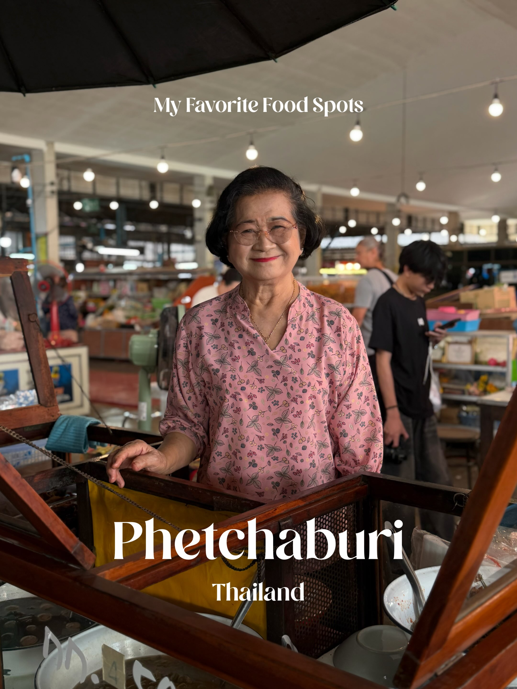
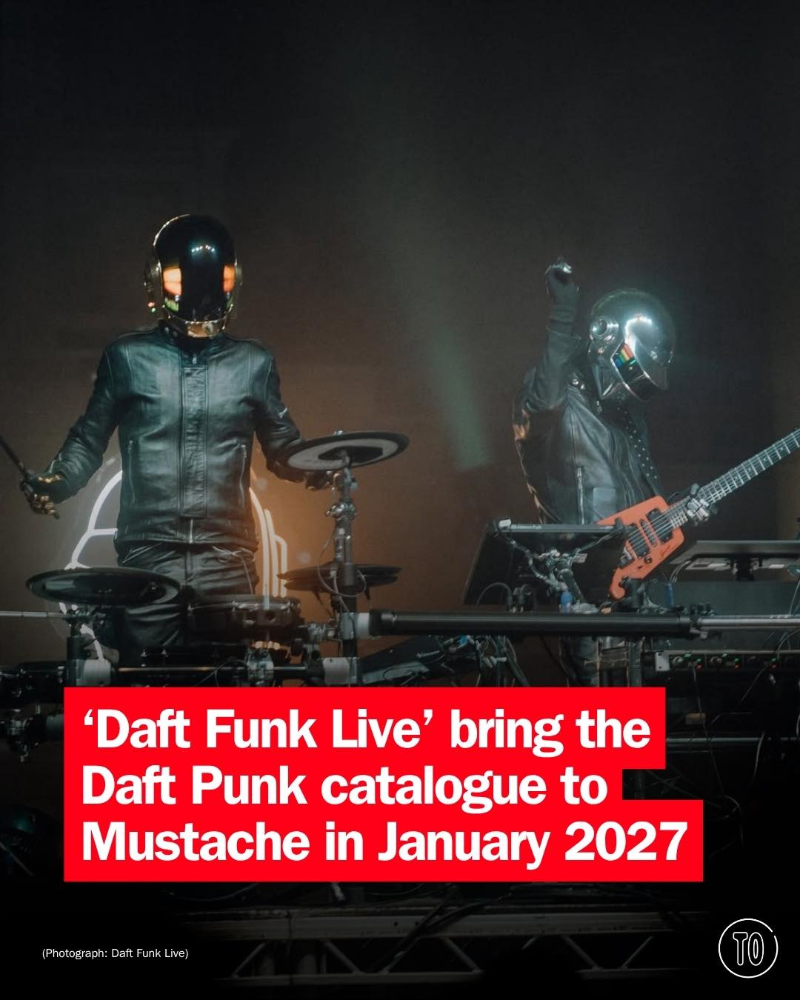
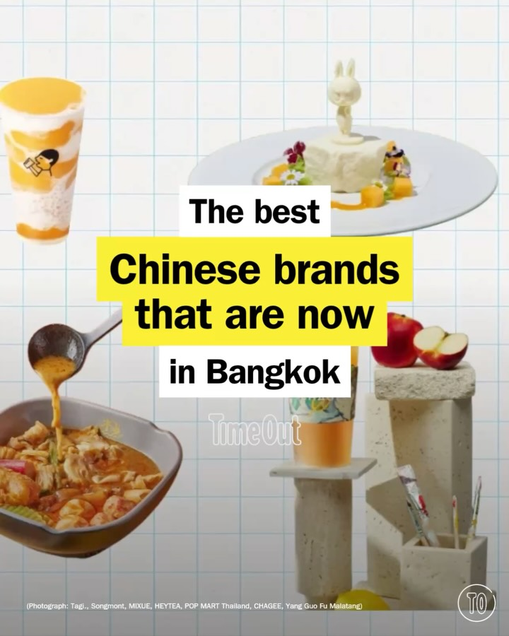

# 📸 2026-09-07 IG 新貼文彙整

## @jiranarong2 · 展覽

**摘要：** （分析失敗：GitHub Models is temporarily unavailable as part of a scheduled retirement brownout.）

> มีคนถามถึงร้านหรืออาหารที่ผมชอบที่เพชรบุรีบ่อยขึ้น เลยคิดว่ารวบรวมลิสท์ที่ตัวเองชอบเอาไว้เลยดีกว่า แล้วส่งให้เขาทีเดียวเลย เลยได้รายชื่ออาหา…

🔗 https://www.instagram.com/p/Dc8CysokxT8/

---

## @timeoutbangkok · 市集

**摘要：** （分析失敗：GitHub Models is temporarily unavailable as part of a scheduled retirement brownout.）

> Daft Punk split in 2021 and rarely toured before that, so for most of us a good tribute is as close as it gets, and ‘Daft Funk Live’ are a p…

🔗 https://www.instagram.com/p/Dc-QhV8GH96/

---

## @timeoutbangkok · 市集

**摘要：** （分析失敗：GitHub Models is temporarily unavailable as part of a scheduled retirement brownout.）

> Bangkok does many things well. Street food, fine dining, nightlife – and, if you’re lucky, making you look considerably sharper than when yo…

🔗 https://www.instagram.com/p/Dc8L8ozmEZZ/

---

## @timeoutbangkok · 市集

**摘要：** （分析失敗：GitHub Models is temporarily unavailable as part of a scheduled retirement brownout.）

> ‘Made in China’ really doesn’t quite mean what it used to. From cult fashion labels and bold design to viral food and drinks, China’s cooles…

🔗 https://www.instagram.com/p/Dc7_zSrE8au/

---

