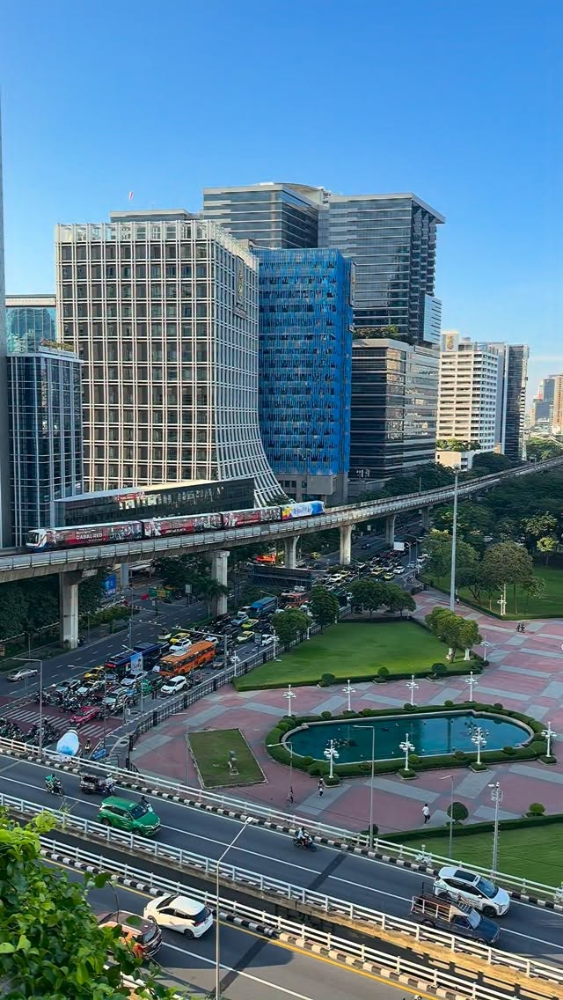
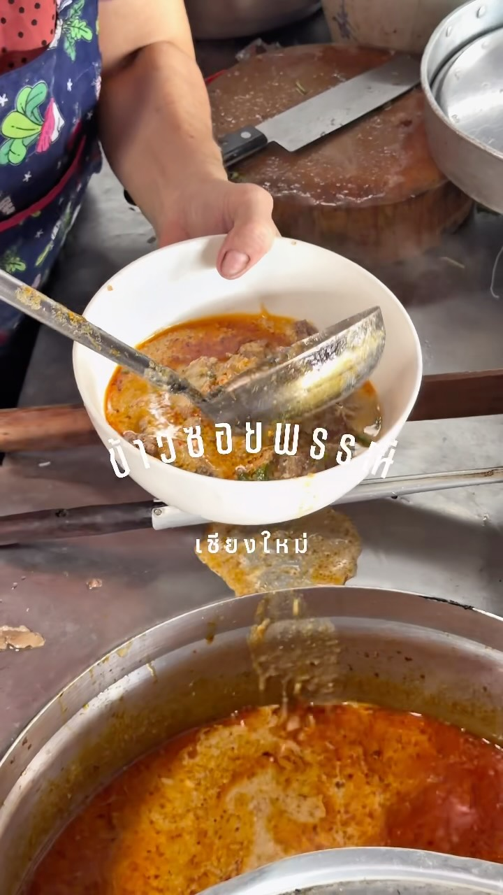
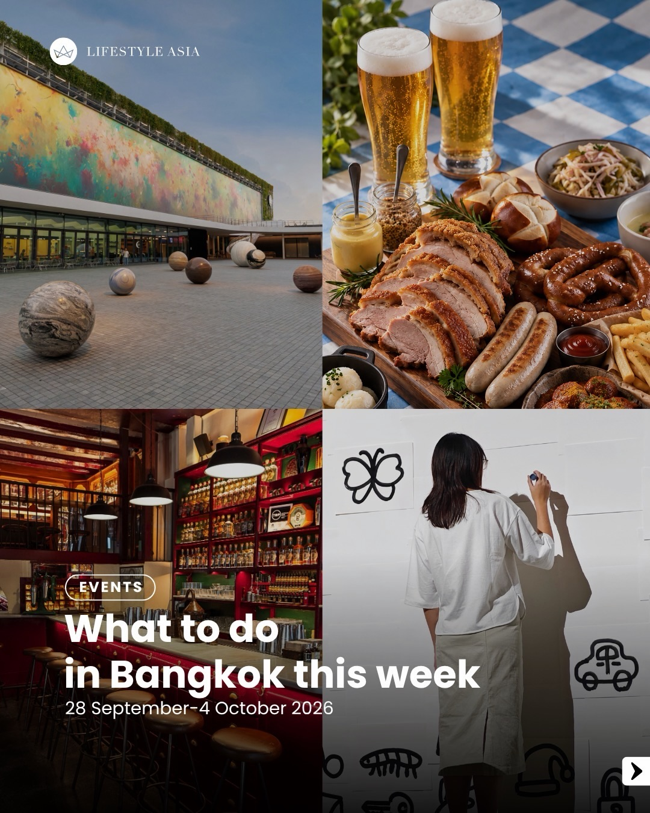
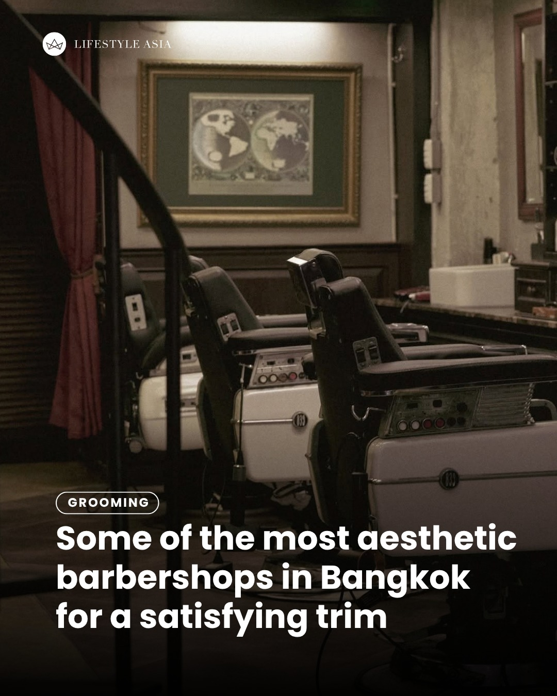
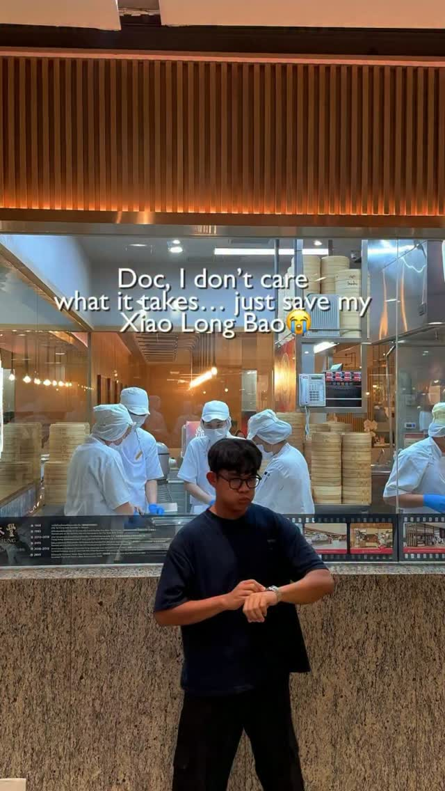

# 📸 2026-09-30 IG 新貼文彙整

## @bangkok_insiders · 展覽

**摘要：** （分析失敗：Unexpected token 'O', "OK
" is not valid JSON）

> Bangkok day after the rain 🌧️ #bangkok #bkk #amazing #travel #natgeo

🔗 https://www.instagram.com/p/Dd3hcesxl1e/

---

## @jiranarong2 · 展覽

**摘要：** （分析失敗：Unexpected token 'O', "OK
" is not valid JSON）

> ขึ้นแท่นตัวท้อปข้าวซอยของผมไปเลย ทั้งเส้นทำเอง ทั้งเนื้อตุ๋น ทั้งหมูทอดของข้าวซอยพรรณี ตรงป่าตัน เชียงใหม่ ไปซ้ำแน่นอนครับ ปล.ข้าวซอยใส่หมูท…

🔗 https://www.instagram.com/p/Dd5d_HjzkJi/

---

## @lifestyleasiath · 旅遊

**摘要：** （分析失敗：Unexpected token 'O', "OK
" is not valid JSON）

> Mini watches — or “tiny watches” by some accounts — were among the biggest trends at Watches and Wonders 2026. Here are some of our top pick…

🔗 https://www.instagram.com/p/Dd5NzQWCuJc/

---

## @lifestyleasiath · 旅遊

**摘要：** （分析失敗：Unexpected token 'O', "OK
" is not valid JSON）

> From World Gourmet Festival 2026 to Dib Bangkok’s latest exhibition, here are the best things to do in Bangkok from 28 September-4 October 2…

🔗 https://www.instagram.com/p/Dd3ian2k0Hx/

---

## @lifestyleasiath · 旅遊

**摘要：** （分析失敗：Unexpected token 'O', "OK
" is not valid JSON）

> From elegant leather seats to classy vibes, these aesthetic barbershops in Bangkok will have you looking forward to every visit. Tap link in…

🔗 https://www.instagram.com/p/Dd3LaqrmpkY/

---

## @goplaybangkok · 旅遊

**摘要：** （分析失敗：Unexpected token 'O', "OK
" is not valid JSON）

> \ #曼谷80年叉燒飯老店・傳說中「肉比飯多」就是這間🍚🐷 / 這盤端上來第一個想法：老闆是不是很怕客人吃不飽ㄚ？ 叉燒、脆皮燒肉、臘腸堆到快看不到下面的飯欸！而且這間在曼谷已經開超過 80 年，每到用餐時間店裡照樣坐滿滿～ 這間 Si Morakot 就藏在金佛寺附近的老巷…

🔗 https://www.instagram.com/p/Dd30VrQRNXe/

---

## @aj.some.more · 旅遊

**摘要：** （分析失敗：Unexpected token 'O', "OK
" is not valid JSON）

> POV: My Xiao Long Bao has been in surgery for 20 minutes 😭🥟 Doctor: We did everything we could. Me: WHAT DO YOU MEAN?! 😭😭😭 Please respe…

🔗 https://www.instagram.com/p/Dd5Zcuaty62/

---

## @aj.some.more · 旅遊

**摘要：** （分析失敗：Unexpected token 'O', "OK
" is not valid JSON）

> POV: You check in at your hotel in Thailand and immediately go to 7-Eleven 😂🇹🇭 Hotel: “Enjoy your stay!” Me: “Thanks, where’s the nearest…

🔗 https://www.instagram.com/p/Dd3veJyhk8w/

---

## @timeoutbangkok · 市集

**摘要：** （分析失敗：Unexpected token 'O', "OK
" is not valid JSON）

> The beach is back 🏝️ Thailand’s famous Maya Bay is reopening on October 1 after its annual conservation break. The Phi Phi Leh paradise, as…

🔗 https://www.instagram.com/p/Dd5qCCAkxEQ/

---

## @timeoutbangkok · 市集

**摘要：** （分析失敗：Unexpected token 'O', "OK
" is not valid JSON）

> Khon Ramakien: Ramavatar Episode is back at the National Theatre for four weekend matinées, and if you missed out on tixs last time, this is…

🔗 https://www.instagram.com/p/Dd5b9FDkph_/

---

## @timeoutbangkok · 市集

**摘要：** （分析失敗：Unexpected token 'O', "OK
" is not valid JSON）

> Don’t know where to crash for the night or chasing something a little less vanilla in Bangkok? Sounds like a job for a love hotel. Remember,…

🔗 https://www.instagram.com/p/Dd3pTgUo32N/

---

