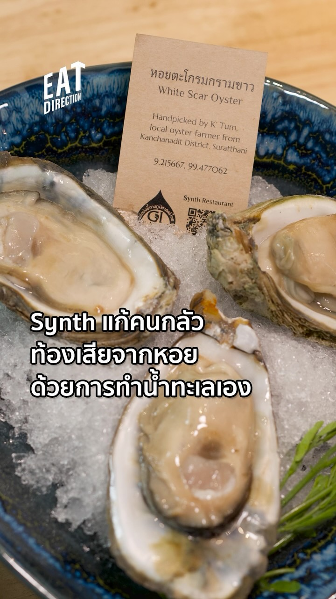
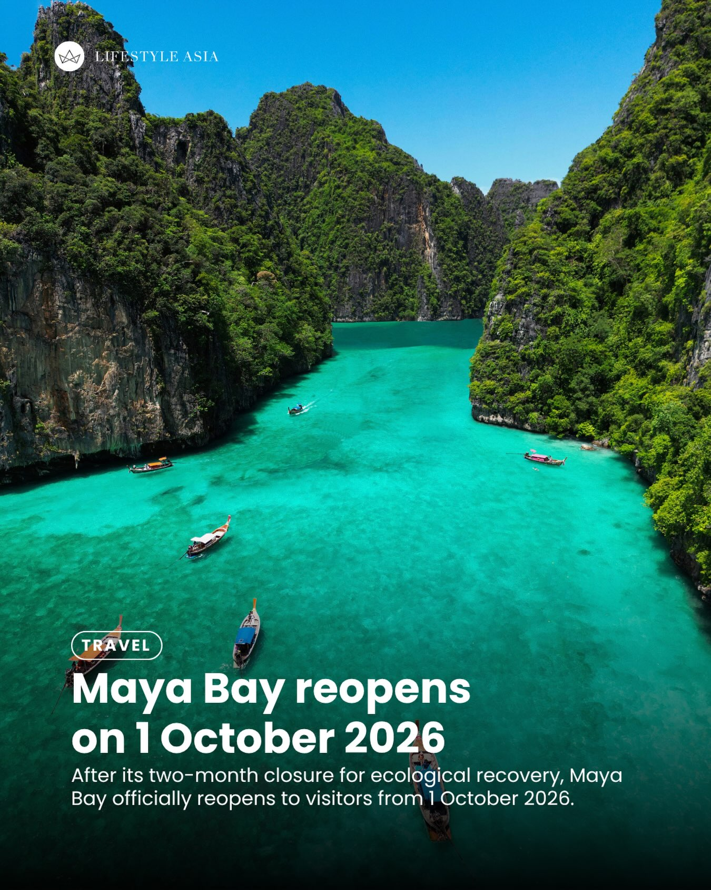
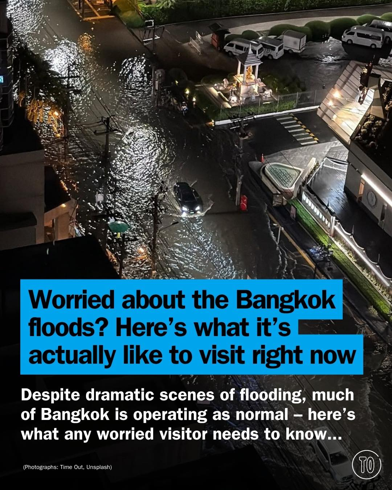

# 📸 2026-10-01 IG 新貼文彙整

## @bangkok_insiders · 展覽

**摘要：** （分析失敗：Unexpected token 'O', "OK
" is not valid JSON）

> Coming back again for extravaganza Vijit Chaopraya 2026 along the Chaopraya River 13th Nov -13th Dec 2026 #bangkok #bkk #amazing #travel #vi…

🔗 https://www.instagram.com/p/Dd8FolIPPRZ/

---

## @jiranarong2 · 展覽

**摘要：** （分析失敗：Unexpected token 'O', "OK
" is not valid JSON）

> หลังๆ ผมก็ไม่ค่อยกล้ากินหอยแล้ว แต่พอบอสทำขนาดนี้เลยกล้ากิน

🔗 https://www.instagram.com/p/Dd7r88lTzd3/

---

## @jiranarong2 · 展覽

**摘要：** （分析失敗：Unexpected token 'O', "OK
" is not valid JSON）

> กินหอมแดง ผักดองกับข้าวซอยวิธีไหน? กินแกล้มล้างมัน ใส่เข้าไปในชามผสมกันเลย

🔗 https://www.instagram.com/p/Dc7g6shTcFl/

---

## @lifestyleasiath · 旅遊

**摘要：** （分析失敗：Unexpected token 'O', "OK
" is not valid JSON）

> Following its annual two-month closure for much-needed ecological recovery, Maya Bay on Koh Phi Phi Leh in Krabi has reopened to visitors on…

🔗 https://www.instagram.com/p/Dd8At80zm76/

---

## @lifestyleasiath · 旅遊

**摘要：** （分析失敗：Unexpected token 'O', "OK
" is not valid JSON）

> If you’re a fan of POP MART’s adorable character, MOLLY, then you shouldn’t miss the 20th anniversary exhibit at CU Centenary Park, which ru…

🔗 https://www.instagram.com/p/Dd6Ed_8ya7T/

---

## @lifestyleasiath · 旅遊

**摘要：** （分析失敗：Unexpected token 'O', "OK
" is not valid JSON）

> It’s golden hour for the Land of Smiles. As of the morning of 30 September 2026, Thailand has won a total of 33 medals at the 2026 Asian Gam…

🔗 https://www.instagram.com/p/Dd5wLQbFqQA/

---

## @aj.some.more · 旅遊

**摘要：** （分析失敗：Unexpected token 'O', "OK
" is not valid JSON）

> WAIT… THIS IS THAILAND?! 👀🇹🇭 For a second, you might think this is somewhere in Korea. 😂 But nope, this view is right here in Thailand, …

🔗 https://www.instagram.com/p/Dd8CodFu6Rv/

---

## @timeoutbangkok · 市集

**摘要：** （分析失敗：Unexpected token 'O', "OK
" is not valid JSON）

> Ruby’s (@rubys.bkk) is Kimpton Maa-Lai Bangkok’s 16-seat cocktail bar that tells a real story, one glass at a time. Broken hearts, the twist…

🔗 https://www.instagram.com/p/Dd8OHVykygC/

---

## @timeoutbangkok · 市集

**摘要：** （分析失敗：Unexpected token 'O', "OK
" is not valid JSON）

> Thailand sits fifth on the Asian Games medal table and we can’t stop refreshing it. With Aichi-Nagoya 2026 in its final days, the national t…

🔗 https://www.instagram.com/p/Dd7_VuwEpGv/

---

## @timeoutbangkok · 市集

**摘要：** （分析失敗：Unexpected token 'O', "OK
" is not valid JSON）

> A million books at Big Bad Wolf, indie films at Doc Club & Friends and an afternoon reading beneath Lumphini’s trees. Add Dr Dunks behind th…

🔗 https://www.instagram.com/p/Dd6SLEckydY/

---

## @timeoutbangkok · 市集

**摘要：** （分析失敗：Unexpected token 'O', "OK
" is not valid JSON）

> Despite some of the dramatic headlines, for most visitors there’s no need to cancel your Bangkok trip. 🌧️ Parts of the capital have been hi…

🔗 https://www.instagram.com/p/Dd6Gdi-khmH/

---

