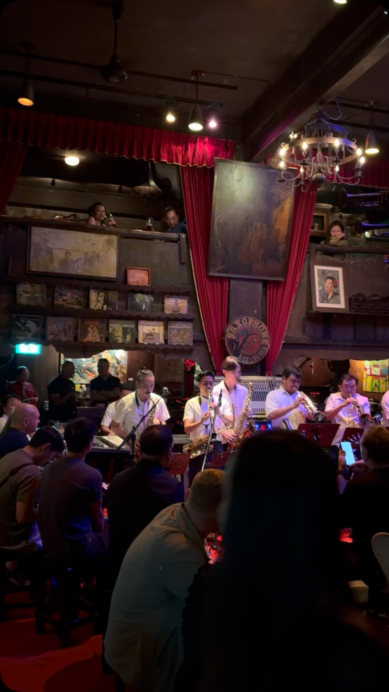
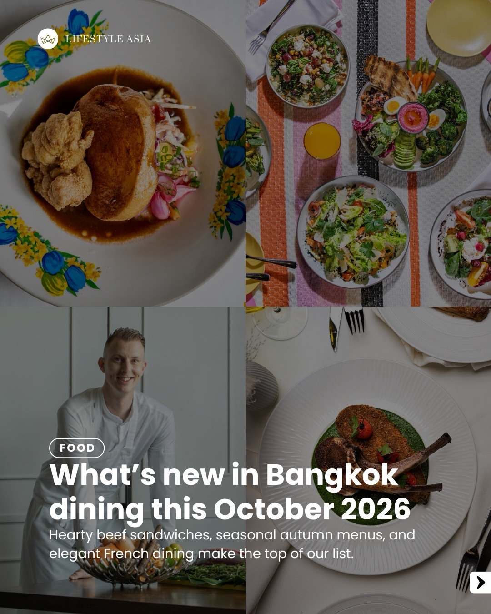
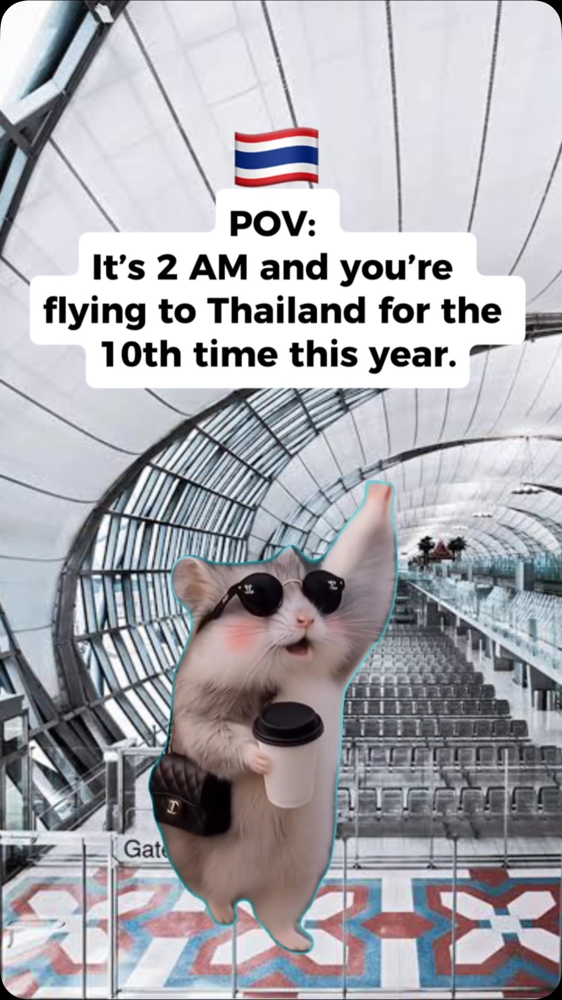
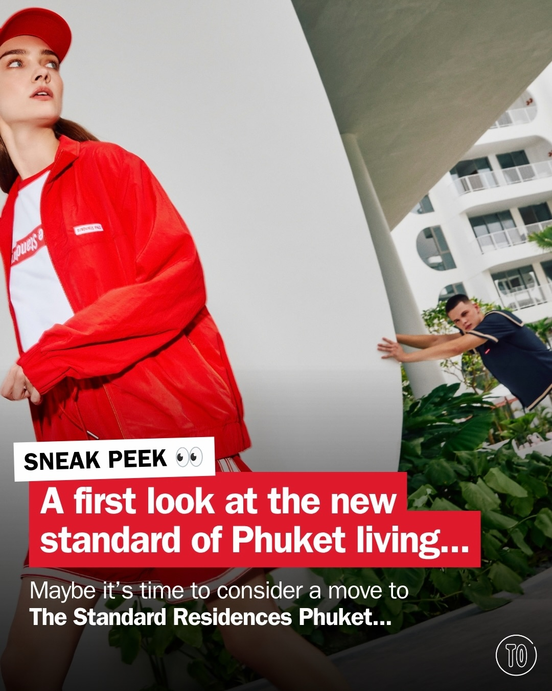
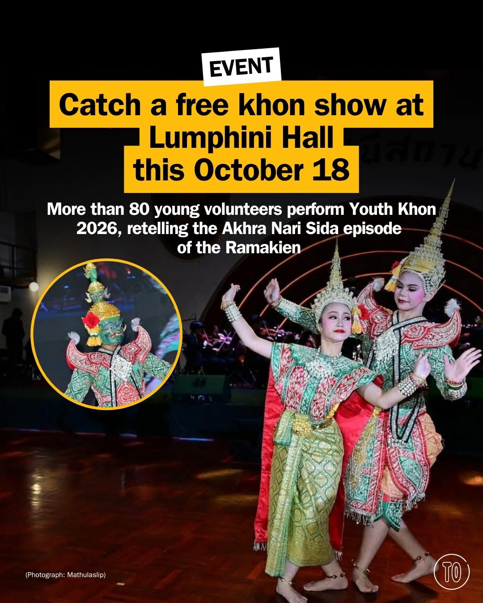
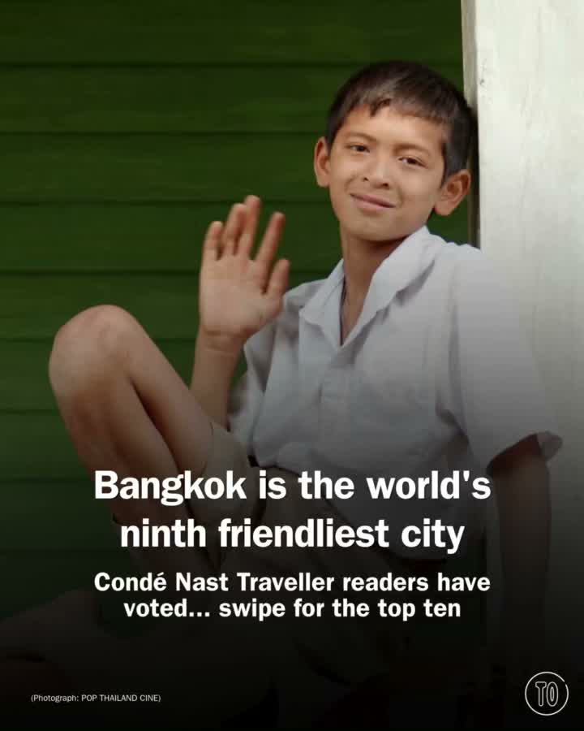

# 📸 2026-10-09 IG 新貼文彙整

## @bangkok_insiders · 展覽

**摘要：** （分析失敗：Unexpected token 'O', "OK
" is not valid JSON）

> The night and f Jazz in Bangkok @saxophonepubthailand #sax #bangkok #bkk #amazing #travel

🔗 https://www.instagram.com/p/DePJ00lJPpk/

---

## @lifestyleasiath · 旅遊

**摘要：** （分析失敗：Unexpected token 'O', "OK
" is not valid JSON）

> For our October edition, we’re spotlighting Thailand hotels featured on The World’s 50 Best Hotels and awarded MICHELIN Keys, KROMO Bangkok’…

🔗 https://www.instagram.com/p/DeQv2zZE_eX/

---

## @lifestyleasiath · 旅遊

**摘要：** （分析失敗：Unexpected token 'O', "OK
" is not valid JSON）

> A chronograph with panda ears for pushers? Say no more. Here’s why we’re crushing on Seiko’s Pandagraph. Tap link in bio for more. #Seiko #S…

🔗 https://www.instagram.com/p/DeQY2TCisSH/

---

## @lifestyleasiath · 旅遊

**摘要：** （分析失敗：Unexpected token 'O', "OK
" is not valid JSON）

> From French dining to wild game and autumnal flavours, our restaurant round-up this month is colourful and varied. Tap link in bio for detai…

🔗 https://www.instagram.com/p/DeOdMcjE9Qt/

---

## @goplaybangkok · 旅遊

**摘要：** （分析失敗：Unexpected token 'O', "OK
" is not valid JSON）

> \ #曼谷70年泰式冰品店・這碗配料也太豐富🍧🇹🇭 / 來曼谷想吃點不一樣的傳統甜點，可以試試這間！ 開了 70 年的泰式剉冰老店「清心丸」，整個攤位擺滿五顏六色、超過五十種的配料，光用看的就選擇障礙發作😆 紅寶石、芋頭、蓮片、椰肉、菠蘿蜜、煎蕊（香蘭粉條）……想吃什麼就…

🔗 https://www.instagram.com/p/DeO_a-8RC9m/

---

## @aj.some.more · 旅遊

**摘要：** （分析失敗：Unexpected token 'O', "OK
" is not valid JSON）

> POV: It’s 2 AM and you’re flying to Thailand for the 10th time this year. 😆🇹🇭 At this point, Thailand is basically your second home! 🏠🇹…

🔗 https://www.instagram.com/p/DeQg6gGBJik/

---

## @aj.some.more · 旅遊

**摘要：** （分析失敗：Unexpected token 'O', "OK
" is not valid JSON）

> 🚀 I FOUND A SPACESHIP HOTEL IN THAILAND?! Would you stay here? 😱 📍 G Nimman Chiang Mai, Thailand 🇹🇭 This futuristic hotel feels like yo…

🔗 https://www.instagram.com/p/DeO4pX0BB-k/

---

## @timeoutbangkok · 市集

**摘要：** （分析失敗：Unexpected token 'O', "OK
" is not valid JSON）

> What if you swapped Bangkok living for something a little more Phuket? 🌴 We’re getting a first glimpse inside the completed two- and three-…

🔗 https://www.instagram.com/p/DeQ7CD3k2fF/

---

## @timeoutbangkok · 市集

**摘要：** （分析失敗：Unexpected token 'O', "OK
" is not valid JSON）

> Lumphini Hall is having a busy year. After years of sitting quiet, the old venue in the middle of Lumphini Park put on a free night of khon …

🔗 https://www.instagram.com/p/DeQwJbrjyYx/

---

## @timeoutbangkok · 市集

**摘要：** （分析失敗：Unexpected token 'O', "OK
" is not valid JSON）

> Bangkok takes ninth place among the world's friendliest cities for 2026, according to Condé Nast Traveller’s Readers’ Choice Awards. Melbour…

🔗 https://www.instagram.com/p/DeO44MODevu/

---

## @timeoutbangkok · 市集

**摘要：** （分析失敗：Unexpected token 'O', "OK
" is not valid JSON）

> Pack your bags, October is calling 🧳 🍽️ Guest chef Esca Khoo takes over Sea Fire Salt (@seafiresaltphuket) at @anantaramaikhao for one nig…

🔗 https://www.instagram.com/p/DeOtLFxE-hN/

---

